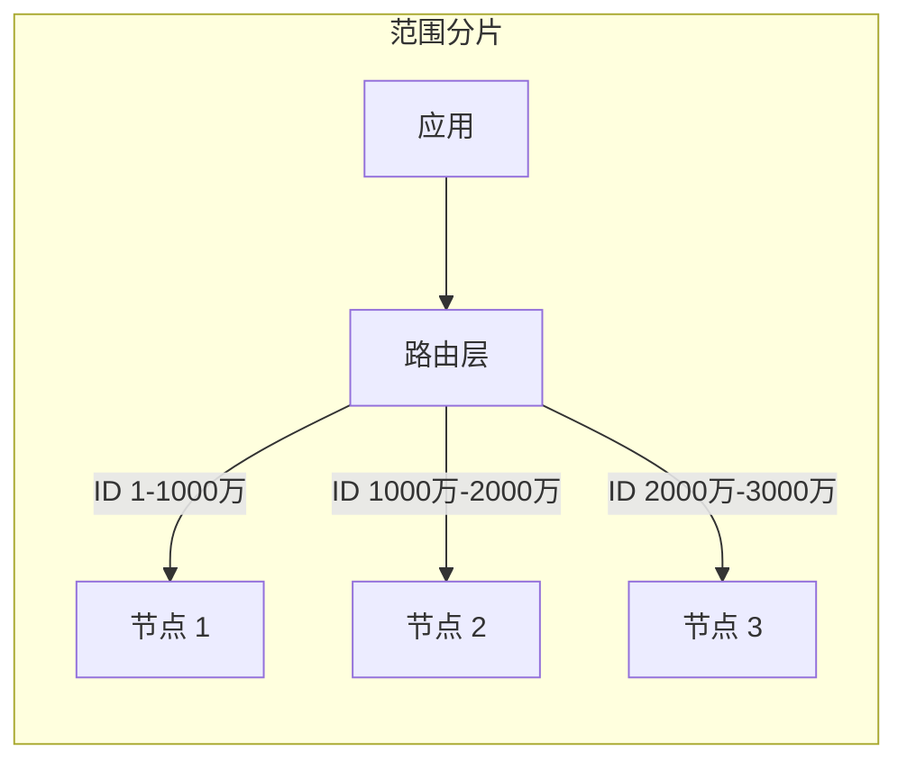

# 范围分片

范围分片是最直觉的分片方式——按数据的某个连续区间划分分片。时间序列数据按月份分、用户数据按 ID 区间分。这种策略简单直观，适合特定类型的数据。

## 按 ID 区间划分

最典型的范围分片策略。每个分片负责一段连续的 ID 区间。



```java title="范围分片路由"
@Service
public class RangeShardRouter {

    private static final long SHARD_SIZE = 10_000_000L; // 每个分片 1000 万

    public int getShardIndex(long id) {
        return (int) (id / SHARD_SIZE);
    }

    public DataSource getDataSource(long id) {
        int shardIndex = getShardIndex(id);
        return shardManager.getDataSource(shardIndex);
    }

    public List<Long> getShardIndices(long startId, long endId) {
        int startIndex = (int) (startId / SHARD_SIZE);
        int endIndex = (int) (endId / SHARD_SIZE);

        List<Long> indices = new ArrayList<>();
        for (int i = startIndex; i <= endIndex; i++) {
            indices.add((long) i);
        }
        return indices;
    }
}
```

## 优点：范围查询高效

范围分片最大的优势是范围查询效率高。如果查询条件包含分片键，可以直接定位到特定分片。

```java title="范围查询示例"
@Service
public class OrderService {

    @Autowired
    private RangeShardRouter router;

    // 高效的范围查询
    public List<Order> getOrdersByIdRange(long startId, long endId) {
        List<Long> shardIndices = router.getShardIndices(startId, endId);

        return shardIndices.stream()
                .map(shardIndex -> {
                    DataSource ds = shardManager.getDataSource(shardIndex.intValue());
                    return jdbcTemplate.queryForList(
                        ds,
                        "SELECT * FROM orders WHERE id BETWEEN ? AND ?",
                        startId, endId
                    );
                })
                .flatMap(List::stream)
                .collect(Collectors.toList());
    }
}
```

**典型的范围查询场景**：

- 分页查询：`LIMIT 100 OFFSET 1000`，可以直接定位分片
- 时间范围查询：如果分片键是时间，按月分片后查询某月数据只需访问一个分片
- ID 区间查询：直接定位到区间所在分片

## 缺点：热点数据不均匀

范围分片的致命弱点是容易产生热点。

### 热点问题

新注册的用户、刚发布的商品、最近的订单——这些「热数据」往往集中在最新的分片。

假设按月份分片：

- 1 月数据写入分片 1
- 2 月数据写入分片 2
- ...
- 12 月数据写入分片 12

大促期间（如 11 月、12 月）的订单全部写入最新分片，导致这个分片负载远超其他分片。

### 不均匀问题

业务增长不均匀时，分片数据量差异巨大。

假设用户 ID 是自增的：

- 早期用户（ID 1-100 万）活跃度低，数据量小
- 当前用户（ID 1 亿-1.1 亿）活跃度高，数据量大

范围分片会让新分片数据量远超旧分片。

```java title="分片数据量不均匀示例"
public class DataDistribution {

    public static void main(String[] args) {
        // 模拟数据分布
        long[] shardDataSize = {
            100_000,   // 分片 0: 早期用户，少量数据
            150_000,   // 分片 1
            200_000,   // 分片 2
            500_000,   // 分片 3
            1_000_000, // 分片 4
            5_000_000, // 分片 5: 当前用户，数据量大
            8_000_000, // 分片 6: 当前用户，接近上限
        };

        // 分片 6 数据量是分片 0 的 80 倍！
    }
}
```

### 热点解决方案

**预创建分片**：提前创建大量空分片，让数据分散写入。适合持续增长的数据。

```java title="预创建分片策略"
@Service
public class PreShardManager {

    private static final int PRE_SHARD_COUNT = 1024;

    public int getShardIndex(long id) {
        return (int) (id % PRE_SHARD_COUNT);
    }
}
```

**热点数据隔离**：识别热点分片后，把热点数据迁移到独立的高性能分片。

**结合时间分片**：对于持续增长的数据，可以结合范围分片（按时间）和哈希分片（如按用户 ID 哈希后范围分片），让数据分布更均匀。

## 适用场景

范围分片不是万能的，它有明确的适用场景。

### 适合范围分片的场景

**时间序列数据**：日志、监控数据、交易记录。时间范围查询是主要访问模式，按时间分片效率最高。

```java title="时间序列分片"
@Service
public class TimeSeriesShardRouter {

    public String getShardKey(LocalDate date) {
        // 按月分片
        return String.format("%d-%02d", date.getYear(), date.getMonthValue());
    }

    public List<String> getShardsInRange(LocalDate start, LocalDate end) {
        List<String> shards = new ArrayList<>();
        LocalDate current = start;
        while (!current.isAfter(end)) {
            shards.add(getShardKey(current));
            current = current.plusMonths(1);
        }
        return shards;
    }
}
```

**读多写少的数据**：日志、归档数据。写入集中在最新分片，读取可能涉及多个历史分片，范围分片不影响读取性能。

**有明确边界的数据**：如行政区划、学号、工号。这些数据的范围是天然确定的。

### 不适合范围分片的场景

**写入热点的数据**：如大促订单、实时消息。写入集中在最新分片，热点问题严重。

**需要均匀分布的数据**：如用户数据、业务数据。选择哈希分片更合适。

**查询条件多样的数据**：如果查询不总是带分片键，范围分片的优势无法发挥。

## 范围分片的配置示例

```yaml title="ShardingSphere 范围分片配置"
schemaName: app_db

dataSources:
  ds_0:
    dataSourceClassName: com.zaxxer.hikari.HikariDataSource
    driverClassName: com.mysql.cj.jdbc.Driver
    jdbcUrl: jdbc:mysql://localhost:3306/ds_0
    username: root
    password:

rules:
- sharding:
    tables:
      orders:
        actualDataNodes: ds_$->{0..3}
        tableStrategy:
          standard:
            shardingColumn: order_id
            shardingAlgorithmName: orders_range
        keyGenerateStrategy:
          column: order_id
          keyGeneratorName: snowflake
    shardingAlgorithms:
      orders_range:
        type: INTERVAL
        props:
          sharding-column: order_id
          logical-table-prefix: orders_
          sharding-length: 10000000
          datetime-lower: 2020-01-01
          datetime-upper: 2030-01-01
          datetime-interval-unit: MONTH
          datetime-interval-amount: 1
```

## 常见误区

**误区一：分片区间设置固定不变**

业务在增长，分片区间应该动态调整。设置过小的区间会导致分片过多，设置过大的区间会导致数据不均匀。

**误区二：忽视热点分片**

范围分片的热点问题不可避免。应该在监控系统上关注各分片的负载差异，及时处理热点。

**误区三：范围分片不需要容量规划**

范围分片更需要容量规划。每个分片的存储上限决定了区间的划分，需要根据业务增速预留余量。

## 延伸思考

范围分片的核心价值是「让范围查询高效」。这个价值在特定场景下无可替代——时间序列数据、读写分离的数据归档。

但它也有明确的代价：热点和不均匀。选择范围分片前，先问自己：

- 我的业务查询，主要是范围查询吗？
- 数据增长模式是均匀的还是集中的？
- 能接受热点分片带来的问题吗？

如果答案是肯定的，范围分片是一个好选择。如果否，考虑哈希分片或其他策略。
