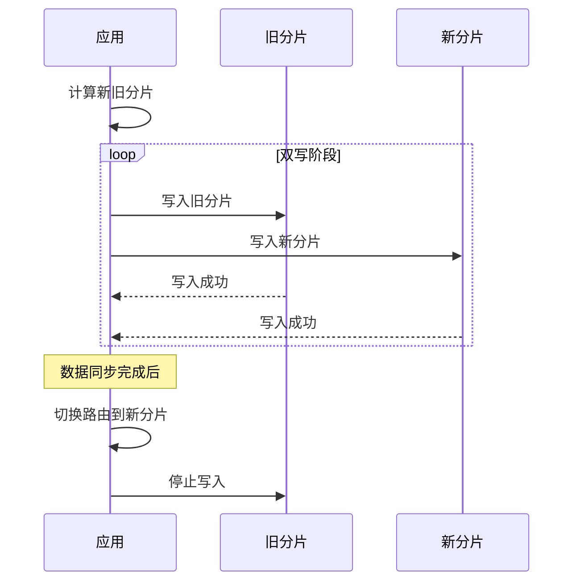

# 动态分片与重平衡

业务在增长，数据在膨胀，初始的分片数终有一天会不够用。动态分片和重平衡就是让系统在不停服的情况下，优雅地扩展容量。

## 迁移时机：手动 vs 自动

### 手动迁移

管理员根据监控数据判断何时需要扩容。

```java title="手动触发迁移"]
@Service
public class ManualMigrationController {

    @Autowired
    private ShardManager shardManager;

    @Autowired
    private DataMigrationService migrationService;

    // 管理员手动触发扩容
    public MigrationPlan planExpansion(int newShardCount) {
        // 1. 评估当前容量
        Capacity评估 assessment = shardManager.assessCapacity();

        if (assessment.hasEnoughCapacity()) {
            return MigrationPlan.noMigrationNeeded();
        }

        // 2. 生成迁移计划
        MigrationPlan plan = shardManager.planMigration(newShardCount);

        // 3. 返回计划供管理员确认
        return plan;
    }

    @PostMapping("/admin/migration/execute")
    public void executeMigration(@RequestBody MigrationPlan plan) {
        // 管理员确认后执行
        migrationService.execute(plan);
    }
}
```

### 自动迁移

系统根据容量阈值自动触发扩容。

```java title="自动扩容策略"]
@Service
public class AutoExpansionService {

    private static final double EXPANSION_THRESHOLD = 0.8; // 80% 容量触发扩容
    private static final double SHRINK_THRESHOLD = 0.3;     // 30% 容量触发缩容
    private static final int MAX_SHARDS = 256;              // 最大分片数

    @Scheduled(fixedRate = 60000) // 每分钟检查
    public void checkAndExpand() {
        double maxUtilization = shardManager.getMaxShardUtilization();

        if (maxUtilization > EXPANSION_THRESHOLD) {
            if (shardManager.getShardCount() < MAX_SHARDS) {
                triggerExpansion();
            } else {
                alertMaxShards();
            }
        }
    }

    private void triggerExpansion() {
        int newShardCount = shardManager.getShardCount() * 2;
        log.info("触发自动扩容：分片数从 {} 增加到 {}", 
                 shardManager.getShardCount(), newShardCount);

        shardManager.expand(newShardCount);
    }
}
```

## 数据迁移策略

### 双写策略

新旧分片同时写入，切换期间逐步迁移。



```java title="双写迁移实现"]
@Service
public class DualWriteMigration {

    private volatile boolean dualWriteEnabled = false;
    private final Set<String> migratedKeys = ConcurrentHashMap.newKeySet();

    public void enableDualWrite() {
        this.dualWriteEnabled = true;
    }

    public void write(String key, Object value) {
        // 写入新分片
        String newShard = newRouter.route(key);
        newShardTemplate.save(newShard, key, value);

        // 双写期间同时写旧分片
        if (dualWriteEnabled) {
            String oldShard = oldRouter.route(key);
            oldShardTemplate.save(oldShard, key, value);
        }
    }

    public Object read(String key) {
        // 迁移完成前读旧分片，迁移完成后读新分片
        if (migratedKeys.contains(key)) {
            return newShardTemplate.read(newRouter.route(key), key);
        }
        return oldShardTemplate.read(oldRouter.route(key), key);
    }

    public void markMigrated(String key) {
        migratedKeys.add(key);
    }
}
```

### 灰度切流

逐步把流量从旧分片迁移到新分片。

```java title="灰度切流"]
@Service
public class TrafficMigration {

    private final AtomicInteger migratedPercentage = new AtomicInteger(0);

    public void startMigration(int targetShards) {
        log.info("开始灰度切流，目标分片数: {}", targetShards);

        // 初始化新分片
        shardManager.addShards(targetShards);

        // 逐步切流：10% -> 30% -> 50% -> 80% -> 100%
        int[] steps = {10, 30, 50, 80, 100};

        for (int step : steps) {
            migrateToPercentage(step);
            sleep(30000); // 每个阶段观察 30 秒
        }
    }

    private void migrateToPercentage(int targetPercentage) {
        while (migratedPercentage.get() < targetPercentage) {
            int current = migratedPercentage.get();
            int next = Math.min(current + 5, targetPercentage);

            // 把 5% 的请求路由到新分片
            router.setMigrationPercentage(next);
            migratedPercentage.set(next);

            log.info("切流进度: {}%", next);
        }
    }
}
```

## 迁移期间服务可用性

迁移过程中，系统必须继续提供服务。不能因为迁移导致服务中断。

### 读写策略

```java title="迁移期间读写策略"]
@Service
public class MigrationAwareService {

    private final ShardRouter oldRouter;
    private final ShardRouter newRouter;
    private final DataMigrationService migrationService;

    public <T> T read(String key) {
        // 优先读新分片（如果数据已迁移）
        if (migrationService.isMigrated(key)) {
            String newShard = newRouter.route(key);
            T result = newShardTemplate.read(newShard, key);
            if (result != null) {
                return result;
            }
        }

        // 降级读旧分片
        String oldShard = oldRouter.route(key);
        return oldShardTemplate.read(oldShard, key);
    }

    public void write(String key, Object value) {
        // 双写：确保新旧分片都有数据
        String oldShard = oldRouter.route(key);
        String newShard = newRouter.route(key);

        // 旧分片必须成功
        oldShardTemplate.write(oldShard, key, value);

        // 新分片也写入（允许失败，由后台补偿）
        try {
            newShardTemplate.write(newShard, key, value);
        } catch (Exception e) {
            log.warn("新分片写入失败，key={}", key, e);
            queueForRetry(key, value);
        }
    }
}
```

### 故障处理

```java title="迁移故障处理"]
@Service
public class MigrationFailureHandler {

    private final AlertService alertService;
    private final RetryQueue retryQueue;

    public void handleMigrationFailure(MigrationContext context, Exception e) {
        log.error("迁移失败: key={}, error={}", context.getKey(), e.getMessage());

        switch (e.getCode()) {
            case NETWORK_ERROR:
                // 网络错误，稍后重试
                scheduleRetry(context, Duration.ofSeconds(30));
                break;

            case TARGET_SHARD_FULL:
                // 目标分片满了，报警并暂停
                alertService.sendCritical("目标分片容量不足", context);
                pauseMigration();
                break;

            case DATA_CORRUPTION:
                // 数据损坏，紧急报警
                alertService.sendEmergency("迁移数据损坏", context);
                abortMigration();
                break;

            default:
                // 其他错误，降级处理
                retryQueue.add(context);
        }
    }

    private void scheduleRetry(MigrationContext context, Duration delay) {
        // 延迟重试
    }
}
```

## 一致性保证

迁移期间的数据一致性是最大的挑战。

### 最终一致性策略

```java title="最终一致性保证"]
@Service
public class ConsistencyGuarantor {

    private final Set<String> inconsistentKeys = ConcurrentHashMap.newKeySet();
    private final ScheduledExecutorService checker;

    public void startConsistencyCheck() {
        // 定期检查不一致的数据
        checker.scheduleAtFixedRate(() -> {
            List<String> keys = getPotentiallyInconsistentKeys();

            for (String key : keys) {
                verifyAndFix(key);
            }
        }, 1, 1, TimeUnit.MINUTES);
    }

    private void verifyAndFix(String key) {
        // 读取新旧分片的数据
        Object newData = newShardTemplate.read(newRouter.route(key), key);
        Object oldData = oldShardTemplate.read(oldRouter.route(key), key);

        if (!equals(newData, oldData)) {
            // 数据不一致，以新分片为准
            log.warn("发现不一致: key={}, old={}, new={}", key, oldData, newData);

            // 以时间戳或版本号决定采用哪个
            Object correctData = resolveConflict(newData, oldData);
            newShardTemplate.write(newRouter.route(key), key, correctData);
            oldShardTemplate.write(oldRouter.route(key), key, correctData);
        }

        inconsistentKeys.remove(key);
    }
}
```

### 校验清单

迁移完成后，必须执行完整性校验。

```java title="迁移后校验"]
@Service
public class MigrationValidator {

    public ValidationReport validate(String shardName) {
        ValidationReport report = new ValidationReport(shardName);

        // 1. 记录数校验
        long oldCount = countRecords(oldShard, shardName);
        long newCount = countRecords(newShard, shardName);

        if (oldCount != newCount) {
            report.addIssue("记录数不一致: 旧分片={}, 新分片={}", oldCount, newCount);
        }

        // 2. 数据完整性校验
        List<String> sampleKeys = getSampleKeys(oldShard, shardName, 1000);
        for (String key : sampleKeys) {
            if (!existsInNewShard(key)) {
                report.addIssue("缺失数据: key={}", key);
            }
        }

        // 3. 路由正确性校验
        for (String key : sampleKeys) {
            String expectedShard = newRouter.route(key);
            if (!shardName.equals(expectedShard)) {
                report.addIssue("路由错误: key={}, 期望={}, 实际={}", 
                                key, expectedShard, shardName);
            }
        }

        return report;
    }
}
```

## 迁移最佳实践

### 1. 提前规划分片数

初期预留足够的分片数，避免频繁迁移。建议预留未来 2-3 年的增长空间。

```java
// 示例：预计 3 年后数据量达到 1 亿，按每分片 100 万计算
int estimatedShards = 100; // 预留 100 个分片
```

### 2. 选择低峰期迁移

避免在业务高峰期执行迁移，减少对服务的影响。

### 3. 分批迁移

不要一次性迁移所有数据，分批进行，每批验证后再继续。

### 4. 保留回滚能力

迁移失败时能快速回滚到迁移前的状态。

### 5. 完善的监控

迁移过程中实时监控关键指标：延迟、错误率、数据一致性。

## 常见误区

**误区一：迁移期间不监控**

迁移不是「发出去就不用管了」。需要实时监控延迟、错误率、数据一致性。

**误区二：追求完美的零错误**

迁移期间允许少量错误，关键是快速发现和修复。

**误区三：迁移完成就万事大吉**

迁移完成后，旧分片可能还需要保留一段时间，用于回滚。

## 延伸思考

动态分片和重平衡是分片系统的「生命周期管理」。它解决的问题是「如何优雅地扩展」。

好的迁移方案应该具备以下特征：

- **服务不中断**：迁移期间系统正常提供服务
- **数据不丢失**：迁移完成后数据完整性有保证
- **可回滚**：迁移失败时能快速回退
- **可观测**：迁移过程全程可监控

在设计分片系统时，应该同时设计迁移方案，确保未来扩容有路可走。
