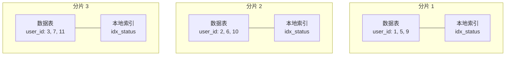
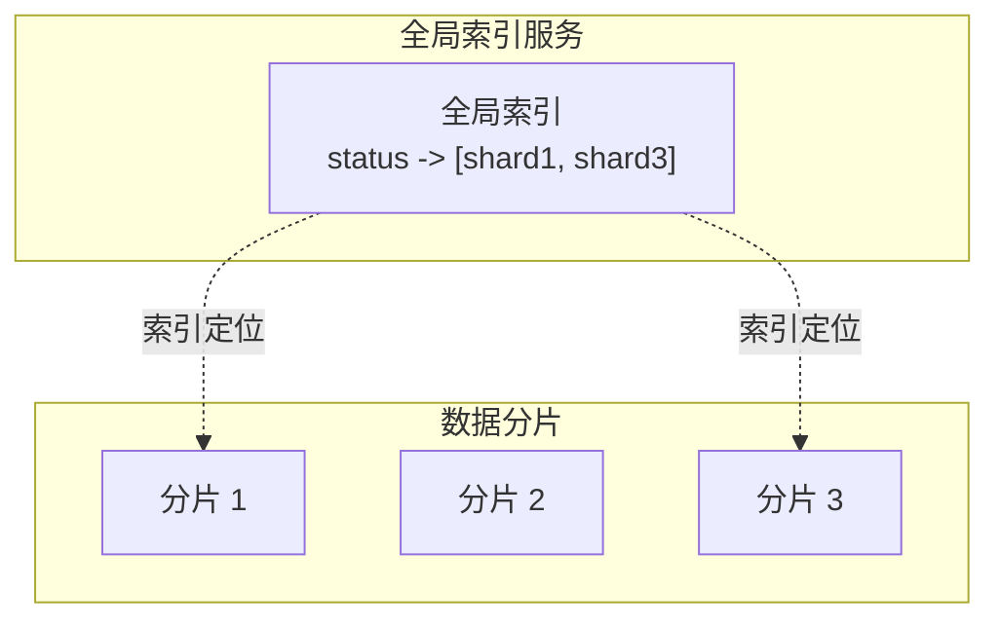
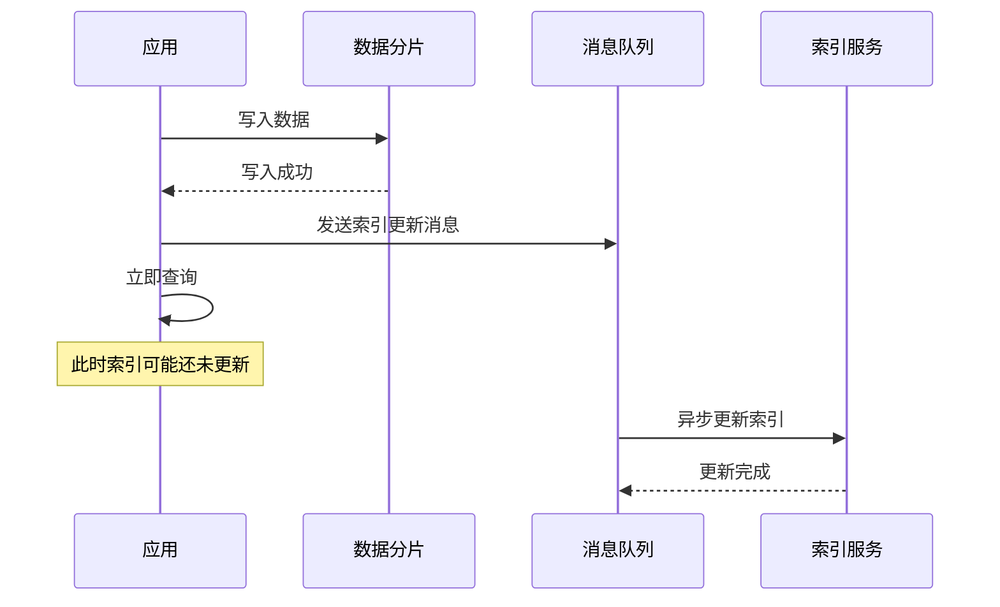
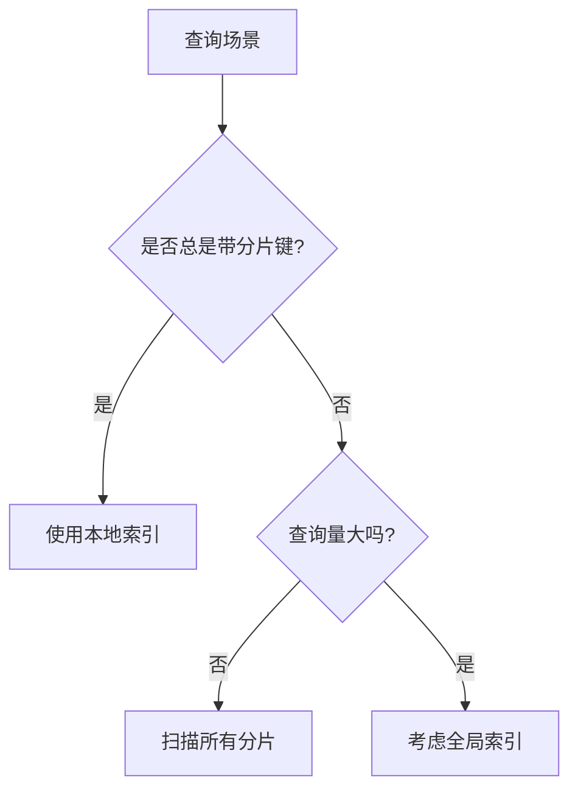

# 分片与二级索引

索引是数据库查询优化的核心。在分片环境下，索引的设计更加复杂——本地索引和全局索引各有优劣，需要根据业务场景选择。

## 本地索引：每个分片维护自己的索引

本地索引（Local Index）是指每个分片独立维护自己的索引，索引和数据在同一个分片内。

### 原理



### 优势

- **写入性能高**：索引和数据在同一分片，单机事务即可保证一致性
- **实现简单**：每个分片像单机数据库一样管理索引
- **无跨分片协调**：不需要额外的索引同步机制

### 局限

**无法高效支持跨分片查询的索引**：

```sql
-- 按 user_id 分片
-- 查询 status = 'pending' 的订单（跨分片）
SELECT * FROM orders WHERE status = 'pending'

-- 本地索引方案：需要扫描所有分片
```

### 实现示例

```sql
-- 每个分片创建本地索引
CREATE INDEX idx_status ON orders (status);
```

```java title="本地索引查询"]
@Service
public class LocalIndexQueryService {

    public List<Order> findByStatus(String status) {
        // 并行查询所有分片的本地索引
        List<CompletableFuture<List<Order>>> futures = shardTemplates.stream()
            .map(template -> CompletableFuture.supplyAsync(() ->
                template.query("SELECT * FROM orders WHERE status = ?", status)
            ))
            .collect(Collectors.toList());

        return futures.stream()
            .map(CompletableFuture::join)
            .flatMap(List::stream)
            .collect(Collectors.toList());
    }
}
```

## 全局索引：独立索引服务

全局索引（Global Index）维护跨分片的全局索引，索引和数据可能不在同一分片。

### 原理



### 优势

- **跨分片查询高效**：通过全局索引直接定位到相关分片
- **支持更多查询模式**：不依赖分片键的查询也能高效

### 局限

- **写入放大**：数据变更时需要同时更新全局索引
- **一致性挑战**：数据写入和索引更新需要协调
- **实现复杂**：需要单独的索引服务或存储

### 实现示例

```java title="全局索引服务"]
@Service
public class GlobalIndexService {

    private final Map<String, Set<String>> index = new ConcurrentHashMap<>();
    private final Map<String, ShardTemplate> shards;

    public void addToIndex(String indexedValue, String shardId, String rowKey) {
        String indexKey = indexedValue;
        Set<String> postings = index.computeIfAbsent(indexKey, k ->
            ConcurrentHashMap.newKeySet()
        );
        postings.add(shardId + ":" + rowKey);
    }

    public void removeFromIndex(String indexedValue, String shardId, String rowKey) {
        String indexKey = indexedValue;
        Set<String> postings = index.get(indexKey);
        if (postings != null) {
            postings.remove(shardId + ":" + rowKey);
        }
    }

    public List<Location> search(String indexedValue) {
        Set<String> postings = index.get(indexedValue);
        if (postings == null || postings.isEmpty()) {
            return Collections.emptyList();
        }

        return postings.stream()
            .map(loc -> {
                String[] parts = loc.split(":");
                return new Location(parts[0], parts[1]);
            })
            .collect(Collectors.toList());
    }
}
```

## 索引同步延迟

全局索引的同步延迟是必须面对的问题。

### 同步方式

**同步写入**：数据写入和索引更新在同一事务中。延迟低，但写入性能受影响。

```java title="同步索引更新"]
@Service
public class SyncIndexWriter {

    @Transactional
    public void writeOrder(Order order) {
        // 写入数据
        shardTemplate.save(order);

        // 同步更新全局索引
        globalIndexService.addToIndex(
            order.getStatus(),
            shardId,
            order.getId().toString()
        );
    }
}
```

**异步写入**：数据先写入，索引更新异步进行。写入性能好，但存在索引延迟。

```java title="异步索引更新"]
@Service
public class AsyncIndexWriter {

    private final KafkaTemplate kafka;

    public void writeOrder(Order order) {
        // 写入数据
        shardTemplate.save(order);

        // 发送索引更新消息
        IndexUpdateMessage msg = new IndexUpdateMessage(
            IndexOperation.ADD,
            "status",
            order.getStatus(),
            shardId,
            order.getId().toString()
        );
        kafka.send("index-updates", msg);
    }

    @KafkaListener(topics = "index-updates")
    public void handleIndexUpdate(IndexUpdateMessage msg) {
        switch (msg.getOperation()) {
            case ADD:
                globalIndexService.addToIndex(msg.getValue(), msg.getShardId(), msg.getRowKey());
                break;
            case REMOVE:
                globalIndexService.removeFromIndex(msg.getValue(), msg.getShardId(), msg.getRowKey());
                break;
        }
    }
}
```

### 延迟影响



## 索引设计原则

### 选择合适的索引类型

**分片键查询为主**：使用本地索引即可，无需全局索引。

**非分片键查询多**：考虑全局索引或热点数据预聚合。

**复合场景**：分片键查询用本地索引，非分片键查询用全局索引。

### 索引与分片键的关系



### 索引数量控制

索引不是越多越好。每个索引都会增加写入开销和存储成本。

**建议**：

- 核心查询字段建立索引
- 高频组合查询考虑复合索引
- 定期评估索引使用率，删除无用的索引

```java title="索引使用率监控"]
@Service
public class IndexUsageMonitor {

    public Map<String, Double> getIndexUsageRates() {
        Map<String, Double> rates = new HashMap<>();

        for (String shardId : shardIds) {
            List<IndexStats> stats = getIndexStats(shardId);

            for (IndexStats stat : stats) {
                double hitRate = stat.getHits() * 1.0 / stat.getTotalScans();
                rates.merge(stat.getIndexName(), hitRate, (a, b) -> (a + b) / 2);
            }
        }

        return rates;
    }

    public List<String> getUnusedIndexes(double threshold) {
        return getIndexUsageRates().entrySet().stream()
            .filter(e -> e.getValue() < threshold)
            .map(Map.Entry::getKey)
            .collect(Collectors.toList());
    }
}
```

## 二级索引实现方案对比

| 维度 | 本地索引 | 全局索引 |
| --- | --- | --- |
| 写入性能 | 高 | 低（有额外开销） |
| 跨分片查询 | 需扫描所有分片 | 高效 |
| 一致性 | 强（单机事务） | 弱（需同步机制） |
| 实现复杂度 | 低 | 高 |
| 适用场景 | 分片键查询 | 非分片键查询 |

## 常见误区

**误区一：所有字段都建索引**

索引会降低写入性能，增加存储成本。只对高频查询字段建索引。

**误区二：全局索引能解决所有查询问题**

全局索引引入写入开销和一致性问题。应该评估是否真的需要。

**误区三：索引和分片策略无关**

索引设计应该配合分片策略。如果某个查询特别频繁，可以考虑调整分片键。

## 延伸思考

二级索引是分片系统的重要扩展。好的索引设计应该：

1. **理解查询模式**：哪些查询频繁、哪些查询偶尔
2. **选择合适类型**：本地索引还是全局索引
3. **控制索引数量**：避免过度索引
4. **监控索引效果**：定期评估索引使用率

索引设计的核心是权衡——查询性能 vs 写入性能、一致性 vs 可用性。根据业务特点找到平衡点。
