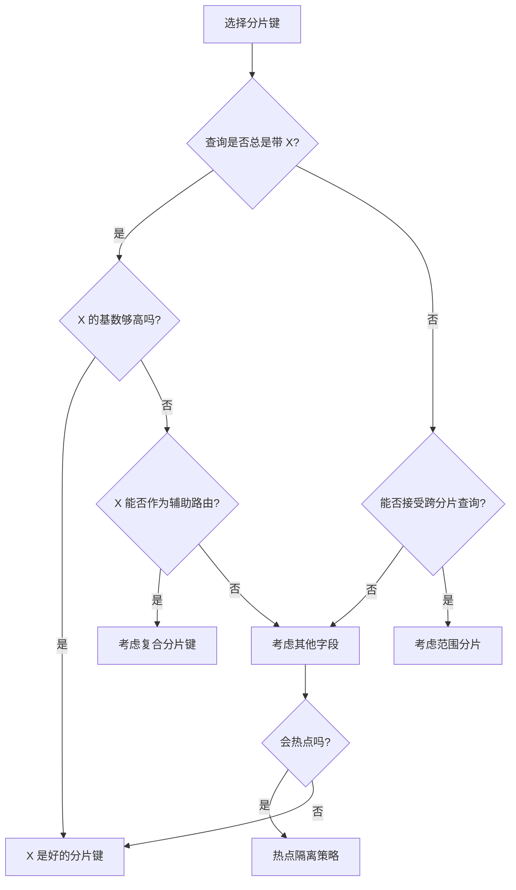

# 分片键设计最佳实践

分片键是分片系统的基石。一旦选定，修改代价极高——需要迁移数据、更新路由、验证一致性。在设计阶段投入足够精力，是避免未来灾难的关键。

## 分片键选择原则

分片键的选择直接影响分片系统的效果。好的分片键能让数据均匀分布、查询高效；差的分片键会导致热点、性能退化。

### 核心原则

| 原则 | 说明 |
| --- | --- |
| 高基数 | 分片键取值范围要大，能生成足够多的分片 |
| 分布均匀 | 数据能均匀分布到各个分片，避免热点分片 |
| 访问局部性 | 查询涉及的关联数据最好在同一个分片 |
| 业务适配 | 符合业务主要访问模式 |

### 评估维度

**基数（Cardinality）**：分片键的不同值有多少？10 个值只能生成 10 个分片，1 亿个值可以生成足够多的分片。

**分布（Distribution）**：每个分片的预期数据量是多少？分片键的取值分布是否均匀？

**查询模式（Query Pattern）**：主要查询是否带分片键？有哪些跨分片查询场景？

**增长率（Growth Rate）**：分片键值的增长趋势如何？是否会导致某些分片数据量远超其他分片？

## 常见分片键

### 用户 ID

用户 ID 是最常见的分片键，适用于用户相关数据的存储。

**优点**：高基数、分布均匀、查询总是带用户 ID。

**适用场景**：用户中心、订单系统（按买家或卖家分片）。

```java title="用户 ID 分片"]
@Service
public class UserBasedShardRouter {

    private final ConsistentHashRouter router;

    public String routeForUser(Long userId) {
        return router.route(userId.toString());
    }

    public String routeForOrder(Long buyerId) {
        // 订单按买家 ID 分片
        return router.route(buyerId.toString());
    }

    public String routeForAddress(Long userId) {
        // 地址按用户 ID 分片，保证用户和地址在同一分片
        return router.route(userId.toString());
    }
}
```

### 时间

时间分片键适合时间序列数据。

**优点**：支持高效的范围查询、归档策略清晰。

**缺点**：可能产生热点（新数据集中在最新分片）。

```java title="时间分片"]
@Service
public class TimeBasedShardRouter {

    private static final String SHARD_PREFIX = "shard_";

    public String getShardKey(LocalDate date) {
        // 按月分片
        return String.format("%d_%02d", date.getYear(), date.getMonthValue());
    }

    public String getShardName(LocalDate date) {
        return SHARD_PREFIX + getShardKey(date);
    }

    public String getShardKey(Long timestamp) {
        LocalDate date = LocalDate.ofEpochDay(timestamp / 86400000);
        return getShardKey(date);
    }
}
```

### 地区/地域

地域分片键适合有地域属性的业务。

**优点**：支持就近访问、合规要求（数据主权）。

**缺点**：不同地区数据量可能差异大。

```java title="地区分片"]
@Service
public class RegionBasedShardRouter {

    private final Map<String, String> regionShardMapping = Map.of(
        "CN_EAST", "shard_cn_east",
        "CN_NORTH", "shard_cn_north",
        "US_EAST", "shard_us_east",
        "US_WEST", "shard_us_west"
    );

    public String getShard(String region) {
        return regionShardMapping.getOrDefault(region, "shard_default");
    }
}
```

### 复合分片键

单一分片键无法满足复杂需求时，可以考虑复合分片键。

```java title="复合分片键"]
@Service
public class CompositeShardRouter {

    public String getShardKey(String region, Long userId) {
        // 地区前缀 + 用户 ID 取模
        // 保证同一地区的用户数据分散到多个分片
        return region + ":" + (userId % 1000);
    }

    public String getShard(String region, Long userId) {
        String key = getShardKey(region, userId);
        return consistentHashRouter.route(key);
    }
}
```

## 分片键修改代价

分片键一旦确定，修改代价极高。

### 修改成本估算

| 操作 | 成本 | 说明 |
| --- | --- | --- |
| 数据迁移 | 极高 | 需要迁移所有历史数据 |
| 路由改造 | 高 | 应用层路由逻辑需要重写 |
| 测试验证 | 高 | 需要回归测试所有查询场景 |
| 停机时间 | 视情况 | 取决于迁移策略 |

### 什么时候需要修改分片键

- 分片键导致严重的热点分片
- 业务访问模式发生重大变化
- 最初的分片键选择有误

### 修改前的评估

```java title="分片键修改评估"]
@Service
public class ShardKeyMigration评估 {

    public Migration评估评估修改(String tableName, String oldKey, String newKey) {
        // 1. 统计当前数据量
        long totalRecords = countRecords(tableName);

        // 2. 分析新分片键的分布
        Map<String, Long> newDistribution = analyzeDistribution(tableName, newKey);

        // 3. 评估迁移时间
        long estimatedHours = estimateMigrationTime(totalRecords);

        // 4. 评估业务影响
        List<QueryPattern> affectedQueries = findAffectedQueries(tableName);

        return new Migration评估(
            totalRecords,
            newDistribution,
            estimatedHours,
            affectedQueries
        );
    }

    private long estimateMigrationTime(long recordCount) {
        // 假设每秒迁移 10000 条记录
        long seconds = recordCount / 10000;
        return seconds / 3600; // 小时
    }
}
```

## 分片键设计检查清单

设计分片键前，逐一检查以下问题：

### 基数检查

- 分片键的不同值能超过 1000 个吗？
- 预期数据量需要多少分片？
- 分片数量是否满足未来 2-3 年增长需求？

### 分布检查

- 数据会均匀分布吗？
- 是否有明显的数据倾斜风险？
- 热点分片的访问量会是平均分片的多少倍？

### 查询检查

- 主要查询是否带分片键？
- 是否有不带分片键的查询？
- 跨分片查询的性能是否可以接受？

### 业务检查

- 分片键是否稳定？（用户 ID 比手机号更稳定）
- 分片键是否涉及敏感信息？（地区分片可能涉及隐私）
- 分片键变更的代价是否可以承受？

## 分片键设计决策树



## 常见错误

### 错误一：使用低基数字段

```sql
-- 错误：按状态分片，状态只有 3 种，无法扩展
SHARD BY status  -- status IN ('pending', 'processing', 'completed')

-- 正确：按用户 ID 分片，高基数
SHARD BY user_id
```

### 错误二：使用单调递增字段作为唯一分片键

```sql
-- 错误：新数据集中在最新分片，造成热点
SHARD BY id  -- id 是自增主键

-- 正确：结合其他字段分散热点
SHARD BY user_id
```

### 错误三：忽视跨分片关联

```java
// 错误：用户和订单在不同分片，关联查询需要跨分片
// user 在 shard_by_user_id(user_id)
// order 在 shard_by_order_id(order_id)

// 正确：订单按用户 ID 分片，与用户同分片
// order 在 shard_by_user_id(buyer_id)
```

## 最佳实践总结

1. **用户 ID 是万能分片键**：如果没有特殊需求，用户 ID 是最稳妥的选择。

2. **时间分片适合归档数据**：时间序列数据用时间分片，但热点问题需要额外处理。

3. **预留分片数**：初期分片数应该能满足未来 2-3 年需求，避免过早扩容。

4. **设计时考虑查询**：分片键应该匹配主要查询模式。

5. **分片键选择后不要轻易改**：修改代价极高，应该在设计阶段充分论证。

## 延伸思考

分片键设计是「一锤定音」的决策。投入再多时间研究都不为过，因为一旦上线，修改的成本是巨大的。

在确定分片键前，应该做以下工作：

- 分析所有查询的访问模式
- 评估数据分布的均匀度
- 模拟热点场景
- 考虑未来业务变化

好的分片键设计，应该让系统在扩展时不需要触及分片键层面——通过增加分片数或调整路由策略就能满足需求。
