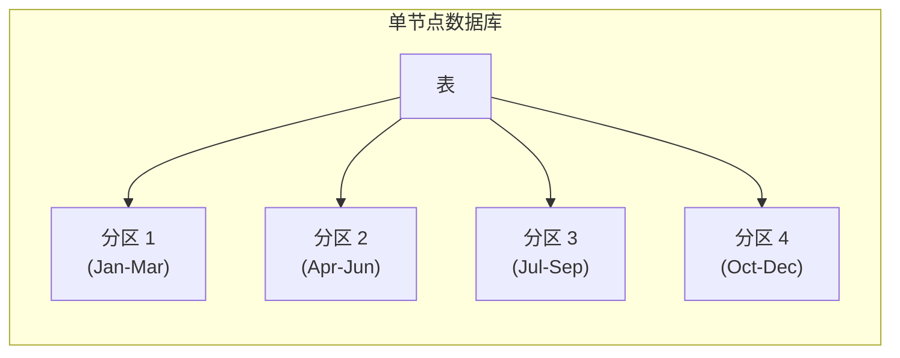
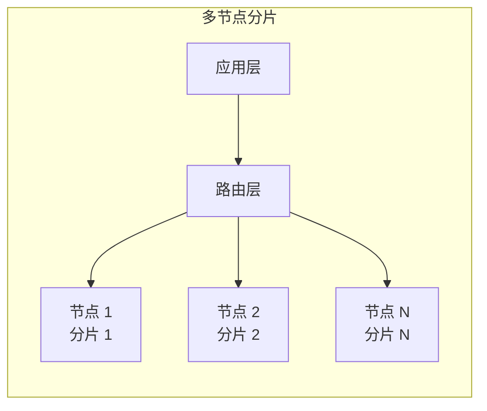
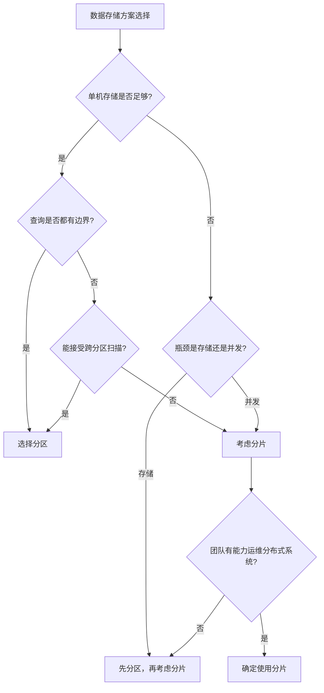

# 分片 vs 分区

数据量大了怎么办？有人会说「分表」，有人说「分库」。但「分」也分两种：分区（Partitioning）和分片（Sharding）。两个概念容易混淆，但解决的问题和使用场景有显著差异。

## 基本概念对比

### 分区（Partitioning）

分区是在**单机数据库内部**，把一张表分成多个分区，每个分区是独立的物理存储单元，但对应用透明。



### 分片（Sharding）

分片是**跨多个数据库节点**，把数据分布到不同节点，每个分片是独立的数据库实例。



## 核心区别

| 维度 | 分区 | 分片 |
| --- | --- | --- |
| 范围 | 单节点内部 | 跨节点 |
| 存储 | 同一服务器的不同分区 | 不同服务器 |
| 透明性 | 对应用透明 | 需要应用层路由 |
| 扩展方式 | 垂直扩展（单机扩容） | 水平扩展（增加节点） |
| 事务 | 单机事务 | 分布式事务 |
| JOIN | 同分区 JOIN 高效 | 跨分片 JOIN 复杂 |
| 备份恢复 | 单表备份 | 多分片协同 |

## 分区的实现

### MySQL 原生分区

```sql
-- 按 RANGE 分区
CREATE TABLE orders (
    id BIGINT PRIMARY KEY,
    user_id BIGINT NOT NULL,
    amount DECIMAL(10,2),
    create_time DATETIME
)
PARTITION BY RANGE (YEAR(create_time)) (
    PARTITION p2022 VALUES LESS THAN (2023),
    PARTITION p2023 VALUES LESS THAN (2024),
    PARTITION p2024 VALUES LESS THAN (2025),
    PARTITION p_future VALUES LESS THAN MAXVALUE
);

-- 按 LIST 分区
CREATE TABLE users (
    id BIGINT PRIMARY KEY,
    region VARCHAR(20)
)
PARTITION BY LIST COLUMNS (region) (
    PARTITION p_east VALUES IN ('BJ', 'TJ', 'HE'),
    PARTITION p_south VALUES IN ('GD', 'FJ', 'HN'),
    PARTITION p_west VALUES IN ('SC', 'YN', 'GZ')
);

-- 按 HASH 分区
CREATE TABLE events (
    id BIGINT PRIMARY KEY,
    user_id BIGINT
)
PARTITION BY HASH (user_id)
PARTITIONS 8;
```

### 分区的查询优化

```sql
-- 分区裁剪：查询自动跳过不相关的分区
EXPLAIN SELECT * FROM orders WHERE create_time >= '2024-01-01' AND create_time < '2024-04-01';

-- 分区索引：每个分区独立索引
CREATE INDEX idx_user ON orders (user_id);
```

## 分片的实现

### 应用层分片

分片逻辑在应用层实现，数据库本身不感知分片。

```java title="应用层分片路由"]
@Service
public class ApplicationShardRouter {

    private final int shardCount = 4;

    public int getShardIndex(Long userId) {
        return (int) (userId % shardCount);
    }

    public DataSource getDataSource(Long userId) {
        int shardIndex = getShardIndex(userId);
        return dataSources.get(shardIndex);
    }

    public void saveOrder(Long userId, Order order) {
        DataSource ds = getDataSource(userId);
        jdbcTemplate.setDataSource(ds);
        jdbcTemplate.update("INSERT INTO orders ...", order);
    }
}
```

### 中间件分片

使用分片中间件（如 ShardingSphere、MyCat），应用层无需修改。

```yaml title="ShardingSphere 分片配置"]
schemaName: app_db

dataSources:
  ds_0:
    dataSourceClassName: com.zaxxer.hikari.HikariDataSource
    jdbcUrl: jdbc:mysql://localhost:3306/ds_0
  ds_1:
    dataSourceClassName: com.zaxxer.hikari.HikariDataSource
    jdbcUrl: jdbc:mysql://localhost:3306/ds_1

rules:
- sharding:
    tables:
      orders:
        actualDataNodes: ds_$->{0..1}
        tableStrategy:
          standard:
            shardingColumn: user_id
            shardingAlgorithmName: orders_mod
    shardingAlgorithms:
      orders_mod:
        type: MOD
        props:
          sharding-count: 4
```

## 使用场景对比

### 什么时候用分区

分区适合以下场景：

- **单表数据量大**：单表超过千万级，单机存储开始紧张
- **查询有明确边界**：可以按时间、地区等分区键做范围查询
- **需要保留历史数据**：分区表便于清理历史分区
- **不需要跨分区查询**：大部分查询在一个分区内完成

**典型场景**：

- 日志表、审计表（按时间分区）
- 订单表（按月份或年份分区）
- 交易记录表（按业务类型分区）

### 什么时候用分片

分片适合以下场景：

- **数据量超大**：单机存储完全不够，需要横向扩展
- **并发写入压力大**：单节点写入成为瓶颈
- **高可用要求高**：需要故障隔离，单机故障不影响其他数据
- **需要跨节点扩展**：业务增长需要不断扩容

**典型场景**：

- 用户中心（海量用户数据）
- 社交 Feed（海量帖子、评论）
- 电商订单（海量历史订单）
- 大数据分析（日志、监控）

## 选择决策树



## 实际案例

### 案例一：订单表演进

**阶段一：单表**

订单量 < 1000 万，单表存储，查询性能良好。

**阶段二：分区**

订单量增长到 5000 万，引入按月份分区。历史月份查询走指定分区，性能稳定。

**阶段三：分片**

订单量突破 1 亿，单机写入成为瓶颈。引入分片，按用户 ID 哈希分到 4 个分片，写入能力提升 4 倍。

### 案例二：用户中心设计

用户中心数据量大、查询频繁，但增长可预测。

**方案**：直接分片

- 按用户 ID 哈希分片
- 初期 8 个分片，预留扩展空间
- 用户数据天然隔离（每个用户只访问自己的数据）

**未选择分区的原因**：

- 分区无法突破单机写入瓶颈
- 用户查询不总是带时间边界

## 常见误区

**误区一：分区和分片可以互换**

两者解决的问题不同。分区解决单机存储问题，分片解决横向扩展问题。

**误区二：分片比分区更高级**

分片不是分区的高级版本，而是不同的扩展手段。分片引入的复杂性远超分区。

**误区三：分片不需要先分区**

大表先分区再分片是常见模式。分区可以解决单分片的容量问题，分片解决整体扩展问题。

**误区四：分区后就不需要分片了**

分区只能解决单节点存储问题，无法解决并发写入问题。当写入成为瓶颈时，仍需要分片。

## 延伸思考

分区和分片不是非此即彼的关系，而是可以组合使用。

**推荐策略**：

1. **先分区**：数据量大但并发不高时，优先分区
2. **后分片**：分区无法解决时，再考虑分片
3. **分片内分区**：分片后，单分片内部仍可分区

这种组合策略让系统在每个阶段都有合适的扩展方案。

理解分区和分片的区别，才能做出正确的架构决策。没有最好的方案，只有最适合当前阶段的方案。
