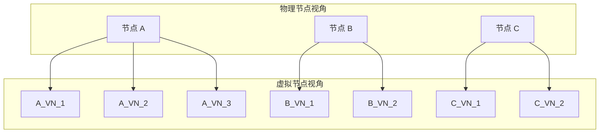

# 虚拟节点与负载均衡

一致性哈希解决了扩容迁移问题，但引入了新问题：节点少时数据分布不均匀。虚拟节点（Virtual Nodes）通过在哈希环上创建多个「分身」，让数据分布更加均衡。

## 物理节点 vs 虚拟节点

**物理节点**：真实的服务器节点，每个节点在哈希环上只有一个位置。

**虚拟节点**：物理节点在哈希环上的「分身」。一个物理节点可以有多个虚拟节点，每个虚拟节点独立映射到哈希环。



## 虚拟节点数量设计

虚拟节点数量越多，数据分布越均匀，但路由计算开销也越大。

### 数量选择原则

**太少**：数据分布不均匀，热点问题明显。

**太多**：路由计算开销增加，内存占用增加。

**推荐值**：每个物理节点 100-200 个虚拟节点。

```java title="虚拟节点数量配置"
@Service
public class VirtualNodeConfig {

    // 推荐范围：100-200
    private static final int DEFAULT_VIRTUAL_NODES = 150;

    public int calculateVirtualNodes(int physicalNodes, long totalDataSize) {
        // 数据量大时，可以增加虚拟节点数
        if (totalDataSize > 1_000_000_000L) { // 10 亿级以上
            return 200;
        }
        return DEFAULT_VIRTUAL_NODES;
    }
}
```

### 数量与均匀度关系

| 物理节点数 | 虚拟节点数 | 数据分布均匀度 |
| --- | --- | --- |
| 3 | 1 | 差，可能差 3-5 倍 |
| 3 | 10 | 一般，可能差 2 倍 |
| 3 | 100 | 较好，误差 `<` 10% |
| 3 | 150 | 好，误差 `<` 5% |
| 10 | 100 | 很好，误差 `<` 3% |

## 负载均衡优化

虚拟节点不仅解决分布均匀问题，还能实现更精细的负载均衡。

### 权重支持

不同物理节点可能有不同的容量（如磁盘大小、内存大小）。通过调整虚拟节点数量，可以实现按权重分配。

```java title="带权重的虚拟节点环"
@Service
public class WeightedVirtualNodeRing<T> {

    private final TreeMap<Long, T> ring = new TreeMap<>();
    private final Map<T, Long> nodeWeights = new HashMap<>();

    public void addNode(T node, long weight) {
        nodeWeights.put(node, weight);

        // 权重决定虚拟节点数量（权重越大，虚拟节点越多）
        int virtualNodes = calculateVirtualNodes(weight);

        for (int i = 0; i < virtualNodes; i++) {
            String virtualNodeKey = node.toString() + "_VN_" + i;
            long hash = hash(virtualNodeKey);
            ring.put(hash, node);
        }
    }

    private int calculateVirtualNodes(long weight) {
        // 基准权重 100，比例计算虚拟节点数
        long baseWeight = 100;
        return (int) Math.max(10, weight / baseWeight * 150);
    }

    public T route(String key) {
        long keyHash = hash(key);
        Map.Entry<Long, T> entry = ring.ceilingEntry(keyHash);

        if (entry == null) {
            entry = ring.firstEntry();
        }

        return entry.getValue();
    }
}
```

### 动态调整

物理节点负载变化时，可以动态调整虚拟节点数量，将负载高的节点部分虚拟节点迁移到其他节点。

```java title="负载感知调整"
@Service
public class LoadAwareSharding {

    private final ConsistentHashRing<String> ring;
    private final LoadMonitor loadMonitor;

    public void rebalanceIfNeeded() {
        Map<String, Double> loads = loadMonitor.getCurrentLoads();

        // 找出负载过高的节点
        for (Map.Entry<String, Double> entry : loads.entrySet()) {
            if (entry.getValue() > 0.8) { // 负载超过 80%
                // 减少该节点的虚拟节点数
                ring.reduceVirtualNodes(entry.getKey());
                System.out.println("节点 " + entry.getKey() + " 负载过高，减少虚拟节点");
            } else if (entry.getValue() < 0.2) { // 负载低于 20%
                // 增加该节点的虚拟节点数
                ring.addVirtualNodes(entry.getKey());
                System.out.println("节点 " + entry.getKey() + " 负载过低，增加虚拟节点");
            }
        }
    }
}
```

## 迁移量控制

虚拟节点还有一个重要作用：控制扩容时的迁移量。

### 扩容迁移策略

传统一致性哈希：新增节点 N+1，只迁移 1/(N+1) 数据。

虚拟节点一致性哈希：可以更精细地控制迁移量。

```java title="增量迁移策略"
@Service
public class IncrementalMigration {

    private final ConsistentHashRing<String> ring;
    private final Map<String, Long> dataSizes = new ConcurrentHashMap<>();

    public MigrationPlan planMigration(String newNode) {
        // 计算当前数据分布
        Map<String, Long> distribution = calculateCurrentDistribution();

        // 计算新节点应该承担的数据量
        long totalData = distribution.values().stream().mapToLong(Long::longValue).sum();
        long targetSize = totalData / (ring.getNodeCount() + 1);

        // 计算需要从哪些节点迁移多少数据
        Map<String, Long> migrationPlan = new HashMap<>();
        for (Map.Entry<String, Long> entry : distribution.entrySet()) {
            long excess = entry.getValue() - targetSize;
            if (excess > 0) {
                migrationPlan.put(entry.getKey(), Math.min(excess, targetSize));
            }
        }

        return new MigrationPlan(newNode, migrationPlan, targetSize);
    }

    public static class MigrationPlan {
        public final String newNode;
        public final Map<String, Long> sourceNodes;
        public final long targetSize;

        public MigrationPlan(String newNode, Map<String, Long> sourceNodes, long targetSize) {
            this.newNode = newNode;
            this.sourceNodes = sourceNodes;
            this.targetSize = targetSize;
        }
    }
}
```

### 分批迁移

大数据量迁移时，应该分批进行，避免一次性迁移导致系统压力。

```java title="分批迁移控制"
@Service
public class BatchMigrationController {

    private static final int BATCH_SIZE = 10_000;
    private static final long BATCH_INTERVAL_MS = 1000;

    public void migrateData(String sourceNode, String targetNode, long totalCount) {
        long migrated = 0;
        long batches = (totalCount + BATCH_SIZE - 1) / BATCH_SIZE;

        for (long batch = 0; batch < batches; batch++) {
            // 迁移一批数据
            migrateBatch(sourceNode, targetNode, batch * BATCH_SIZE, BATCH_SIZE);
            migrated += BATCH_SIZE;

            // 记录进度
            double progress = (double) migrated / totalCount * 100;
            System.out.printf("迁移进度: %.2f%% (%d/%d)%n", progress, migrated, totalCount);

            // 间隔一段时间再迁移下一批
            if (batch < batches - 1) {
                try {
                    Thread.sleep(BATCH_INTERVAL_MS);
                } catch (InterruptedException e) {
                    Thread.currentThread().interrupt();
                    break;
                }
            }
        }
    }

    private void migrateBatch(String source, String target, long offset, int limit) {
        // 实际迁移逻辑
    }
}
```

## 虚拟节点完整实现

```java title="虚拟节点一致性哈希环"
public class VirtualNodeHashRing<T> {

    private final TreeMap<Long, T> ring = new TreeMap<>();
    private final Map<T, Set<Long>> nodeToVirtualHashes = new HashMap<>();
    private final HashFunction hashFunction;
    private final int virtualNodesPerPhysical;

    public VirtualNodeHashRing() {
        this(150);
    }

    public VirtualNodeHashRing(int virtualNodesPerPhysical) {
        this(new MurmurHashFunction(), virtualNodesPerPhysical);
    }

    public VirtualNodeHashRing(HashFunction hashFunction, int virtualNodesPerPhysical) {
        this.hashFunction = hashFunction;
        this.virtualNodesPerPhysical = virtualNodesPerPhysical;
    }

    public void addNode(T node) {
        addNode(node, virtualNodesPerPhysical);
    }

    public void addNode(T node, int virtualNodes) {
        Set<Long> hashes = new HashSet<>();
        for (int i = 0; i < virtualNodes; i++) {
            String virtualNodeKey = node.toString() + "_VN_" + i;
            long hash = hashFunction.hash(virtualNodeKey);
            ring.put(hash, node);
            hashes.add(hash);
        }
        nodeToVirtualHashes.put(node, hashes);
    }

    public void removeNode(T node) {
        Set<Long> hashes = nodeToVirtualHashes.remove(node);
        if (hashes != null) {
            for (Long hash : hashes) {
                ring.remove(hash);
            }
        }
    }

    public T route(String key) {
        if (ring.isEmpty()) {
            throw new IllegalStateException("哈希环为空");
        }

        long keyHash = hashFunction.hash(key);
        Map.Entry<Long, T> entry = ring.ceilingEntry(keyHash);

        if (entry == null) {
            entry = ring.firstEntry();
        }

        return entry.getValue();
    }

    public int getPhysicalNodeCount() {
        return nodeToVirtualHashes.size();
    }

    public int getVirtualNodeCount() {
        return ring.size();
    }

    public Map<T, Double> getDistribution() {
        Map<T, Long> counts = new HashMap<>();
        for (T node : nodeToVirtualHashes.keySet()) {
            counts.put(node, 0L);
        }

        for (Map.Entry<Long, T> entry : ring.entrySet()) {
            counts.merge(entry.getValue(), 1L, Long::sum);
        }

        int total = ring.size();
        Map<T, Double> distribution = new HashMap<>();
        for (Map.Entry<T, Long> entry : counts.entrySet()) {
            distribution.put(entry.getKey(), (double) entry.getValue() / total);
        }
        return distribution;
    }
}
```

## 常见误区

**误区一：虚拟节点越多越好**

虚拟节点越多，均匀度越好，但路由计算开销和内存占用也增加。找到平衡点即可。

**误区二：虚拟节点不需要管理**

虚拟节点也需要生命周期管理。节点添加、移除时，需要同步更新虚拟节点映射。

**误区三：负载均衡只靠虚拟节点**

虚拟节点只是静态均衡。动态负载均衡（如热点检测、容量调度）需要额外的监控和调度机制。

**误区四：迁移可以瞬间完成**

大数据量迁移需要时间。应该设计分批迁移策略，并监控迁移进度。

## 延伸思考

虚拟节点是一致性哈希的进化版本，它解决了数据分布均匀的问题。但它不是银弹：

- 虚拟节点数量需要根据实际情况调优
- 动态负载均衡需要配套的监控和调度机制
- 迁移策略需要根据业务特点设计

理解虚拟节点的原理和应用场景，是构建高可用分布式存储系统的基础。
