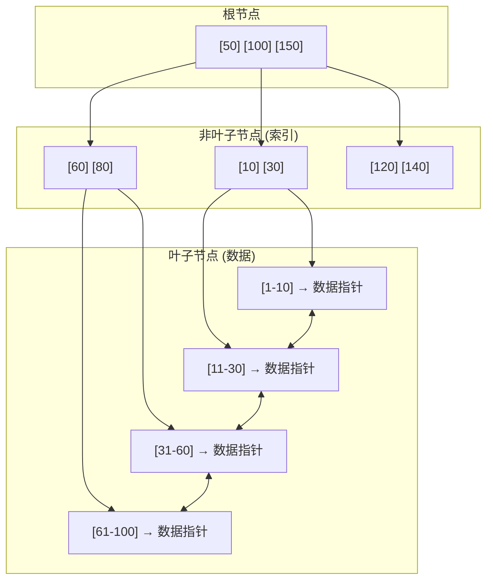

# B+ Tree 原理详解

MySQL 的 InnoDB 为什么用 B+ Tree 而不是哈希索引？除了范围查询，还有什么决定了这个选择？

B+ Tree 是数据库索引的基石，理解它的结构和工作原理，是理解数据库性能的必经之路。

## B+ Tree 结构

B+ Tree 是一种自平衡的多路搜索树，与二叉搜索树不同，B+ Tree 的每个节点可以有多个子节点（通常几十到几百个）。

```
        [50, 100]
       /    |    \
   [10,30] [50,80] [100,150]
    / | \    / | \     / | \
  ... ...  ... ...   ... ...
```

B+ Tree 的特点：

- **所有数据都在叶子节点**：非叶子节点只存储索引
- **叶子节点链表相连**：支持范围遍历
- **所有叶子节点深度相同**：查询时间稳定



## B+ Tree 查找

查找 key = 45：

```java
public class BPlusTree {
    public byte[] search(int key) {
        // 1. 从根节点开始
        Node current = root;
        
        // 2. 非叶子节点：二分查找子树
        while (!current.isLeaf()) {
            int index = current.binarySearch(key);
            current = current.getChild(index);
        }
        
        // 3. 叶子节点：二分查找数据
        int index = current.binarySearch(key);
        if (index >= 0) {
            return current.getValue(index);
        }
        
        return null;  // 未找到
    }
}
```

时间复杂度：`O(log_m n)`，其中 m 是每个节点的子节点数，n 是总数据量。

## B+ Tree 插入

插入 key = 25：

### 情况一：叶子节点未满

直接插入到有序位置。

### 情况二：叶子节点已满

需要分裂（Split）：

```
原节点: [10, 20, 30, 40, 50] (已满，5个)
        ↓ 分裂
左节点: [10, 20, 30]        (保留前3个)
右节点: [40, 50]            (新建，保留后2个)
中位数: 40                  (提升到父节点)
```

```java
public void insert(int key, byte[] value) {
    // 1. 找到应该插入的叶子节点
    LeafNode leaf = findLeaf(key);
    
    // 2. 尝试插入
    if (leaf.size() < MAX_ENTRIES) {
        leaf.insert(key, value);
    } else {
        // 3. 叶子节点分裂
        LeafNode newLeaf = leaf.split();
        
        // 4. 中位数提升到父节点
        int midKey = leaf.getMidKey();
        insertIntoParent(leaf, midKey, newLeaf);
    }
}
```

### 递归分裂

如果父节点插入后也满了，继续分裂，一直递归到根节点。

## B+ Tree 与 B Tree 的区别

| 特性 | B+ Tree | B Tree |
|---|---|---|
| 叶子节点 | 只存数据指针 | 存数据和指针 |
| 非叶子节点 | 只存索引（更小） | 存数据和索引 |
| 叶子链表 | 相邻叶子相连 | 不相连 |
| 范围查询 | 只需遍历链表 | 需要回溯树 |
| 查询效率 | 稳定 O(log n) | 最差可能 O(1) |

```
B Tree (每个节点都存数据):
        [50(Ptr)]
       /    |    \
   [30]   [50]   [80]
   /|\     |     /|\
  ...      ↑    ...
        数据在内部节点

B+ Tree (只有叶子存数据):
        [50] [100]
       /    |    \
   [...]  [...]  [...]
    |       |       |
  数据     数据     数据 ← 叶子节点链表相连
```

## B+ Tree 在 InnoDB 中的应用

InnoDB 使用 B+ Tree 作为主键索引（Clustered Index）：

```sql
-- 主键索引 (Clustered Index)
CREATE TABLE orders (
    id BIGINT PRIMARY KEY,  -- 主键，B+ Tree 的 key
    customer_id BIGINT,
    amount DECIMAL,
    ...
);

-- 索引结构:
-- B+ Tree 的叶子节点包含完整的行数据
-- 按主键排序存储
```

### 辅助索引

除了主键索引，InnoDB 还支持辅助索引（Secondary Index）：

```sql
CREATE INDEX idx_customer ON orders(customer_id);

-- 辅助索引结构:
-- B+ Tree 的 key = customer_id
-- B+ Tree 的 value = 主键值（而非完整行数据）
```

查询时，如果使用辅助索引：

```java
// SELECT * FROM orders WHERE customer_id = 1001;
// 先通过辅助索引找到主键
// 再通过主键索引找到完整数据
public List<Order> findByCustomerId(long customerId) {
    // 1. 辅助索引查找主键
    List<Long> primaryKeys = secondaryIndex.search(customerId);
    
    // 2. 主键索引查找完整数据
    return primaryKeys.stream()
        .map(this::findByPrimaryKey)
        .collect(Collectors.toList());
}
```

这就是 **回表（Table Lookup）**：先查辅助索引拿到主键，再查主键索引拿完整数据。

## 索引覆盖

如果查询只需要索引中的数据，不需要回表，这就是**覆盖索引（Covering Index）**：

```sql
-- 覆盖索引查询
SELECT customer_id, COUNT(*) 
FROM orders 
GROUP BY customer_id;

-- 执行计划: Using index (覆盖索引，不需要回表)
```

```java
// 代码层面判断是否覆盖索引
public boolean isCovering(Query query, Index index) {
    Set<String> required = query.getRequiredColumns();
    Set<String> indexed = index.getColumns();
    return indexed.containsAll(required);
}
```

> **性能提示**：覆盖索引可以避免回表，显著提升查询性能。写 SQL 时，尽量只查询索引列，或使用索引覆盖。

## B+ Tree 的代价

**空间放大**：内部节点也存储指针，消耗空间。

**插入/删除成本**：可能触发节点分裂或合并，需要维护平衡。

**不适合写入密集**：每次写入都可能触发磁盘随机 I/O（更新索引）。

这些代价推动了 LSM Tree 等写入优化结构的发展。
