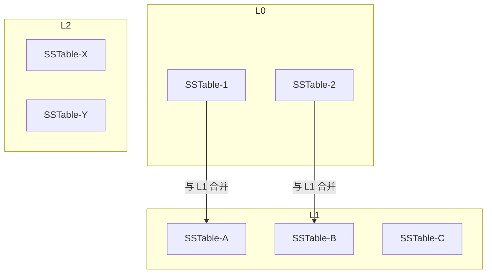
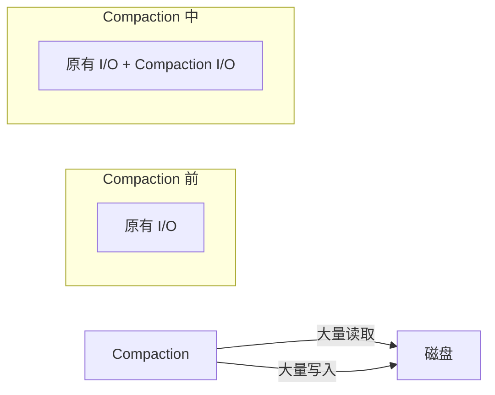

# LSM Tree 的 Compaction 策略

LSM Tree 的数据不更新，只追加。旧数据会一直占用空间，需要定期「合并清理」。这个过程叫 **Compaction**。

Compaction 是 LSM Tree 最复杂的部分，也是调优的重点。

## 为什么需要 Compaction

LSM Tree 的写入是追加的，同一个 key 可能有多份副本：

```
写入过程:
key=A, value=1      → MemTable
key=A, value=2      → MemTable (更新)
key=A 被删除         → MemTable (Tombstone)

磁盘上可能存在:
L0: [A=2, B=1]     (包含 A 的更新)
L1: [A=1, C=1]     (包含 A 的旧值)
L2: [A=0, D=1]      (包含 A 的更旧值)
```

问题：

- **空间浪费**：同一 key 多份副本，占用额外空间
- **读放大**：查询需要检查多层

Compaction 就是把重复的 key 合并，只保留最新值。

## Compaction 策略分类

### Leveled Compaction

Leveled Compaction 把数据分层，每层容量指数增长：

```
L1: 容量 = 10 × L0
L2: 容量 = 10 × L1
L3: 容量 = 10 × L2
...
```

每层只包含有序的、无重复 key 的 SSTable。



### Leveled Compaction 流程

```java
public class LeveledCompaction {
    public void compact(int level) {
        // 1. 选择一层中一个 SSTable
        SSTable input = selectSSTable(level);
        
        // 2. 与下一层有重叠的 SSTable 合并
        List<SSTable> overlapped = findOverlapping(level + 1, input);
        
        // 3. 合并写入下一层
        List<SSTable> merged = merge(input, overlapped);
        
        // 4. 删除旧 SSTable，添加新的
        deleteSSTables(input, overlapped);
        writeSSTables(level + 1, merged);
    }
}
```

### Size-Tiered Compaction

Size-Tiered 不分层，按文件大小组织：

```
Tier 0: 小文件
Tier 1: 稍大文件
Tier 2: 更大的文件
...
```

当某个 Tier 的文件数量达到阈值，触发合并：

```java
public class SizeTieredCompaction {
    public void maybeCompact() {
        for (Tier tier : tiers) {
            if (tier.fileCount >= TIER_SIZE_THRESHOLD) {
                compact(tier);
            }
        }
    }
    
    public void compact(Tier tier) {
        // 合并该 Tier 所有文件
        SSTable merged = mergeAll(tier.sstables);
        
        // 写入上一级 Tier
        moveToNextTier(merged);
        
        // 删除旧文件
        deleteSSTables(tier.sstables);
    }
}
```

## 两种策略对比

| 特性 | Leveled | Size-Tiered |
|---|---|---|
| 空间放大 | 低（~10%~20%） | 中（~50%） |
| 写放大 | 高（~25x） | 低（~3x） |
| 读放大 | 低 | 中 |
| 写入平稳性 | 平稳 | 可能突增 |

**写放大计算（Leveled）**：

```
一次写入可能在 Compaction 链中被放大 N 倍：
假设每层容量是上层的 10 倍
Level 0 → Level 1: 10x (整层合并)
Level 1 → Level 2: 10x
Level 2 → Level 3: 10x
总写放大: 约 30x
```

## Compaction 的代价

### 磁盘 I/O 风暴

Compaction 是重操作，会消耗大量磁盘 I/O：



### 写入速率影响

Compaction 会和正常写入竞争磁盘带宽：

```java
// Compaction 速率控制
public class CompactionThrottler {
    private static final long MAX_COMPACTION_BYTES_PER_SEC = 100 * 1024 * 1024; // 100MB/s
    
    public void compact(SSTable input) {
        long bytesWritten = 0;
        long startTime = System.currentTimeMillis();
        
        while (!input.isExhausted()) {
            // 节流控制
            throttle();
            
            // 写入
            byte[] chunk = input.readNextChunk(CHUNK_SIZE);
            write(chunk);
            bytesWritten += chunk.length;
        }
        
        // 确保不超过速率限制
        enforceRateLimit(bytesWritten, startTime);
    }
}
```

## Compaction 调优参数

### RocksDB Compaction 配置

```java
// RocksDB 配置示例
Options options = new Options();
options.level0_file_num_compaction_trigger = 4;     // L0 文件数达到 4 时触发合并
options.max_bytes_for_level_base = 256 * 1024 * 1024;  // L1 容量 256MB
options.max_bytes_for_level_multiplier = 10;        // 每层容量是上层的 10 倍
options.compaction_style = CompactionStyle.LEVEL;  // Leveled Compaction

// 动态调整 Compaction 优先级
options.compaction_priority = CompactionPriority.MinOverlappingRatio;
```

### 常见问题与调优

**写入抖动严重**？

```
原因: Compaction 速率跟不上写入速率
解决:
1. 降低每层容量乘数（max_bytes_for_level_multiplier）
2. 增加 Compaction 线程数
3. 使用更快的存储（SSD）
```

**读取延迟高**？

```
原因: 读取需要检查太多层
解决:
1. 减少层数（降低 max_bytes_for_level_multiplier）
2. 使用 Bloom Filter 减少无效读取
3. 增加内存缓存大小
```

**空间不足**？

```
原因: Compaction 来不及清理垃圾数据
解决:
1. 监控空间放大比例
2. 手动触发 Compaction
3. 清理 Tombstone 较多的数据
```

## 选择 Compaction 策略

**选择 Leveled Compaction**：

- 对空间放大敏感（存储成本高）
- 写入速率平稳
- 读取延迟要求低

**选择 Size-Tiered Compaction**：

- 写入突增场景
- 写放大敏感
- 可以容忍稍高的空间放大

> **经验之谈**：大多数场景下，Leveled Compaction 是更好的选择。但如果你的场景是「写入为主、偶尔大量删除」，Size-Tiered 可能更合适。生产环境建议先用 Leveled，观察一段时间后再根据实际情况调整。
