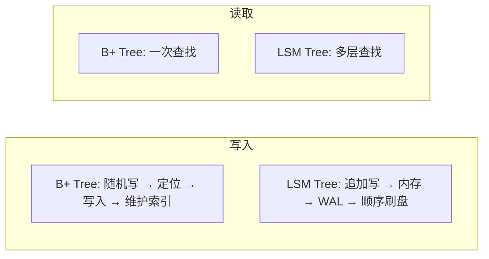

# B+ Tree 与 LSM Tree 对比

选 MySQL 还是 HBase？用 RocksDB 还是 InnoDB？这个问题没有标准答案，但有一个系统的思考框架。

B+ Tree 和 LSM Tree 是两种最主流的存储结构，它们的设计哲学截然不同。

## 核心差异

```
B+ Tree: 原地更新，数据就地修改
LSM Tree: 追加写入，新数据写入内存和磁盘末尾
```

这个根本差异，导致了读写性能、空间效率、写入性能的全方位权衡。



## 写入性能对比

### B+ Tree 写入

一次写入可能需要：

1. 读取目标页（如果不在缓存）
2. 写入数据
3. 更新各级索引
4. 刷盘

```java
// B+ Tree 写入成本分析
class BTreeWrite {
    public void write(KeyValue kv) {
        // 1. 定位数据页
        Page page = locatePage(kv.key);  // 可能的磁盘 I/O
        
        // 2. 写入数据
        page.update(kv.key, kv.value);
        
        // 3. 更新索引（从根到叶）
        for (Node node : path) {
            node.updateIndex();
        }
        
        // 4. 刷盘
        page.flush();  // 随机 I/O
    }
}
```

### LSM Tree 写入

LSM Tree 的写入成本：

1. 写入 WAL（顺序写）
2. 写入 MemTable（内存操作）
3. 异步刷盘（批量顺序写）

```java
// LSM Tree 写入成本分析
class LSMTreeWrite {
    public void write(KeyValue kv) {
        // 1. WAL 顺序写
        wal.append(kv);  // 顺序 I/O
        
        // 2. MemTable 内存操作
        memTable.add(kv);  // 内存
        
        // 3. 异步合并（后台）
        // 后台线程合并 SSTable
    }
}
```

### 写入性能实测

| 场景 | B+ Tree (InnoDB) | LSM Tree (RocksDB) |
|---|---|---|
| 顺序写入 1GB | ~30s | ~5s |
| 随机写入 1GB | ~180s | ~5s |
| 混合写入 | 取决于随机比例 | 接近顺序写入 |

## 读取性能对比

### B+ Tree 读取

单次查找，最多访问 `log_m(n)` 个节点（通常 3~4 层）。

```java
// B+ Tree 读取: 固定 3~4 次查找
class BTreeRead {
    public Value read(Key key) {
        Node current = root;
        int depth = 0;
        
        while (!current.isLeaf()) {
            current = current.findChild(key);
            depth++;
        }
        
        // 最多 3~4 层
        return current.find(key);
    }
}
```

### LSM Tree 读取

可能需要检查多层：

```
MemTable → Immutable → L0 → L1 → L2 → ...
```

最坏情况需要读取所有层。

```java
// LSM Tree 读取: 可能需要检查所有层
class LSMTreeRead {
    public Value read(Key key) {
        // 1. 查 MemTable
        if (memTable.contains(key)) {
            return memTable.get(key);
        }
        
        // 2. 逐层向下查找
        for (int level = 0; level <= maxLevel; level++) {
            if (bloomFilter.mightContain(key)) {
                Value v = sstables[level].get(key);
                if (v != null) return v;
            }
        }
        
        return null;
    }
}
```

### 读取性能实测

| 场景 | B+ Tree (InnoDB) | LSM Tree (RocksDB) |
|---|---|---|
| 热点数据读取 | ~0.1ms | ~0.1ms |
| 冷数据读取 | ~10ms | ~20~50ms |
| 范围查询 | 高效 | 较高效 |

## 空间放大 vs 读写放大

### 概念定义

**空间放大（Space Amplification）**：实际占用的磁盘空间 / 有效数据大小

```
B+ Tree: 删除后空间不一定释放（页面碎片）
LSM Tree: Compaction 滞后时，可能有多份旧数据
```

**写放大（Write Amplification）**：磁盘实际写入量 / 应用写入量

```
B+ Tree: 写入数据 + 更新索引 + 刷盘
LSM Tree: 写入 WAL + 写入 MemTable + Compaction 多层合并
```

**读放大（Read Amplification）**：磁盘读取次数 / 应用读取次数

```
B+ Tree: 固定 1~3 次（树高度）
LSM Tree: 可能需要读取多层
```

### 对比总结

| 指标 | B+ Tree | LSM Tree |
|---|---|---|
| 写放大 | 低 (2~3x) | 高 (10~30x) |
| 读放大 | 低 (1~3x) | 高 (3~10x) |
| 空间放大 | 低 | 中~高 |
| 顺序写入吞吐 | 中 | 高 |
| 随机写入吞吐 | 低 | 高 |

## 选型建议

### 选择 B+ Tree

- **读多写少**：OLTP 业务，大量点查和范围查询
- **强一致性要求**：需要原地更新
- **复杂事务**：跨多表的复杂查询和更新
- **团队熟悉度**：团队更熟悉 MySQL/PostgreSQL

### 选择 LSM Tree

- **写多读少**：日志、监控、时序数据
- **高写入吞吐**：消息队列、CDC
- **大存储容量**：TB~PB 级数据
- **资源受限**：希望用更少资源支撑更高写入

### 场景化选型

| 场景 | 推荐存储 |
|---|---|
| 电商订单系统 | B+ Tree (MySQL) |
| 日志采集系统 | LSM Tree (Elasticsearch) |
| 用户行为分析 | LSM Tree (ClickHouse) |
| 实时消息系统 | LSM Tree (Kafka 存储层) |
| 配置中心 | LSM Tree (etcd/RocksDB) |
| 金融交易系统 | B+ Tree (PostgreSQL) |

## 混合方案

实际系统往往不是非此即彼，而是结合两者优势：

**MySQL + InnoDB + RocksDB**：

```java
// 热数据放 MySQL（内存缓存）
// 冷数据放对象存储（LSM Tree 结构）
class HybridStorage {
    public void write(Data data) {
        if (isHot(data)) {
            mysql.write(data);  // B+ Tree
        } else {
            rocksdb.write(data);  // LSM Tree
        }
    }
}
```

**内存 B+ Tree + 磁盘 LSM Tree**：

```
热数据: B+ Tree (内存) → 快速查询
冷数据: LSM Tree (磁盘) → 低成本存储
```

> **核心结论**：没有最好的存储结构，只有最适合场景的选择。理解 B+ Tree 和 LSM Tree 的权衡，是做出正确决策的基础。
