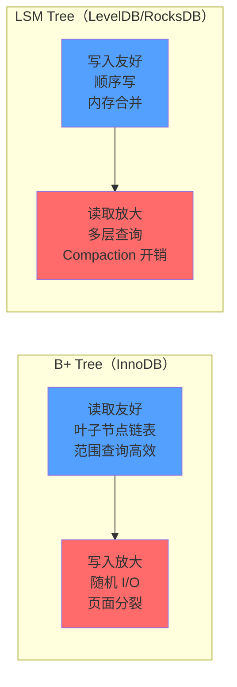
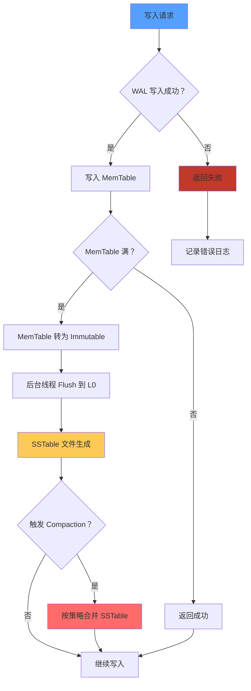
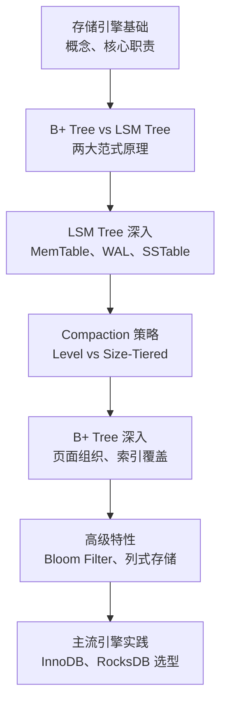

# 存储引擎

数据库选型时，你是否有过这样的经历：团队选了 InnoDB 存储日志数据，结果磁盘空间暴涨、写入性能反而不如预期；或者选了 RocksDB 做范围查询，结果线上查询延迟飙到秒级。

表面上这是「数据库没选对」，但根本原因往往是**对存储引擎原理缺乏理解**。不同的存储引擎，本质上是对不同读写模式的优化——读多写少 vs 写多读少、范围查询 vs 点查询、单机 vs 分布式。没有一种引擎能通吃所有场景，选择的本质是 trade-off。

**存储引擎是数据库性能的地基。地基不稳，上层建筑再华丽也撑不住。**

本模块聚焦存储引擎的核心知识点，从 B+ Tree 与 LSM Tree 两大范式出发，深入讲解数据组织、读写优化、持久化机制，并系统对比主流存储引擎的架构设计与适用场景。

## 模块结构

本模块按主题分为 6 个子模块：

| 子模块 | 核心问题 | 典型场景 |
| --- | --- | --- |
| 存储引擎概述 | 什么是存储引擎，核心职责是什么 | 数据库与存储引擎的关系 |
| LSM Tree 原理详解 | 日志结构存储的设计思路 | 写多读少、时序数据、写入优化 |
| SSTable 与 MemTable | LSM Tree 的核心组件 | 数据组织、写入路径 |
| WAL（预写日志）机制 | 崩溃恢复保障 | 数据持久化、故障恢复 |
| Compaction 策略 | LSM Tree 的合并与清理 | 空间放大、读写放大调优 |
| B+ Tree 原理详解 | 关系型数据库主流存储结构 | 读多写少、范围查询、事务支持 |

## 两大存储范式对比

| 特性 | B+ Tree | LSM Tree |
| --- | --- | --- |
| 写入方式 | 随机 I/O（直接写入 B+ Tree） | 顺序写（追加到 MemTable） |
| 读取方式 | 单次树遍历 | 多层合并查询 |
| 写入放大 | 低 | 中等到高（取决于 Compaction） |
| 读取放大 | 低 | 中等到高 |
| 空间放大 | 低（节点紧凑） | 中到高（存在重复数据） |
| 典型代表 | InnoDB、PostgreSQL | LevelDB、RocksDB、Cassandra |
| 适用场景 | 读多写少、范围查询 | 写多读少、时序数据、写入吞吐 |

## LSM Tree 写入路径

## 存储引擎高级特性

现代存储引擎不仅提供基础的数据读写，还包含多种高级特性以应对不同场景：

- **索引结构**：除了主键索引，还有位图索引（适合低基数列）、倒排索引（适合全文搜索）
- **存储格式**：行式存储（OLTP 友好）vs 列式存储（OLAP 高效）
- **Bloom Filter**：快速判断 Key 是否存在于 SSTable，减少无效 I/O
- **Compaction 策略**：Level-Tiered（空间友好）vs Size-Tiered（写入友好）

## 主流存储引擎

| 引擎 | 类型 | 存储结构 | 事务支持 | 典型场景 |
| --- | --- | --- | --- | --- |
| InnoDB | 关系型 | B+ Tree | ACID 完整支持 | MySQL OLTP 场景 |
| RocksDB | 嵌入式 KV | LSM Tree | 单 Key 原子性 | 嵌入式存储、消息队列 |
| LevelDB | 嵌入式 KV | LSM Tree | 单 Key 原子性 | 早期 KV 存储参考实现 |
| Cassandra | 分布式 KV | LSM Tree | 最终一致性 | 跨数据中心写入 |
| ScyllaDB | 分布式 KV | LSM Tree | 可调一致性 | 高写入吞吐场景 |

## 常见认知误区

| 误区 | 真相 |
| --- | --- |
| LSM Tree 一定比 B+ Tree 快 | LSM Tree 写入快，但读取可能更慢，取决于 Compaction 配置 |
| 只要选了 InnoDB 就不用关心存储 | InnoDB 的索引组织方式、表空间管理同样影响性能 |
| Compaction 越频繁越好 | Compaction 消耗 CPU 和 I/O，过于频繁反而影响写入吞吐 |
| 存储引擎选型是一次性的 | 随着数据量和访问模式变化，可能需要迁移或调整配置 |
| 空间放大只是磁盘浪费 | 空间放大还会导致 Compaction 开销增加、缓存效率下降 |

## 学习路径建议

## 本章导读

根据你的学习目标，推荐以下阅读顺序：

- **想理解原理**：[B+ Tree 原理详解](/system-design/storage-engine/bplus-tree) → [LSM Tree 原理详解](/system-design/storage-engine/lsm-tree)
- **想动手实践**：[WAL 机制](/system-design/storage-engine/wal) → [SSTable 与 MemTable](/system-design/storage-engine/sstable-memtable)
- **想选型落地**：[存储引擎选型指南](/system-design/storage-engine/selection) → [InnoDB 架构解析](/system-design/storage-engine/innodb)
- **想深入优化**：[Compaction 策略](/system-design/storage-engine/compaction) → [Bloom Filter 应用](/system-design/storage-engine/bloom-filter-storage)

准备好开始了吗？让我们从存储引擎的基础概念开始。
