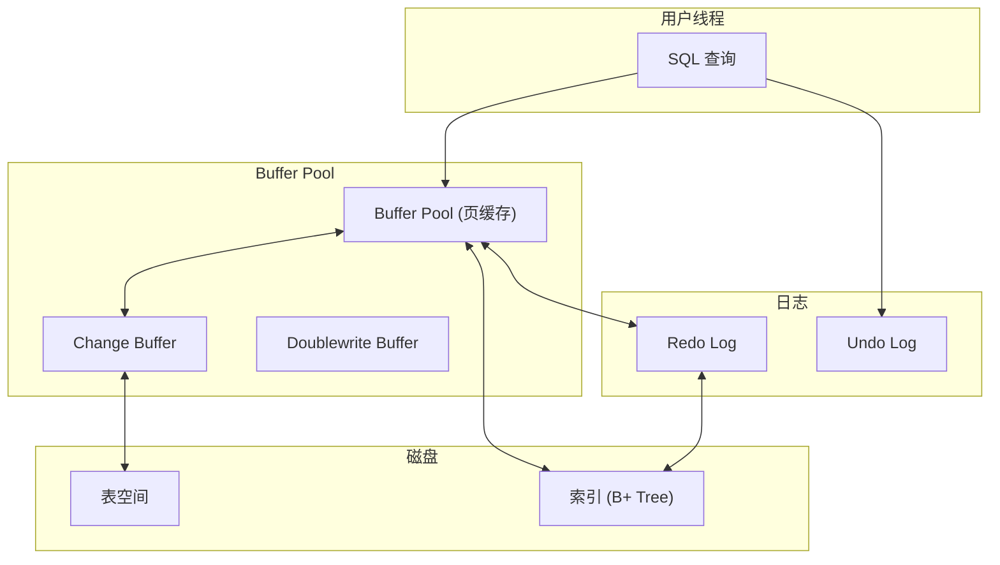

# InnoDB 存储引擎架构

MySQL 是世界上最流行的开源数据库，而 InnoDB 是 MySQL 的默认存储引擎。理解 InnoDB 的架构，是理解 MySQL 性能的关键。

InnoDB 解决了什么问题？**在保证 ACID 的前提下，提供高性能的事务处理**。

## InnoDB 整体架构



## Buffer Pool

Buffer Pool 是 InnoDB 的内存缓存池，缓存磁盘上的数据页（Page）。

### Buffer Pool 结构

```
Buffer Pool (如 8GB):
├── Page 1: user:1001 → Alice
├── Page 2: user:1002 → Bob
├── Page 3: order:5001 → {items: [...]}
└── Page N: ...
```

### LRU 淘汰策略

Buffer Pool 使用改进的 LRU 算法，避免全表扫描污染缓存：

```cpp
// 经典 LRU 问题:
// SELECT * FROM huge_table; -- 全表扫描
// 扫描结果: 会把热点数据全部挤出 Buffer Pool

// InnoDB 解决方案: 分层 LRU
class LRUSplitList {
 private:
  // 热端 (young): 最近访问的热点数据
  std::list<Page*> young_list_;
  
  // 冷端 (old): 刚从磁盘加载的数据
  std::list<Page*> old_list_;
  
 public:
  // 访问时，如果是冷端数据，移动到热端
  void Access(Page* page) {
    if (page->InOldList()) {
      MoveToYoungList(page);
    }
  }
};
```

### Page 结构

InnoDB 的数据页默认 16KB：

```cpp
struct Page {
  // 页头
  uint16_t offset;      // 偏移量
  uint16_t size;        // 大小
  uint32_t checksum;    // 校验和
  
  // 行数据
  Row rows[...];
  
  // 页尾
  uint32_t page_lsn;    // 最后修改的 LSN
  uint16_t free_space;  // 空闲空间
};
```

## Redo Log

Redo Log 记录对页的物理修改，用于崩溃恢复。

### Redo Log 工作原理

```cpp
// 写入 Redo Log
void innobase::log_write_low(...) {
  // 1. 追加到日志缓冲区
  log_buffer.append(log_entry);
  
  // 2. 刷新到磁盘（组提交优化）
  if (should_flush()) {
    os_aio_free();
    log_flush_to_disk();
  }
}

// 崩溃恢复
void recv_recovery_rollback_active() {
  // 1. 读取 Redo Log
  for (log_entry in redo_log) {
    // 2. 应用到 Buffer Pool
    apply_log_entry(entry);
  }
}
```

### 配置建议

```sql
-- Redo Log 大小（通常设置为 Buffer Pool 的 25%~50%）
innodb_log_file_size = 4GB
innodb_log_files_in_group = 3

-- 刷盘策略
innodb_flush_log_at_trx_commit = 1  -- 每次提交都刷盘（安全）
-- 0: 每秒刷盘一次，可能丢 1 秒数据
-- 1: 每次提交刷盘，最安全
-- 2: 提交到 OS 缓存，不丢数据（OS 崩溃可能丢）
```

## Undo Log

Undo Log 记录行的旧值，用于事务回滚和 MVCC。

### Undo Log 结构

```sql
-- InnoDB 中，Undo Log 存储在系统表空间的 Rollback Segment
-- 每个事务有一个或多个 Undo Log 链

Transaction 1:
  Undo Log 1: UPDATE users SET age=30 WHERE id=1 (旧值 age=25)
  Undo Log 2: DELETE FROM orders WHERE id=100 (旧值 = 整行)

Transaction 2 (并发):
  Undo Log 3: UPDATE users SET name='Bob' WHERE id=1 (旧值 name='Alice')
```

### MVCC 读取

```cpp
// 读取一致性快照
Row* RowSearch::get_row() {
  if (trx->isolation_level == READ_COMMITTED) {
    // READ COMMITTED: 读取最新已提交版本
    return latest_committed_version(row);
  } else if (trx->isolation_level == REPEATABLE_READ) {
    // REPEATABLE READ: 读取事务开始时的版本
    return version_at_trx_start(row);
  }
}
```

## Change Buffer

Change Buffer 缓存对二级索引的修改，减少随机 I/O。

### 为什么要缓存索引修改

```sql
-- 执行大量插入
INSERT INTO orders (user_id, amount) VALUES (1, 100);
INSERT INTO orders (user_id, amount) VALUES (2, 200);
INSERT INTO orders (user_id, amount) VALUES (3, 300);
-- 每次插入都要更新 user_id 的索引页
-- user_id 索引页不同 → 大量随机写
```

### Change Buffer 工作原理

```cpp
class ChangeBuffer {
  // 合并缓冲：多个修改合并一次写入
  ChangeBufferEntry entries[...];
  
  void Insert(int index_id, key, value) {
    // 先写入 Change Buffer
    entries.push_back({index_id, key, value});
  }
  
  void MergeToDisk() {
    // 合并后一次性写入索引页
    MergeAndWrite(entries);
  }
}
```

### 配置

```sql
-- 启用 Change Buffer
innodb_change_buffering = all  -- all: 插入/删除/更新都缓存

-- Change Buffer 最大大小
innodb_change_buffer_max_size = 25  -- Buffer Pool 的 25%
```

## Doublewrite Buffer

Doublewrite Buffer 解决部分页写入（Partial Page Write）问题。

### 问题场景

```
磁盘写入 16KB 页时:
- 只写入了前 4KB → 页撕裂（ Torn Page）
- 恢复时页校验失败，数据损坏
```

### 解决方案

```cpp
class DoublewriteBuffer {
  // 1. 先写到 Doublewrite Buffer (顺序写 1MB)
  char buffer[2MB];  // 128 个页
  
  // 2. 再从 Buffer 写到数据文件 (顺序写)
  WriteToDataFiles(buffer);
  
  // 恢复时:
  // 如果数据文件页损坏，从 Doublewrite Buffer 恢复
}
```

## 自适应哈希索引

InnoDB 自动监控表访问，为热点数据构建哈希索引：

```sql
-- 自适应哈希索引是自动的，无法手动控制
-- 但可以监控其使用情况

SHOW ENGINE INNODB STATUS\G
---
INDEX_NAME: adaptive hash index
    BUFFER_ALL: 1234 pages
    BUFFER_HIT: 99.5%
---
```

## 主键索引与辅助索引

```sql
-- InnoDB 的索引结构
CREATE TABLE users (
    id BIGINT PRIMARY KEY,        -- 主键索引（聚集索引）
    name VARCHAR(100),
    email VARCHAR(100),
    INDEX idx_name (name),       -- 辅助索引
    UNIQUE INDEX idx_email (email)  -- 唯一索引
);

-- 主键索引：叶子节点存储完整行数据
-- 辅助索引：叶子节点存储主键值
```

## 监控与调优

```sql
-- 查看 Buffer Pool 命中率
SHOW ENGINE INNODB STATUS\G
---
Buffer pool hit rate: 1000/1000 (100%)

-- 查看 Redo Log 状态
SHOW ENGINE INNODB LOG\G

-- 查看各线程状态
SHOW PROCESSLIST;

-- 关键配置
SELECT * FROM performance_schema.global_variables
WHERE VARIABLE_NAME LIKE 'innodb%';
```

> **性能建议**：Buffer Pool 应该足够大，能容纳热点数据；Redo Log 应该足够大，避免频繁切换；独立表空间比共享表空间更灵活。选择合适的配置，是 InnoDB 性能调优的基础。
