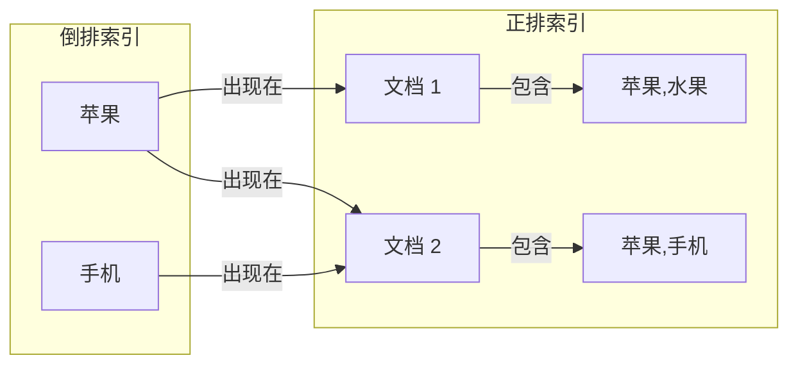

# 位图索引与倒排索引

搜索「苹果」，返回的结果包含水果苹果和苹果手机——这是倒排索引在起作用。

索引是数据库和搜索引擎的核心技术。理解正排索引与倒排索引，是理解搜索系统、数据分析系统的必经之路。

## 正排索引 vs 倒排索引

### 正排索引（Forward Index）

文档 → 包含的词

```
文档 1: "苹果是一种水果"
文档 2: "苹果手机很贵"
文档 3: "香蕉也很好吃"

正排索引:
文档 1 → [苹果, 是, 一种, 水果]
文档 2 → [苹果, 手机, 很, 贵]
文档 3 → [香蕉, 也, 好吃]
```

按文档找词，适合「查看文档包含哪些词」。

### 倒排索引（Inverted Index）

词 → 包含词的文档

```
倒排索引:
苹果 → [文档 1, 文档 2]
手机 → [文档 2]
水果 → [文档 1]
香蕉 → [文档 3]
好吃 → [文档 3]
```

按词找文档，适合「查找包含某个词的文档」。



## 倒排索引结构

倒排索引的核心是 **Posting List（倒排列表）**：

```
Term: "苹果"
├── Document ID: 1, Position: 0
├── Document ID: 2, Position: 0
├── Document ID: 5, Position: 3
└── Document ID: 8, Position: 1
```

### Posting List 结构

```java
public class PostingList {
    // Posting: 单个文档中词项的信息
    static class Posting {
        int docId;           // 文档 ID
        int frequency;      // 词频
        List<Integer> positions;  // 出现位置
    }
    
    // 倒排列表
    List<Posting> postings;
    
    // 跳表优化：加速合并
    SkipList<Posting> skipList;
}
```

### 倒排索引构建

```java
public class InvertedIndex {
    Map<String, List<Posting>> index = new HashMap<>();
    
    // 添加文档
    public void addDocument(int docId, String text) {
        List<String> terms = analyzer.analyze(text);
        
        for (String term : terms) {
            Posting posting = new Posting(docId, terms.frequency());
            index.computeIfAbsent(term, k -> new ArrayList<>())
                 .add(posting);
        }
    }
    
    // 查询：返回包含 term 的所有文档
    public List<Integer> search(String term) {
        List<Posting> postings = index.get(term);
        if (postings == null) return Collections.emptyList();
        return postings.stream()
            .map(p -> p.docId)
            .collect(Collectors.toList());
    }
}
```

## Elasticsearch 倒排索引

Elasticsearch 基于 Apache Lucene，使用倒排索引实现全文搜索。

### Lucene 倒排索引结构

```
Segment:
├── 倒排索引 (.tip)      # Term 字典
├── 倒排列表 (.doc)      # Posting List
├── 存储域 (.fdx/fdt)    # 存储字段
└── 标准化因子 (.norm)    # 字段长度归一化
```

### Elasticsearch 查询示例

```json
// 查询 "苹果" AND "手机"
GET /products/_search
{
  "query": {
    "bool": {
      "must": [
        { "match": { "name": "苹果" }},
        { "match": { "name": "手机" }}
      ]
    }
  }
}

// 执行过程:
// 1. 查找 "苹果" 的 Posting List
// 2. 查找 "手机" 的 Posting List
// 3. 合并两个 Posting List（AND 交集）
```

### 倒排索引合并

倒排索引查询需要合并多个 Posting List：

```java
public List<Integer> intersect(List<Integer> list1, List<Integer> list2) {
    List<Integer> result = new ArrayList<>();
    
    int i = 0, j = 0;
    while (i < list1.size() && j < list2.size()) {
        if (list1.get(i) == list2.get(j)) {
            result.add(list1.get(i));
            i++;
            j++;
        } else if (list1.get(i) < list2.get(j)) {
            i++;
        } else {
            j++;
        }
    }
    
    return result;
}
```

## 位图索引

位图索引（Bitmap Index）用位数组表示数据是否出现，适合离散值字段。

### 位图索引原理

```java
// 假设有 10000 个用户，按状态分类
// 状态: [活跃, 冻结, 注销]

// 位图索引
BitSet active = new BitSet();      // 活跃用户的位图
BitSet frozen = new BitSet();      // 冻结用户的位图
BitSet deleted = new BitSet();     // 注销用户的位图

// 查询活跃且未冻结的用户
BitSet result = (BitSet) active.clone();
result.andNot(frozen);  // 减去冻结用户
```

### 位图存储格式

| 用户 ID | 活跃 | 冻结 | 注销 |
|---|---|---|---|
| 1 | 1 | 0 | 0 |
| 2 | 1 | 0 | 0 |
| 3 | 0 | 1 | 0 |
| 4 | 0 | 0 | 1 |

存储为位图：

```
活跃: [1, 1, 0, 0] → 1100 (二进制)
冻结: [0, 0, 1, 0] → 0010
注销: [0, 0, 0, 1] → 0001
```

## Roaring Bitmap

普通位图在稀疏数据上浪费空间。Roaring Bitmap 混合使用数组和位图，平衡空间和性能。

### Roaring Bitmap 原理

```java
public class RoaringBitmap {
    // 按 2^16 分桶
    Map<Integer, Container> containers = new HashMap<>();
    
    public void add(int value) {
        int bucket = value >>> 16;  // 高 16 位：桶 ID
        short offset = (short) value; // 低 16 位：桶内偏移
        
        containers.computeIfAbsent(bucket, k -> 
            new Container()
        ).add(offset);
    }
    
    // 容器类型选择
    static abstract class Container {
        abstract void add(short value);
        abstract boolean contains(short value);
    }
    
    // 数组容器（稀疏：< 4096 个值）
    static class ArrayContainer extends Container {
        short[] array;  // 有序数组
    }
    
    // 位图容器（密集：>= 4096 个值）
    static class BitmapContainer extends Container {
        long[] bitmap;  // 2^16 位
    }
}
```

### 容器选择策略

| 数据密度 | 选择容器 | 空间占用 |
|---|---|---|
| 稀疏 (< 4096) | 数组 | ~8KB |
| 密集 (>= 4096) | 位图 | 8KB |
| 连续 | Run-Length | ~几字节 |

## 倒排索引 + 位图组合

在大规模分析场景中，倒排索引和位图索引经常组合使用：

```java
// Elasticsearch 的 filter 使用位图
public class FilterExecutor {
    // term 查询 → Posting List → BitSet
    // bool filter → BitSet 操作 (AND/OR/NOT)
    
    public BitSet execute(Filter filter) {
        if (filter instanceof TermFilter) {
            // TermFilter: 查倒排索引 → 转 BitSet
            PostingList postings = invertedIndex.get(((TermFilter) filter).term);
            return postings.toBitSet();
        } else if (filter instanceof BoolFilter) {
            // BoolFilter: 位图操作
            BoolFilter bool = (BoolFilter) filter;
            BitSet result = execute(bool.must());
            for (BitSet should : bool.shoulds()) {
                result.or(should);
            }
            return result;
        }
    }
}
```

> **应用场景**：倒排索引用于文本搜索，位图索引用于等值查询和过滤器。在分析型数据库（ClickHouse、Druid）中，位图索引是加速维度过滤的核心技术。
