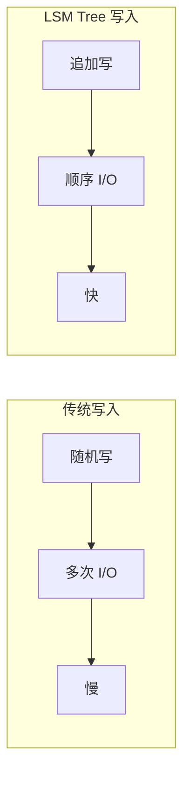
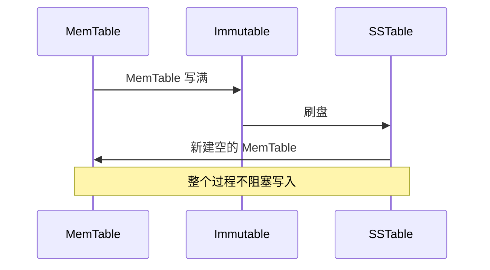

# LSM Tree 原理详解

写放大是数据库的性能杀手。随机写入磁盘、频繁更新索引——这些问题折磨了一代数据库工程师。直到 LSM Tree 的出现。

LSM Tree（Log-Structured Merge Tree）是一种专门为写优化设计的存储结构。HBase、RocksDB、LevelDB 都在用它。

## LSM Tree 的核心思想

传统 B+ Tree 的写入需要：定位数据位置 → 写入数据 → 更新索引 → 刷盘。每次写入都可能触发多次磁盘 I/O。

LSM Tree 的核心洞察：**把随机写变成顺序写**。



LSM Tree 的写入流程：

1. **先写内存**：数据先写入内存缓冲区（MemTable）
2. **写 WAL**：同时写入预写日志（WAL），保证崩溃不丢失
3. **异步合并**：内存写满后，异步合并到磁盘（SSTable）
4. **分层组织**：磁盘上的数据分层组织，逐层合并

## LSM Tree 分层结构

LSM Tree 将磁盘数据分为多层，越上层数据越新，越下层数据越旧。

```
内存 (MemTable):
┌─────────────────────────────────────┐
│ key: "user:1001" → value: {name}   │
│ key: "user:1002" → value: {name}   │
│ key: "user:1003" → value: {name}   │
└─────────────────────────────────────┘
            ↓ 刷盘 (Immutable MemTable 合并)
            
磁盘 L0 (最新):
┌─────────────────────────────────────┐
│ SSTable: [user:1001, user:1002]    │
│ SSTable: [user:1003, user:1004]   │
└─────────────────────────────────────┘
            ↓ 合并
磁盘 L1:
┌─────────────────────────────────────┐
│ SSTable: [user:1001, user:1002,    │
│            user:1003, user:1004]    │
└─────────────────────────────────────┘
            ↓ 合并
磁盘 L2 (最旧):
┌─────────────────────────────────────┐
│ SSTable: [user:1001 ~ user:9999]   │
└─────────────────────────────────────┘
```

### 每一层的容量限制

每一层通常比上一层大 T 倍（例如 T = 10）：

- L0: ~4 个 SSTable
- L1: 4 × 10 = 40 个 SSTable
- L2: 40 × 10 = 400 个 SSTable

当某一层达到容量限制时，触发合并（Compaction），把数据合并到下一层。

## 写入流程详解

### Step 1: 写入 MemTable

```java
// MemTable 写入
public void put(String key, String value) {
    // 写入 MemTable（跳表保证有序）
    memTable.add(key, value);
    
    // 写入 WAL（保证持久化）
    wal.write(key, value);
    
    // 如果 MemTable 满了，触发刷盘
    if (memTable.isFull()) {
        flushToDisk();
    }
}
```

MemTable 通常用**跳表（Skip List）**实现，保证写入有序且复杂度为 `O(log n)`。

### Step 2: 写入 WAL

WAL（Write-Ahead Log）记录了所有未刷盘的修改。崩溃恢复时，重放 WAL 恢复数据。

```java
// WAL 格式
WAL: [key="user:1001", value="Alice", offset=1000]
WAL: [key="user:1002", value="Bob", offset=1050]
WAL: [key="user:1001", value="Alice2", offset=1100]
```

### Step 3: MemTable 刷盘

MemTable 写满后，转换成 Immutable MemTable，然后异步刷盘成 SSTable。



### Step 4: 合并（SSTable Compaction）

当 L0 达到容量时，与 L1 进行合并。合并过程：

1. 读取 L0 和 L1 的所有数据
2. 按 key 排序合并
3. 保留每个 key 的最新值
4. 写入新的 L1 SSTable

```java
// 简化的 Compaction 逻辑
public void compact(int level) {
    List<SSTable> toCompact = getSSTables(level);
    
    // 外部排序合并
    Iterator<KVPair> merged = mergeSort(toCompact);
    
    // 写入新的 SSTable
    SSTable newSSTable = writeSSTable(merged);
    
    // 删除旧的 SSTable
    deleteSSTables(toCompact);
}
```

## 读写放大问题

LSM Tree 的设计有代价。

### 写放大（Write Amplification）

一次写入可能触发多次磁盘写入：

```
1. 写入 MemTable (1x)
2. 写入 WAL (1x)
3. L0 刷盘 (1x)
4. L0 → L1 合并 (N × 写入)
```

实际写入量可能是原始数据的 3~10 倍。

### 读放大（Read Amplification）

读取一条数据可能需要检查多层：

```
读取流程:
  1. 查 MemTable
  2. 查 Immutable MemTable
  3. 查 L0 的所有 SSTable
  4. 查 L1 的所有 SSTable
  5. ...
```

最坏情况下需要读取所有层。

## LSM Tree vs B+ Tree

| 特性 | LSM Tree | B+ Tree |
|---|---|---|
| 写入性能 | 高（顺序写） | 中（随机写） |
| 读取性能 | 中（可能需多层） | 高（单次查找） |
| 空间效率 | 中（可能有重复） | 高（无重复） |
| 写放大 | 高 | 低 |
| 读放大 | 高 | 低 |
| 适用场景 | 写多读少 | 读多写少 |

## 适用场景

**LSM Tree 适合**：

- 日志系统：写入密集，极少读取历史
- 时序数据库：数据按时间追加
- 消息队列：写入后批量消费
- NoSQL 数据库：HBase、RocksDB

**B+ Tree 更适合**：

- 关系型数据库：读写都频繁
- 交易系统：需要强一致性
- 随机更新频繁的场景

> **核心权衡**：LSM Tree 用写入放大换读取放大。如果你有大量顺序写入但查询延迟不敏感的场景，LSM Tree 是更好的选择。
