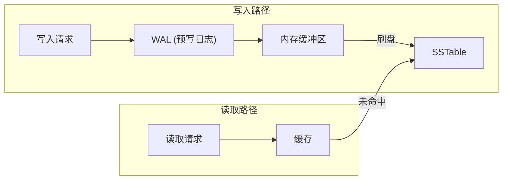
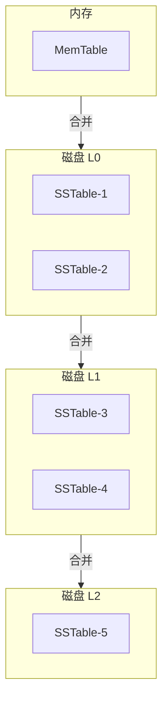

# 存储引擎概述

MySQL 为什么用 B+ Tree 而不用数组？Redis 为什么这么快？HBase 为什么适合海量存储？这些问题的答案，都藏在存储引擎的设计里。

理解存储引擎，不是为了造一个数据库，而是为了理解数据存储背后的权衡与取舍。这些权衡，几乎出现在每一个系统设计中。

## 什么是存储引擎

存储引擎是**数据库系统中负责数据存储和检索的核心组件**。它决定了数据如何组织、如何写入磁盘、如何读取出来、如何保证不丢失。

```
应用程序
    ↓ SQL
数据库管理系统 (DBMS)
    ↓ 调用
存储引擎 ←→ 磁盘
```

存储引擎不是数据库的全部，但它直接影响：

- **读写性能**：数据怎么组织，决定了读写速度
- **空间效率**：数据如何压缩，影响存储成本
- **可靠性**：数据如何持久化，决定了故障恢复能力

## 存储引擎核心职责

### 数据组织

数据在磁盘上不是随意堆放的。存储引擎需要决定：

- 用什么数据结构组织数据（B+ Tree、LSM Tree、Hash Index）
- 如何分层存储（热数据在内存，冷数据在磁盘）
- 如何压缩数据（行压缩、列压缩）

### 读写路径



**写入路径**：先写日志（WAL）保证不丢失，然后写入内存缓冲区，异步刷盘到磁盘。

**读取路径**：优先从缓存读取，未命中时再访问磁盘。

### 崩溃恢复

系统崩溃时，内存中的数据会丢失。存储引擎需要从磁盘恢复数据：

- WAL 中记录了所有未刷盘的操作
- 恢复时重放 WAL，恢复到崩溃前的状态

### 并发控制

多个请求同时读写同一份数据时，存储引擎需要处理并发问题：

- 锁机制（行锁、表锁）
- MVCC（多版本并发控制）

## 常见的存储引擎架构

### B+ Tree 存储引擎

以 B+ Tree 作为主索引，数据存储在叶子节点。

**代表**：InnoDB（MySQL 默认存储引擎）

**特点**：

- 读取性能好，适合范围查询
- 写入需要维护树结构，有一定的写入放大
- 内存和磁盘协同工作（Buffer Pool）

### LSM Tree 存储引擎

以日志结构合并树为核心，写入先到内存，后异步合并到磁盘。

**代表**：RocksDB、LevelDB、HBase

**特点**：

- 写入性能极好（顺序写）
- 读取可能需要多层查找
- 空间放大（Compaction 时重复数据）



## 为什么需要了解存储引擎

**性能调优**：

理解存储引擎，才能正确配置数据库参数。例如，InnoDB 的 Buffer Pool 应该设置多大？Redo Log 应该多大？这些都需要理解存储引擎的工作原理。

**选型决策**：

- MySQL 选 InnoDB 还是 MyISAM？
- Redis 选 RDB 还是 AOF？
- 新项目选 HBase 还是 ClickHouse？

**故障排查**：

MySQL 为什么突然变慢？磁盘 I/O 突然飙高？这些问题的根因，往往在存储引擎层面。

**架构设计**：

如何设计缓存策略？如何减少随机写？如何利用顺序写的优势？理解存储引擎，才能设计出高效的数据系统。

## 本章内容导航

存储引擎专题将深入讲解：

- **LSM Tree**：HBase、RocksDB 的核心，了解写入优化
- **B+ Tree**：InnoDB 的核心，了解读取优化
- **WAL**：预写日志，理解持久化保证
- **Compaction**：合并策略，理解空间与性能权衡
- **列式存储**：ClickHouse、Parquet 的核心，了解分析场景

每一章都会讲解原理、代码实现、权衡取舍，目标是让你不仅「知道」，更「理解」。
