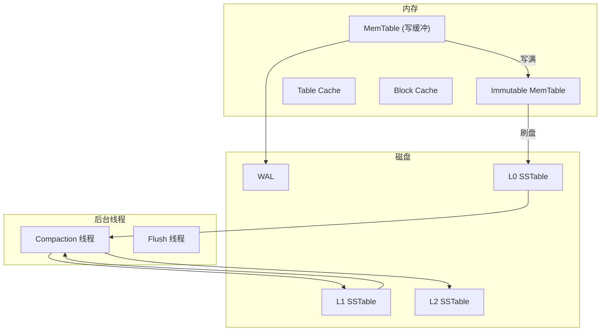

# RocksDB 架构解析

LevelDB 是 Google 员工用 C++ 写的单机器 KV 存储，以简洁著称。RocksDB 是 Facebook 在 LevelDB 基础上改进的企业级 KV 存储，成为众多系统的存储底座。

Kafka、MySQL RockDB、Cassandra、RocksDB……这些系统都离不开它。

## RocksDB vs LevelDB

| 特性 | LevelDB | RocksDB |
|---|---|---|
| 起源 | Google | Facebook |
| 语言 | C++ | C++ |
| 线程安全 | 否 | 是 |
| Column Family | 不支持 | 支持 |
| Compaction | Leveled | 多策略 |
| 第三方集成 | 少 | 丰富 |

RocksDB 在 LevelDB 基础上增加了：

- 多线程 Compaction
- Column Family（逻辑隔离）
- Compaction Filter（TTL、数据过期）
- 更多优化和调参选项

## RocksDB 架构



## 核心组件

### MemTable

内存中的有序数据结构，默认使用跳表（SkipList）。

```java
// RocksDB MemTable 配置
DBOptions options = new DBOptions();
options.setMaxWriteBufferNumber(3);              // MemTable 数量
options.setWriteBufferSize(64 * 1024 * 1024);  // 每个 64MB
options.setMemTableFactory(new SkipListFactory());  // 跳表
// 也可用 HashSkipList、Vector 等
```

### Column Family

Column Family 提供逻辑隔离，类似于关系型数据库的表：

```java
// 创建 Column Family
db.createColumnFamily(new ColumnFamilyDescriptor(
    "orders".getBytes(), new ColumnFamilyOptions()
));

db.createColumnFamily(new ColumnFamilyDescriptor(
    "inventory".getBytes(), new ColumnFamilyOptions()
));

// 写入不同 Column Family
db.put(new WriteOptions(), 
    db.getColumnFamilyHandle("orders"), 
    "order:1001".getBytes(), 
    orderData);

// 查询
db.get(new ReadOptions(), 
    db.getColumnFamilyHandle("orders"), 
    "order:1001".getBytes());
```

### WAL（预写日志）

```java
// WAL 配置
WriteOptions writeOptions = new WriteOptions();
writeOptions.setSync(true);  // 同步刷盘
writeOptions.setDisableWAL(false);  // 启用 WAL

// 写入
db.put(writeOptions, key, value);
```

### Block Cache

热点数据缓存，减少磁盘读取：

```java
// 配置 Block Cache
LRUCache cache = new LRUCache(
    100 * 1024 * 1024,    // 100MB
    8,                    // 8 个分片
    false,                // 非高速缓存
    0,                    // 优先级
    null, null
);

BlockBasedTableConfig tableConfig = new BlockBasedTableConfig();
tableConfig.setBlockCache(cache);
tableConfig.setBlockSize(16 * 1024);  // 16KB block
```

## Compaction 策略

RocksDB 支持多种 Compaction 策略：

### Level Compaction（默认）

```java
// Level Compaction 配置
CompactionOptionsStyle style = CompactionOptionsStyle.LEVEL;
ColumnFamilyOptions cfOptions = new ColumnFamilyOptions()
    .setCompactionStyle(CompactionStyle.LEVEL)
    .setLevel0FileNumCompactionTrigger(4)        // L0 达到 4 个触发合并
    .setMaxBytesForLevelBase(256 * 1024 * 1024)  // L1 容量 256MB
    .setMaxBytesForLevelMultiplier(10);          // 每层 10 倍增长
```

### Universal Compaction

适合写入突增场景，减少写放大：

```java
// Universal Compaction
ColumnFamilyOptions cfOptions = new ColumnFamilyOptions()
    .setCompactionStyle(CompactionStyle.UNIVERSAL)
    .setUniversalCompactionOptions(
        new UniversalCompactionOptions()
            .setMaxSizeAmplificationPercent(200)  // 允许 2 倍空间放大
    );
```

## Compaction Filter

Compaction Filter 允许在 Compaction 过程中过滤或修改数据：

### TTL 数据过期

```java
// TTL Compaction Filter
public class TTLFilter implements CompactionFilter {
    private long ttlMillis;
    
    @Override
    public boolean filter(Long seq, String key, String value, 
                          long[] expTs, byte[] expType) {
        if (expTs[0] > 0 && System.currentTimeMillis() > expTs[0]) {
            return true;  // 返回 true 表示删除
        }
        return false;
    }
    
    @Override
    public String name() {
        return "TTLFilter";
    }
}
```

### 数据类型转换

```java
// Compaction 时转换数据格式
public class DataMigrationFilter implements CompactionFilter {
    @Override
    public boolean filter(Long seq, String key, String value, 
                          long[] expTs, byte[] expType) {
        // 旧格式 v1 → 新格式 v2
        if (isOldFormat(value)) {
            return filter(key, convertToV2(value));
        }
        return false;
    }
}
```

## 监控指标

RocksDB 提供丰富的监控指标：

```java
// 获取统计信息
Statistics stats = options.statistics();
Histogram histogram = stats.getHistogram("rocksdb.compaction.time");
Timer timer = stats.getTimer("rocksdb.write.total.time");

// 打印 SSTable 信息
List<LiveFileMetaData> files = db.getLiveFilesMetaData();
for (LiveFileMetaData file : files) {
    System.out.printf(
        "Level %d, %d KB, %d keys, %s%n",
        file.level(),
        file.size() / 1024,
        file.numEntries(),
        file.fileName()
    );
}
```

### 关键监控指标

| 指标 | 含义 | 健康范围 |
|---|---|---|
| `compaction.pending_bytes` | 待 Compaction 数据量 | 越小越好 |
| `memtable.size` | 当前 MemTable 大小 | 接近配置上限 |
| `num.files-at-level` | 每层文件数 | L0 越小越好 |
| `read.latency` | 读取延迟 | P99 < 10ms |

## 使用示例

```java
// 完整的 RocksDB 使用示例
public class RocksDBExample {
    
    public void run() throws RocksDBException {
        // 1. 配置
        Options options = new Options();
        options.setCreateIfMissing(true);
        options.setMaxOpenFiles(10000);
        options.setBytesForSync(1024 * 1024L);
        
        // 2. Column Family
        List<ColumnFamilyHandle> columnFamilies = new ArrayList<>();
        columnFamilies.add(rocksDB.getDefaultColumnFamily());
        
        // 3. 打开数据库
        DBOptions dbOptions = new DBOptions(options);
        List<ColumnFamilyDescriptor> columnFamilyDescriptors = 
            Arrays.asList(new ColumnFamilyDescriptor(
                RocksDB.DEFAULT_COLUMN_FAMILY, 
                new ColumnFamilyOptions()
            ));
        
        DB db = RocksDB.open(dbOptions, "/path/to/db", 
            columnFamilyDescriptors, columnFamilies);
        
        // 4. 写入
        WriteOptions writeOptions = new WriteOptions();
        writeOptions.setSync(false);
        db.put(writeOptions, "key1".getBytes(), "value1".getBytes());
        
        // 5. 读取
        byte[] value = db.get("key1".getBytes());
        
        // 6. 遍历
        RocksIterator it = db.newIterator();
        for (it.seekToFirst(); it.isValid(); it.next()) {
            System.out.println(new String(it.key()) + ": " + 
                            new String(it.value()));
        }
        
        // 7. 关闭
        it.close();
        db.close();
    }
}
```

> **应用场景**：RocksDB 广泛用于 Kafka Streams、MyRocks、Cassandra 替代方案、配置中心、消息队列等场景。如果你需要一个高性能的本地 KV 存储，RocksDB 是首选。
