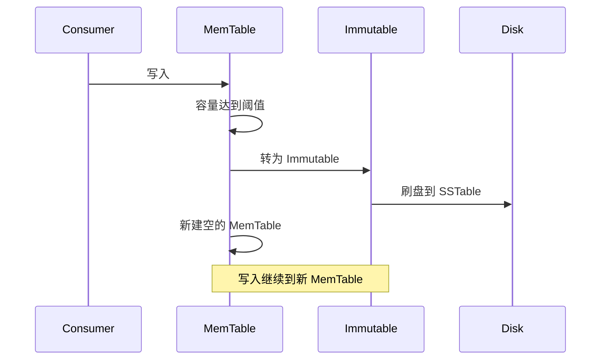

# SSTable 与 MemTable

LSM Tree 的性能依赖两个关键数据结构：**SSTable**（磁盘上的数据文件）和 **MemTable**（内存中的数据缓冲区）。理解它们的工作原理，是掌握 LSM Tree 的基础。

## MemTable：内存有序缓冲区

MemTable 是 LSM Tree 的第一层存储，写入的数据首先进入 MemTable。

### 数据结构

MemTable 通常用**跳表（Skip List）**实现：

```java
// 跳表节点
class SkipListNode {
    String key;
    String value;
    int level;  // 当前节点层数
    SkipListNode[] next;  // 每层的后继指针
}

// 跳表操作
class MemTable {
    private SkipListNode head;
    private int maxLevel;
    
    public void add(String key, String value) {
        // 从高层向低层查找插入位置
        SkipListNode[] update = findInsertPositions(key);
        
        // 创建新节点（随机层数）
        SkipListNode newNode = new SkipListNode(key, value, randomLevel());
        
        // 插入节点
        for (int i = 0; i < newNode.level; i++) {
            newNode.next[i] = update[i].next[i];
            update[i].next[i] = newNode;
        }
    }
}
```

### 为什么用跳表而不是 B+ Tree

- **实现简单**：跳表比 B+ Tree 容易实现
- **写性能好**：只需要修改指针，不需要分裂节点
- **有序遍历**：天然支持范围查询

### 容量控制

MemTable 不能无限增长。通常配置固定大小（如 64MB），写满后触发刷盘：

```java
public void put(String key, String value) {
    if (memTable.size() >= MAX_MEMTABLE_SIZE) {
        // 标记为不可变，开始刷盘
        memTable.setImmutable();
        flushToDisk(memTable);
        
        // 创建新的 MemTable
        memTable = new MemTable();
    }
    memTable.add(key, value);
}
```

## SSTable：磁盘上的数据文件

SSTable（Sorted String Table）是 MemTable 刷盘后的产物，按 key 排序存储在磁盘上。

### SSTable 结构

```
┌──────────────────────────────────────────────┐
│ Data Block 1: [key1, value1][key2, value2]...│
│ Data Block 2: [key9, value9][key10, value10].│
│ ...                                          │
├──────────────────────────────────────────────┤
│ Index Block:                                  │
│   key5 → offset: 2048, size: 1024            │
│   key10 → offset: 4096, size: 1024            │
├──────────────────────────────────────────────┤
│ Filter Block: Bloom Filter 数据               │
├──────────────────────────────────────────────┤
│ Meta Index Block: 索引块位置信息              │
├──────────────────────────────────────────────┤
│ Footer: 元数据区（固定大小）                  │
└──────────────────────────────────────────────┘
```

### Data Block

数据块是 SSTable 的核心，每个块通常 4KB~64KB，包含有序的 key-value 对。

```java
// Data Block 写入
public void writeDataBlock(DataBlockWriter writer, List<KVPair> data) {
    for (KVPair pair : data) {
        writer.write(pair.key, pair.value);
        
        // 达到块大小时，结束当前块
        if (writer.currentSize() >= BLOCK_SIZE) {
            writer.finishBlock();
            indexWriter.addIndex(writer.lastKey(), writer.currentPosition());
        }
    }
}
```

### Index Block

索引块存储每个数据块的起始位置，支持快速定位：

```
索引项格式: key → (offset, size)
查询时: 二分查找定位 block → 读取 block → 二分查找定位 key
```

### Filter Block（布隆过滤器）

每个 SSTable 都有对应的布隆过滤器，快速判断某个 key 是否存在：

```java
// SSTable 查询
public String get(String key) {
    // 1. 检查布隆过滤器
    if (!bloomFilter.mightContain(key)) {
        return null;  // 一定不存在
    }
    
    // 2. 查找索引定位 block
    BlockIndex index = findBlockIndex(key);
    
    // 3. 读取 block
    DataBlock block = readBlock(index.offset, index.size);
    
    // 4. 在 block 中查找
    return block.get(key);
}
```

## Immutable MemTable：合并过渡态

MemTable 刷盘时，会先变成 Immutable MemTable（不可变内存表），只读不写。



这个过渡态确保了刷盘过程不会阻塞写入。

## SSTable 合并过程

当多层 SSTable 需要合并时，遵循以下流程：

### 多路归并排序

```java
public List<KVPair> mergeSSTables(List<SSTable> sstables) {
    // 创建最小堆，按 key 排序
    PriorityQueue<SSTableIterator> heap = new PriorityQueue<>();
    
    for (SSTable sstable : sstables) {
        heap.add(sstable.iterator());
    }
    
    List<KVPair> result = new ArrayList<>();
    String lastKey = null;
    
    while (!heap.isEmpty()) {
        // 取出最小的 key
        SSTableIterator min = heap.peek();
        KVPair pair = min.next();
        
        // 跳过重复 key，保留最新值
        if (lastKey != null && pair.key.equals(lastKey)) {
            continue;
        }
        
        result.add(pair);
        lastKey = pair.key;
    }
    
    return result;
}
```

### 合并时删除操作

如果某个 key 的值是删除标记（Tombstone），合并时应该忽略该 key 的旧值：

```java
if (pair.value == TOMBSTONE) {
    // 删除操作，忽略后续旧值
    skipOldValues(pair.key);
} else {
    result.add(pair);
}
```

## SSTable 与 MemTable 的协同

```
写入流程:
MemTable → (WAL) → (刷盘) → SSTable

读取流程:
MemTable → Immutable MemTable → SSTable (L0) → SSTable (L1) → ...
```

读取时，从上往下查找，找到就返回（因为上层数据更新）。

```java
public String get(String key) {
    // 从最新到最旧逐层查找
    if (memTable.contains(key)) {
        return memTable.get(key);
    }
    
    for (int i = 0; i <= maxLevel; i++) {
        String value = sstables[i].get(key);
        if (value != null) {
            return value;
        }
    }
    
    return null;  // 不存在
}
```

> **优化建议**：Bloom Filter 是 SSTable 读取性能的关键。如果没有布隆过滤器，每次读取都要检查所有 SSTable，导致读放大严重。确保布隆过滤器的误判率设置合理（通常 1%~3%）。
