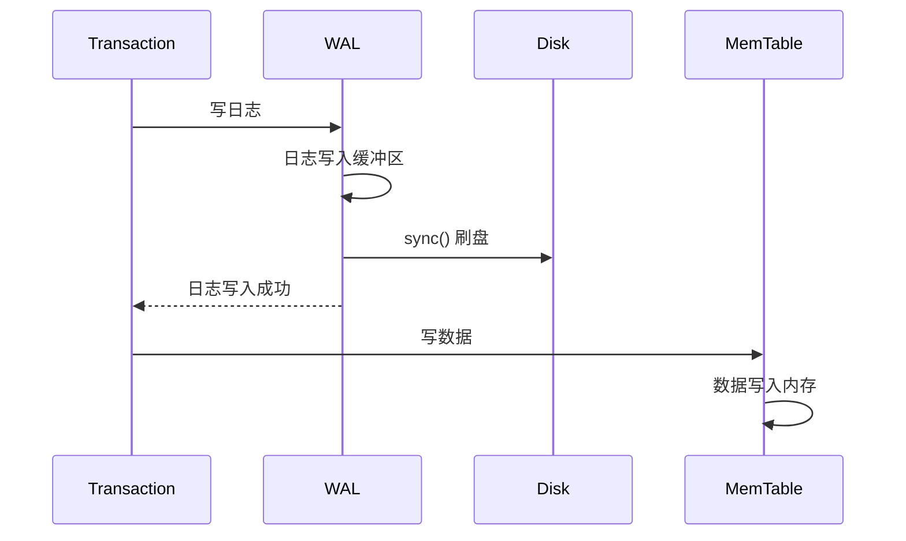
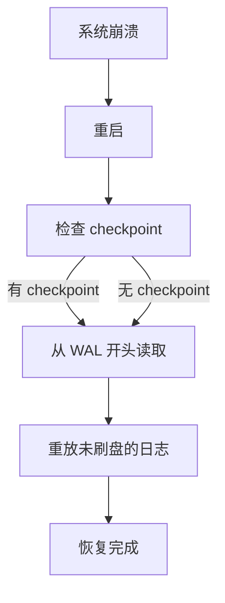

# WAL 预写日志机制

数据库突然断电，重启后数据还在吗？这取决于 WAL（Write-Ahead Logging，预写日志）。

WAL 是存储引擎最朴素的可靠性保证：先把日志写到磁盘，再写数据。就算写数据时崩溃，日志里也有记录。

## WAL 原理

WAL 的核心思想：**在数据写入磁盘之前，先把操作记录写入日志**。

```
传统做法:
写入数据 → 成功
(如果此时崩溃，数据丢失)

WAL 做法:
1. 写入 WAL 日志 → 成功
2. 写入数据 → 成功
(如果步骤 2 崩溃，重启后从 WAL 恢复)
```

### WAL 的三个关键特性

**顺序写**：WAL 日志只追加，不修改，天然是顺序写。

**同步刷盘**：日志写入后必须同步刷盘，不能只停留在内存。

**幂等操作**：日志中记录的是「做什么」，而不是「做了什么」，方便重放。

## WAL 与 Redo Log 的关系

很多资料把 WAL 和 Redo Log 混用，但严格来说：

- **WAL**：通用概念，任何「先写日志再写数据」的机制都是 WAL
- **Redo Log**：InnoDB 中特定的 WAL，记录「重做」操作

```
WAL (概念层)
  ↓
Redo Log (InnoDB 实现)
Undo Log (InnoDB 实现)
Binlog (MySQL 复制)
```

## WAL 工作流程

### 写入流程



### 崩溃恢复流程



## WAL 实现

### 日志格式

```java
// WAL 日志条目
class WALEntry {
    long txId;           // 事务 ID
    long lsn;            // 日志序列号
    WALOperation op;     // 操作类型
    byte[] data;         // 操作数据
}

// 操作类型
enum WALOperation {
    PUT,    // 插入/更新
    DELETE, // 删除
    COMMIT, // 事务提交
    ROLLBACK // 事务回滚
}
```

### 写入实现

```java
public class WriteAheadLog {
    private FileChannel channel;
    private long currentLsn = 0;
    
    public long write(WALEntry entry) throws IOException {
        // 1. 序列化日志条目
        byte[] data = serialize(entry);
        
        // 2. 计算 Checksum
        long checksum = CRC32.calculate(data);
        
        // 3. 写入日志
        ByteBuffer buffer = ByteBuffer.allocate(8 + 4 + data.length + 8);
        buffer.putLong(currentLsn);    // LSN
        buffer.putInt(data.length);    // 长度
        buffer.put(data);              // 数据
        buffer.putLong(checksum);     // 校验和
        
        channel.write(buffer);
        
        // 4. 同步刷盘
        channel.force(true);
        
        return currentLsn++;
    }
}
```

### Checkpoint 机制

WAL 会不断增长，不能无限保留。Checkpoint 机制定期标记「此前的日志已安全刷盘」，可以清理。

```java
public void checkpoint() throws IOException {
    // 1. 确保所有数据已刷盘
    flushAllData();
    
    // 2. 写入 checkpoint 标记
    WALEntry checkpoint = new WALEntry(WALOperation.CHECKPOINT);
    checkpoint.data = getDataFileCheckpoint();
    write(checkpoint);
    
    // 3. 清理旧的 WAL 文件
    truncateWALFiles(checkpoint.lsn);
}
```

## WAL vs Redo Log vs Undo Log

| 特性 | WAL | Redo Log | Undo Log |
|---|---|---|---|
| 目的 | 崩溃恢复 | 重做未刷盘的操作 | 回滚未提交的事务 |
| 内容 | 物理或逻辑操作 | 物理操作 | 逻辑操作 |
| 方向 | 向前 | 向前 | 向后 |
| 清理时机 | Checkpoint 后 | Checkpoint 后 | 事务提交后 |

### Redo Log：重做未刷盘的数据

```java
// InnoDB Redo Log 恢复
public void recover() {
    // 1. 读取 Redo Log
    List<RedoEntry> redos = readRedoLog();
    
    // 2. 按 LSN 排序
    redos.sort(Comparator.comparing(e -> e.lsn));
    
    // 3. 重放每条日志
    for (RedoEntry redo : redos) {
        if (redo.type == PUT) {
            // 重做插入/更新
            tablePage.put(redo.pageId, redo.offset, redo.data);
        } else if (redo.type == DELETE) {
            // 重做删除
            tablePage.delete(redo.pageId, redo.offset);
        }
    }
}
```

### Undo Log：回滚未提交的事务

```java
// Undo Log 记录（反向操作）
class UndoLogEntry {
    long txId;
    long pageId;
    long offset;
    byte[] oldValue;  // 修改前的值，用于回滚
}

// 回滚事务
public void rollback(long txId) {
    List<UndoLogEntry> undos = getUndoLogs(txId);
    
    // 逆序回滚
    for (int i = undos.size() - 1; i >= 0; i--) {
        UndoLogEntry undo = undos.get(i);
        pageCache.write(undo.pageId, undo.offset, undo.oldValue);
    }
}
```

## 组提交优化

WAL 的瓶颈是刷盘。如果每条日志都单独刷盘，性能很差。组提交（Group Commit）把多个日志合并成一次刷盘。

```java
public class GroupCommitWAL {
    private List<WALEntry> buffer = new ArrayList<>();
    private long lastFlushTime;
    
    public void write(WALEntry entry) {
        buffer.add(entry);
        
        // 等待足够多的日志或超时
        if (buffer.size() >= GROUP_SIZE 
            || System.currentTimeMillis() - lastFlushTime > MAX_WAIT_MS) {
            flush();
        }
    }
    
    private synchronized void flush() {
        // 所有日志合并成一次写
        channel.write(mergeAll(buffer));
        channel.force(true);
        
        buffer.clear();
        lastFlushTime = System.currentTimeMillis();
    }
}
```

## 生产配置建议

```properties
# RocksDB WAL 配置
wal_dir=/path/to/wal
wal_ttl_seconds=86400
wal_bytes_per_sync=1048576
db_write_buffer_size=67108864

# InnoDB Redo Log 配置
innodb_log_file_size=4GB
innodb_log_buffer_size=64MB
innodb_flush_log_at_trx_commit=1
# 1: 每次提交都刷盘（最安全）
# 2: 每秒刷盘一次（性能好，可能丢 1 秒数据）
# 0: 交给 OS（性能最好，可能丢更多数据）
```

> **配置警示**：`innodb_flush_log_at_trx_commit` 设置为 0 或 2 会显著提升性能，但会牺牲持久性。如果对数据可靠性要求高（如金融场景），必须设置为 1。
