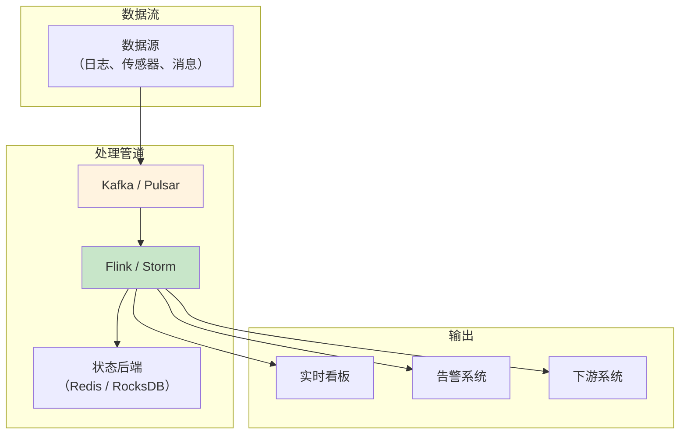
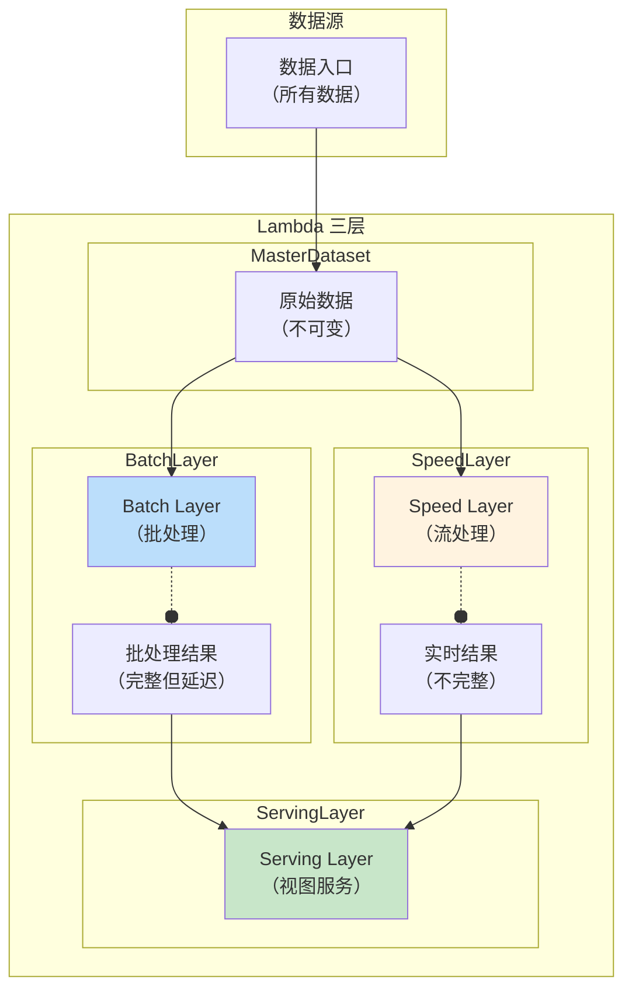
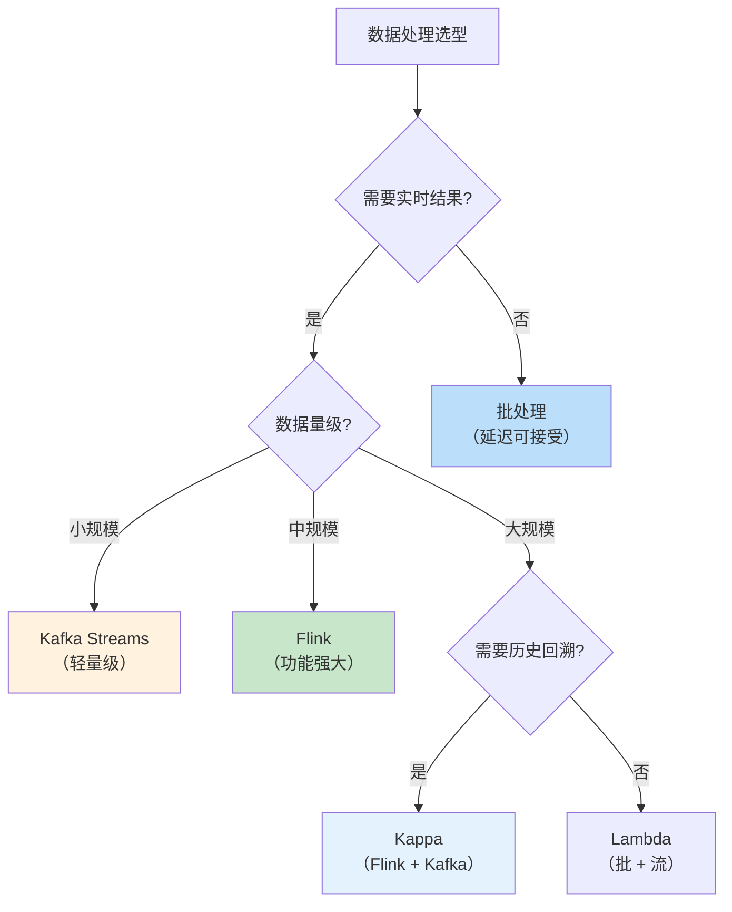

# 批处理 vs 流处理

凌晨 3 点，数据团队跑完了昨日的数据报表：用户增长、GMV、复购率——所有指标都已更新到 BI 看板。业务团队上班后就能看到昨天的完整数据。

但有一个问题：这份报表的数据截止到昨天 24:00。如果有人在凌晨 1 点下了单，管理层早上 8 点才能看到这条数据。

这就是批处理的本质：**定时处理大量数据，提供完整但延迟的结果**。与之对应的是流处理：**持续处理单条数据，提供实时但可能不完整的结果**。

## 两种处理范式的对比

```mermaid
flowchart LR
    subgraph 批处理（离线）
        B1["数据收集\n（T+1）"] --> B2["定时执行\n（每日/每小时）"]
        B2 --> B3["完整结果\n（延迟高）"]
    end
    
    subgraph 流处理（实时）
        S1["数据持续流入\n（实时）"] --> S2["逐条处理\n（微批次或单条）"]
        S2 --> S3["增量结果\n（延迟低）"]
    end
    
    style B1 fill:#bbdefb
    style S1 fill:#c8e6c9
```

| 维度 | 批处理 | 流处理 |
| --- | --- | --- |
| **数据范围** | 全量数据 | 单条或微批次 |
| **处理延迟** | 分钟~小时级 | 毫秒~秒级 |
| **结果完整性** | 100%（无遗漏） | 可能有数据丢失 |
| **计算模式** | 定时批量计算 | 持续增量计算 |
| **系统复杂度** | 较低 | 较高 |
| **资源消耗** | 周期性峰值 | 持续平稳 |

## 批处理：大规模数据的王者

### 核心特征

批处理系统在固定时间窗口内处理大量数据，通常是 T+1（今天的数据明天才能看到）甚至更长的延迟。

### 典型场景

**BI 报表**：日活、月活、GMV、转化率——这类指标需要聚合全量数据，不需要实时更新。

**数据仓库同步**：从业务数据库同步数据到数据仓库，通常是每日全量或增量同步。

**邮件营销**：每天凌晨跑一次用户分群，生成当天的营销人群包。

### 技术选型

| 框架 | 特点 | 适用场景 |
| --- | --- | --- |
| **Hadoop MapReduce** | 大数据批处理经典 | 超大规模数据处理 |
| **Spark** | 内存计算，速度快 | 中大规模数据 |
| **Flink（Batch）** | 统一批流引擎 | 需要同时处理批和流 |
| **DataX** | 异构数据源同步 | 数据库到数据仓库 |

### 代码示例：Spark 批处理

```java
// Spark 批处理：计算昨日活跃用户
public class DailyActiveUsers {
    
    public static void main(String[] args) {
        SparkSession spark = SparkSession.builder()
            .appName("DailyActiveUsers")
            .getOrCreate();
        
        JavaSparkContext sc = new JavaSparkContext(spark.sparkContext());
        
        // 读取昨日日志
        JavaRDD<String> logs = sc.textFile("hdfs:///logs/2024-01-15/*.log");
        
        // 解析并提取用户 ID
        JavaRDD<String> userIds = logs.map(line -> {
            String[] fields = line.split(",");
            return fields[3];  // 第4个字段是 user_id
        });
        
        // 去重并计数
        long activeUsers = userIds.distinct().count();
        
        // 写入结果表
        spark.sql("INSERT INTO bi.daily_metrics VALUES ('2024-01-15', 'active_users', " + activeUsers + ")");
        
        sc.close();
    }
}
```

### 批处理的代价

**延迟高**：最快要等一个批次窗口结束才能出结果（通常 1 小时起步）。

**资源峰值**：批处理作业启动时资源占用激增，可能影响在线服务。

**不支持实时决策**：无法基于实时数据做即时响应。

## 流处理：实时数据的引擎

### 核心特征

流处理系统持续处理数据流，处理延迟从毫秒到秒不等。



### 典型场景

**实时大屏**：双十一成交额大屏，每秒更新一次。

**实时告警**：接口响应时间 P99 超过 500ms，立即告警。

**实时推荐**：用户点击行为秒级更新推荐模型。

**反欺诈**：交易风控，毫秒级判断是否可疑。

### 技术选型

| 框架 | 特点 | 适用场景 |
| --- | --- | --- |
| **Apache Flink** | 强一致、有状态、流批一体 | 复杂实时计算 |
| **Apache Kafka Streams** | 轻量级、Kafka 原生 | 简单实时处理 |
| **Apache Spark Streaming** | 微批次，兼容 Spark | 需要批流统一 |
| **Apache Storm** | 纯流处理、低延迟 | 简单 ETL |

### 代码示例：Flink 流处理

```java
// Flink 流处理：实时统计每分钟下单金额
public class RealTimeOrderStats {
    
    public static void main(String[] args) throws Exception {
        StreamExecutionEnvironment env = 
            StreamExecutionEnvironment.getExecutionEnvironment();
        
        // 启用检查点，保证 exactly-once
        env.enableCheckpointing(1000);
        env.getCheckpointConfig().setCheckpointStorage("hdfs:///checkpoints");
        
        // 读取订单 Kafka Topic
        DataStream<Order> orders = env.addSource(
            new FlinkKafkaConsumer<>(
                "orders",
                new OrderDeserializationSchema(),
                kafkaProps
            )
        );
        
        // 实时聚合：每分钟统计 GMV
        DataStream<MinuteGMV> gmvStats = orders
            .keyBy(order -> order.getProductCategory())
            .timeWindow(Time.minutes(1))
            .sum("amount");
        
        // 输出到 Kafka
        gmvStats.addSink(new FlinkKafkaProducer<>(
            "minute-gmv-stats",
            new MinuteGMVSerializationSchema(),
            kafkaProps
        ));
        
        env.execute("RealTimeOrderStats");
    }
}
```

### 流处理的代价

**状态管理复杂**：需要维护处理状态（窗口聚合、JOIN 数据），状态丢失会导致结果错误。

**处理语义难保证**：exactly-once 比 at-least-once 复杂得多。

**资源持续消耗**：24 小时运行，资源持续占用。

**调试困难**：流处理链路长，出问题排查难度大。

## Lambda 架构：鱼和熊掌兼得？

Lambda 架构试图同时获得批处理的完整性和流处理的实时性。



### 原理

- **Batch Layer**：处理全量历史数据，提供完整但延迟高的结果
- **Speed Layer**：处理新数据，提供实时但可能不完整的结果
- **Serving Layer**：合并两个结果，实时数据补充批处理数据的延迟

### Lambda 的问题

**维护两套代码**：批处理和流处理用不同框架，逻辑需要维护两份。

**一致性难以保证**：两个层的数据格式、计算逻辑需要完全一致。

**运维成本高**：批处理和流处理两套系统都需要运维。

## Kappa 架构：简化的尝试

Kappa 架构用纯流处理替代 Lambda 的批处理层，用 Kafka 作为统一数据源。

```mermaid
flowchart TD
    subgraph 数据源
        App["应用"]
        Logs["日志"]
        DB["数据库变更"]
    end
    
    subgraph Kafka（统一数据源）
        K["Kafka\n（消息持久化）"]
    end
    
    subgraph 处理层
        F["Flink\n（流处理引擎）"]
    end
    
    subgraph 输出
        O1["实时计算"]
        O2["历史回溯"]
        O3["离线仓库"]
    end
    
    App --> K
    Logs --> K
    DB --> K
    
    K --> F
    F --> O1
    F --> O2
    F --> O3
    
    style K fill:#fff3e0
    style F fill:#c8e6c9
```

### Kappa 的优势

**统一代码**：批处理和流处理用同一套逻辑。

**简化运维**：只需要运维流处理系统。

**历史回溯**：Kafka 保留全量数据，可以随时回溯重新计算。

### Kappa 的限制

**Kafka 存储成本**：全量数据存在 Kafka，存储成本高。

**不适合超大规模**：超大规模数据回溯耗时长。

## 选型决策树



## 常见误区

### 「批处理已经过时了」

批处理在大数据场景下仍然不可或缺：
- 全量数据聚合
- 模型训练
- 数据仓库同步

对于 T+1 业务场景，批处理是性价比最高的选择。

### 「流处理可以替代批处理」

流处理擅长增量计算，但「全量重新计算」是流处理的弱项。如果业务需要每天跑全量报表，流处理不适合。

### 「Lambda 架构是银弹」

Lambda 需要维护两套系统、两套代码。除非对实时性和完整性都有极致要求，否则 Kappa 或纯批处理/流处理更简单。

### 忽视状态管理

流处理中，状态管理是最容易出问题的环节：
- 状态数据丢失 → 结果错误
- 状态数据过大 → 内存溢出
- 检查点间隔大 → 恢复时间长

## 思考题

**问题 1**：一个电商平台的「实时 GMV 大屏」和「每日销售报表」应该分别用什么架构？为什么？

<details>
<summary>参考答案</summary>

**实时 GMV 大屏**：流处理架构
- **技术方案**：Kafka + Flink，实时消费订单消息，每秒计算 GMV
- **延迟要求**：`<` 1 秒更新
- **数据完整性**：允许短暂误差（最终以每日报表为准）

**每日销售报表**：批处理架构
- **技术方案**：Spark / DataX，从订单库同步数据，按日聚合
- **延迟要求**：T+1 即可
- **数据完整性**：必须 100% 准确

**为什么不混用？**
- 如果用批处理做实时大屏，延迟太高
- 如果用流处理做每日报表，历史回溯成本高

</details>

**问题 2**：Flink 的 exactly-once 语义是怎么实现的？为什么实现 exactly-once 比 at-least-once 复杂得多？

<details>
<summary>参考答案</summary>

**Flink exactly-once 实现原理**：

1. **分布式快照（Checkpoint）**：
   - Barrier 对齐机制：等待所有输入 Channel 的 Barrier 到达后再处理
   - 快照状态：将处理状态异步写入持久化存储（如 HDFS）
   - 两阶段提交：Sink 提交时需要两阶段提交确保数据不丢失

2. **Source 端的偏移管理**：
   - Kafka Consumer 维护偏移量到 Checkpoint
   - 故障恢复时，从 Checkpoint 恢复偏移量，重新消费

**为什么比 at-least-once 复杂**：

| 机制 | at-least-once | exactly-once |
| --- | --- | --- |
| **重试** | 简单重试即可 | 需要幂等 Sink 或两阶段提交 |
| **状态** | 可丢失，重新计算 | 必须持久化状态 |
| **输出** | 可能有重复 | 必须恰好一次 |
| **复杂度** | 低 | 高 |

**代价**：
- 性能下降：Barrier 对齐需要等待
- 实现复杂：Source + Channel + Operator + Sink 都需要配合
- 运维成本：Checkpoint 存储、恢复时间

</details>

**问题 3**：如果你负责设计一个「实时 + 历史」的指标计算系统，数据量预估 1 年 100 亿条，应该选择 Lambda 还是 Kappa？为什么？

<details>
<summary>参考答案</summary>

**选择方案：混合架构**

1. **近期数据（最近 7 天）**：Kappa + Flink
   - Kafka 保留 7 天数据
   - Flink 流处理计算实时指标
   - 数据量：约 19 亿条，Kafka 存储压力可控

2. **历史数据（7 天以上）**：批处理
   - 每日凌晨跑批处理
   - 将结果写入 ClickHouse 或 ES
   - 历史查询走 ClickHouse

3. **Serving 层合并**：应用层合并
   ```java
   public Metrics getMetrics(long userId, String date) {
       if (isRecentDate(date)) {
           return realtimeMetrics.get(userId);
       } else {
           return batchMetrics.get(userId, date);
       }
   }
   ```

**为什么不纯 Kappa**：
- 100 亿条数据存 Kafka 成本太高
- 一年数据回溯耗时长

**为什么不纯 Lambda**：
- 两套代码维护成本高
- 只有少数指标需要同时实时和完整

</details>
