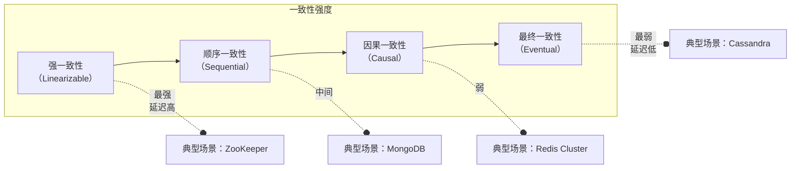
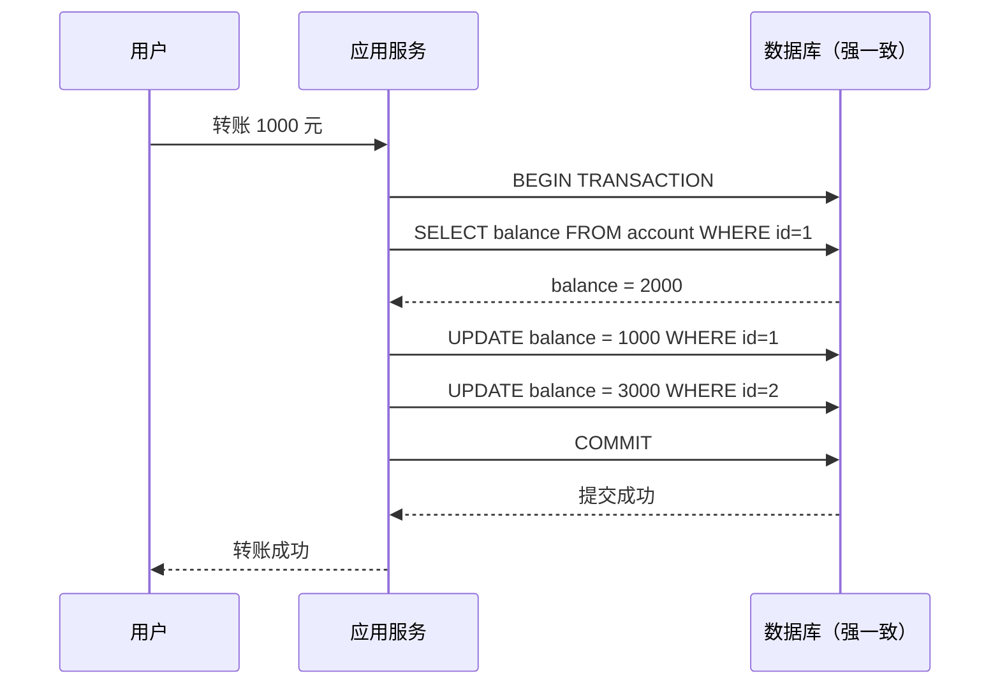
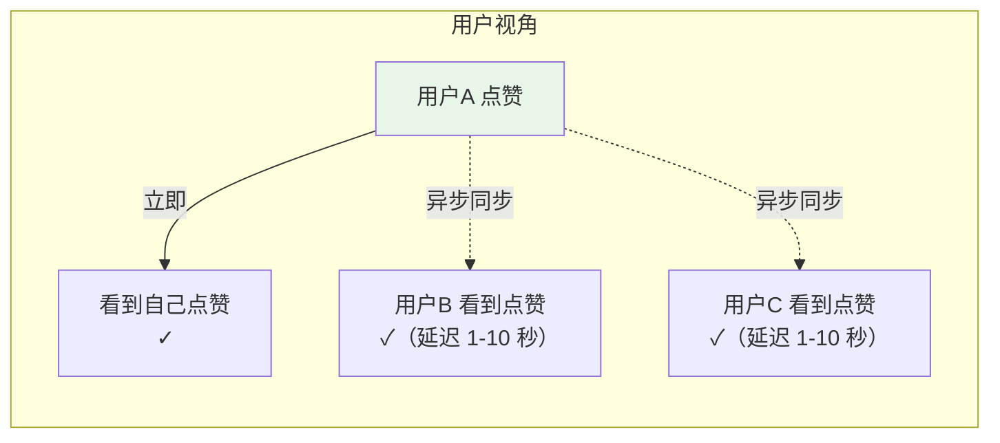
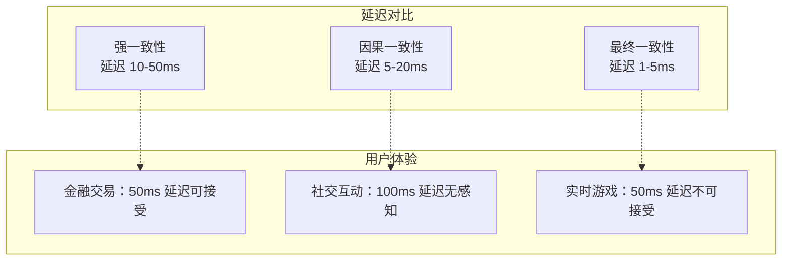
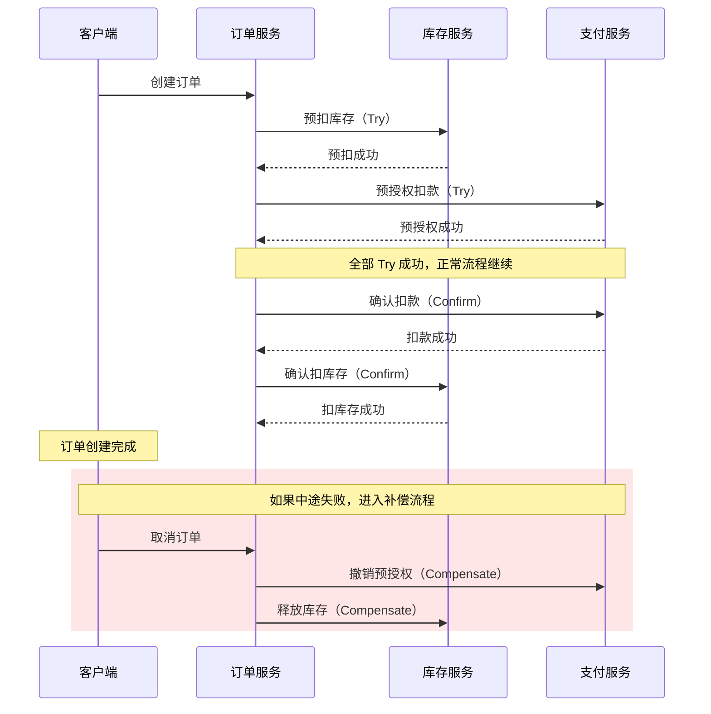
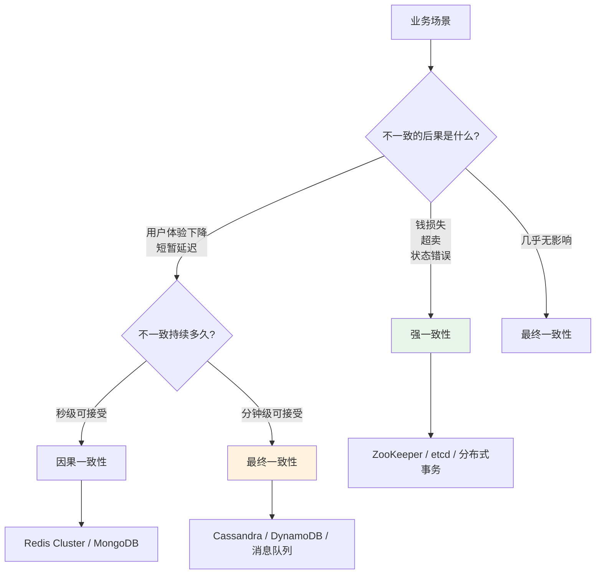

# 强一致性 vs 最终一致性场景选择

「用户下单成功了，为什么刷新页面订单状态还是『待支付』？」

这是最终一致性系统最常见的问题。用户以为「操作成功 = 立刻看到结果」，但实际上很多系统在保证高可用性的同时，选择了牺牲实时一致性——写入的数据需要经过一段时间才能被所有读取节点感知。

强一致性和最终一致性不是「好与坏」的区别，而是「不同场景下的合理选择」。选错了，用户体验崩塌；选对了，系统可用性和性能双双提升。

## 一致性模型光谱

一致性不是一个二选一的开关，而是一个连续的光谱：



| 一致性模型 | 定义 | 典型系统 | 延迟 | 可用性 |
| --- | --- | --- | --- | --- |
| **强一致性** | 所有节点同时看到相同数据 | ZooKeeper、etcd、传统 RDBMS | 高 | 较低 |
| **顺序一致性** | 所有节点看到操作顺序相同 | MongoDB（单副本） | 中 | 中 |
| **因果一致性** | 因果相关的操作顺序一致 | Cassandra（有因果保证时） | 中 | 高 |
| **最终一致性** | 暂时不一致，最终收敛 | DynamoDB、Cassandra | 低 | 极高 |

## 强一致性场景：这些地方不能妥协

### 金融交易：钱不能算错

银行转账、证券交易、支付结算——这些场景的一致性要求是「一个字都不能错」。多转了钱要追回，少转了钱要补足，系统还要能经受审计。



强一致性的代价：
- **延迟较高**：需要等待多数节点确认
- **可用性较低**：分区时无法服务

但对于金融场景，「宁可不可用，也不能出错」。ZooKeeper 和 etcd 是这类场景的标配。

### 库存扣减：超卖是灾难

电商秒杀、演唱会抢票、限时抢购——库存扣减必须是强一致性的。一旦出现超卖，要么赔钱安抚用户，要么让用户失望而归。

强一致性库存扣减的核心逻辑：

```java
// 强一致性扣库存（分布式锁）
public boolean deductInventory(long productId, int quantity) {
    // 1. 获取分布式锁
    String lockKey = "inventory:lock:" + productId;
    String lockValue = UUID.randomUUID().toString();
    boolean locked = redis.set(lockKey, lockValue, "NX", "EX", 10);
    if (!locked) {
        return false; // 获取锁失败，说明正在被扣减
    }
    
    try {
        // 2. 查询当前库存
        int currentStock = getStock(productId);
        if (currentStock < quantity) {
            return false; // 库存不足
        }
        
        // 3. 扣减库存（事务保证原子性）
        int newStock = currentStock - quantity;
        updateStock(productId, newStock);
        
        return true;
    } finally {
        // 4. 释放锁
        redis.del(lockKey);
    }
}
```

### 订单状态：状态机不能跳步

订单从「待支付」到「已支付」再到「已发货」是一个严格的状态机。如果允许最终一致性，库存扣减和订单状态可能短暂不一致，导致「已发货但库存未扣减」的尴尬局面。

强一致性的订单处理通常使用：
- **分布式事务**（2PC/3PC）：强一致但性能差
- **Saga 模式 + 补偿事务**：最终一致但实现复杂
- **消息队列 + 本地消息表**：折中方案

## 最终一致性场景：可以容忍短暂不一致

### 社交互动：点赞不用那么急

用户点赞一条微博，看到自己点了赞就够开心了。至于其他用户什么时候能看到——晚几秒完全没人在意。



这类场景的特点：
- **用户不直接感知数据一致性**：用户只关心自己看到的结果
- **短暂不一致可接受**：几秒到几十秒的延迟用户无感知
- **可用性要求极高**：社交场景「服务挂了」比「数据不一致」更严重

### 内容发布：草稿不需要立即可见

发布文章、上传视频、编辑资料——这类操作通常也是最终一致性的。用户点击「发布」后，系统告诉用户「发布成功」，实际上后台可能还在处理上传、转码等操作。

### 消息推送：推送晚几秒无所谓

用户发送一条消息，如果对方「晚 0.5 秒收到」会有什么影响吗？几乎没有。所以消息推送系统通常采用最终一致性，只要消息不丢、最终能送达就行。

## 一致性延迟与用户体验

一致性与延迟是一对矛盾：越强的一致性，往往意味着越高的延迟。



**延迟敏感型场景**（如实时游戏、在线协作编辑）通常选择较弱的一致性模型，因为强一致性带来的延迟会直接破坏用户体验。

**一致性敏感型场景**（如金融交易、库存扣减）则必须选择强一致性，即使延迟高一些也可以接受。

## Saga 模式：最终一致性下的可靠事务

强一致性场景用分布式事务，最终一致性场景用什么？答案是 **Saga 模式**。

Saga 将一个分布式事务拆分成多个本地事务，每个本地事务都有对应的补偿操作。如果某个步骤失败，就依次执行之前成功步骤的补偿操作来「回滚」。



Saga 的核心代码实现：

```java
// Saga 编排器
public class OrderSaga {
    
    public void execute(CreateOrderCommand command) {
        try {
            // Step 1: 预扣库存
            inventoryService.tryDeduct(command.getProductId(), command.getQuantity());
            
            // Step 2: 预授权支付
            paymentService.tryAuthorize(command.getUserId(), command.getAmount());
            
            // Step 3: 创建订单
            orderService.createOrder(command);
            
            // Step 4: 确认扣款
            paymentService.confirm(command.getUserId(), command.getAmount());
            
            // Step 5: 确认扣库存
            inventoryService.confirmDeduct(command.getProductId(), command.getQuantity());
            
        } catch (Exception e) {
            // 补偿：如果某步失败，回滚之前的步骤
            compensate();
            throw e;
        }
    }
    
    private void compensate() {
        // 补偿顺序与执行顺序相反
        if (inventoryConfirmed) {
            inventoryService.releaseDeduct(productId, quantity);
        }
        if (paymentAuthorized) {
            paymentService.cancelAuthorize(userId, amount);
        }
        if (inventoryTried) {
            inventoryService.releaseTryDeduct(productId, quantity);
        }
    }
}
```

Saga 的优势是**性能好、无锁**；代价是**实现复杂、需要完整的补偿逻辑**。

## 选型决策树

如何根据业务场景选择一致性级别？



| 决策问题 | 选择强一致性 | 选择最终一致性 |
| --- | --- | --- |
| 数据不一致会直接造成财产损失吗？ | 是 → 强一致 | 否 → 可考虑最终一致 |
| 用户能感知到短暂的数据不一致吗？ | 能 → 强一致 | 不能 → 可考虑最终一致 |
| 系统可用性要求有多高？ | 要求一般 → 强一致 | 要求极高 → 最终一致 |
| 业务是否可以接受补偿事务？ | 可以 → Saga | 不能 → 强一致 |

## 常见误区

### 「最终一致性 = 不需要一致性」

最终一致性不是「随便写、随便读」，而是「允许短暂不一致、但最终要收敛」。系统需要设计冲突解决机制，确保并发写入不会导致数据永久冲突。

### 「强一致性一定更好」

强一致性意味着更高的延迟和更低的可用性。对于社交点赞、消息推送这种场景，强一致性带来的代价远超收益。

### 忽视补偿逻辑

选择 Saga 模式后，很多团队只想着「正常流程怎么走」，忽视了「失败时怎么补偿」。没有完整补偿逻辑的 Saga，等于「没有回滚机制的分布式事务」——比不用 Saga 更危险。

### 不考虑业务演进

初期业务简单，可以选择最终一致性；等业务复杂后，可能需要升级到强一致性。设计时要考虑「迁移成本」。

## 思考题

**问题 1**：一个外卖订单系统，用户下单后需要通知商家接单、骑手取餐。应该选择强一致性还是最终一致性？为什么？

<details>
<summary>参考答案</summary>

**建议选择最终一致性**，原因如下：

1. **用户下单的核心诉求是「快」**：用户不想在支付页面等 500ms 才能看到结果
2. **短暂不一致可接受**：商家「晚 0.5 秒收到通知」几乎没有影响
3. **高可用性重要**：高峰期外卖系统如果挂了，损失巨大
4. **补偿机制完善**：如果商家没有收到通知，可以通过电话或重新推送解决

但需要注意：
- **支付环节必须强一致**：钱不能算错
- **库存扣减必须强一致**：不能超卖
- **通知可以异步**：用消息队列实现最终一致

实际实现可以采用**混合策略**：核心链路（支付、库存）用强一致性，非核心链路（通知）用最终一致性。

</details>

**问题 2**：在线文档协作（如 Google Docs）需要什么级别的一致性？为什么？

<details>
<summary>参考答案</summary>

**需要因果一致性**，原因如下：

1. **并发编辑需要因果保证**：用户A 删了一行，用户B 在那行后面打字——两操作必须因果有序，否则结果混乱
2. **强一致性延迟太高**：如果每次操作都要等待所有节点确认，用户会感受到明显卡顿
3. **可用性要求高**：在线文档通常是多人实时协作，服务挂了影响整个团队工作

具体实现：
- Google Docs 使用 **CRDT（Conflict-free Replicated Data Type）** 实现无冲突协同编辑
- CRDT 是一种特殊的因果一致性保证，即使有并发编辑，也能自动合并成正确结果
- 操作变换（Operational Transform）是另一种方案，通过变换操作序列来保证因果

核心思路：**因果一致性强于最终一致性（保证协作有序），弱于强一致性（允许并发无冲突）**。

</details>

**问题 3**：如果 Saga 模式的某个补偿操作也失败了，应该怎么办？

<details>
<summary>参考答案</summary>

这是 Saga 模式的经典难题，需要系统性解决：

1. **设计幂等补偿**：补偿操作必须设计为幂等的，可以安全重试
2. **人工介入机制**：
   - 记录所有「补偿失败」的事务到告警表
   - 值班人员定期检查并手动处理
   - 关键场景（如金额相关）设置人工审批流程

3. **重试 + 死信队列**：
   ```java
   try {
       compensate();
   } catch (Exception e) {
       // 写入死信队列，等待后续重试
       deadLetterQueue.send(new CompensationTask(sagaState));
       alert("补偿失败，需要人工介入");
   }
   ```

4. **预设最大重试次数**：超过后触发告警并暂停新事务

5. **架构上避免补偿失败**：
   - 使用更可靠的消息队列（如 Kafka 持久化）
   - 补偿操作设计为「只增不减」，避免回滚失败

**核心原则**：Saga 不能保证 100% 自动恢复，但可以通过设计让「需要人工介入」的情况尽可能少、且人工介入的复杂度尽可能低。

</details>
