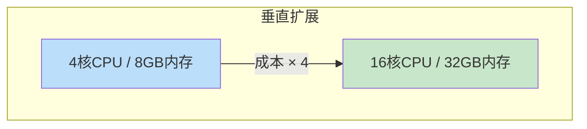
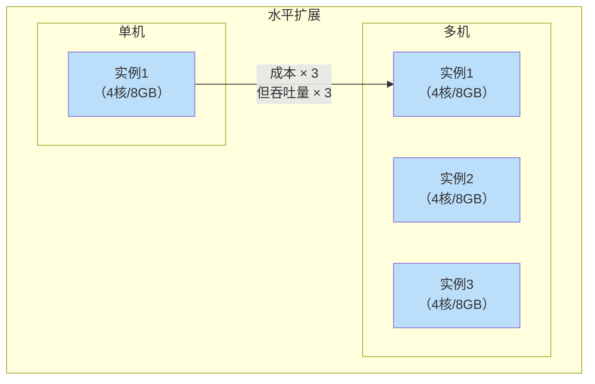
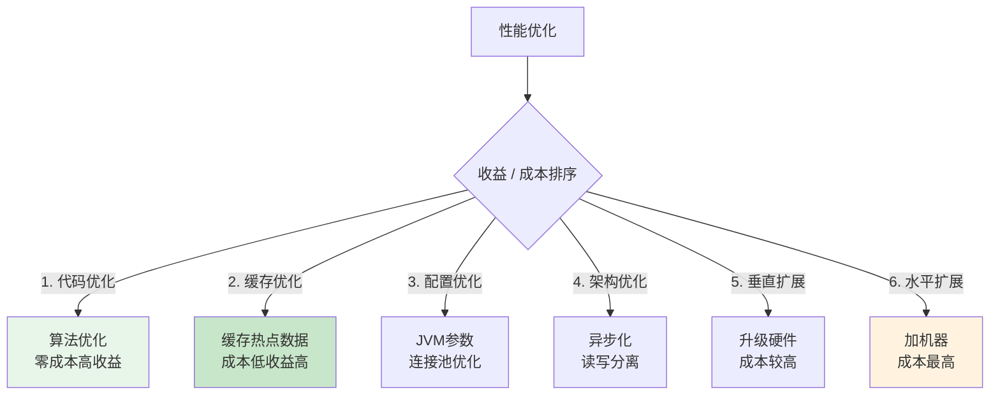

# 成本 vs 性能的经济权衡

双十一前夕，团队讨论是否要升级服务器配置：加 30 万预算买更好的机器，把 P99 延迟从 100ms 降到 50ms。

这个决策看似简单，实际上需要回答几个问题：
- 50ms 延迟能带来多少收益？
- 除了买机器，还有没有其他方案？
- 这个收益值得投入吗？

**性能优化不是技术问题，而是经济问题**。在资源有限的情况下，如何让每一分钱都花在刀刃上，是架构师的核心能力之一。

## 性能优化的成本矩阵

### 硬件成本

| 组件 | 低配方案 | 高配方案 | 性能提升 | 成本增加 |
| --- | --- | --- | --- | --- |
| **CPU** | 4 核 | 16 核 | 2-3 倍 | 3 倍 |
| **内存** | 8GB | 32GB | 缓存命中率提升 | 3 倍 |
| **磁盘** | HDD | NVMe SSD | IOPS 10 倍 | 5 倍 |
| **网络** | 1Gbps | 10Gbps | 带宽 10 倍 | 3 倍 |

### 软件成本

| 类型 | 成本构成 | 示例 |
| --- | --- | --- |
| **许可证** | 商业软件授权费 | Oracle、VMware |
| **人力** | 优化、运维人力 | DBA、DevOps |
| **时间** | 优化研发周期 | 3 个月的优化工作 |
| **机会成本** | 投入优化 vs 开发新功能 | 放弃一个功能 |

### 隐性成本

| 隐性成本 | 说明 |
| --- | --- |
| **复杂度增加** | 高级优化往往引入更多组件 |
| **运维负担** | 高性能系统通常运维更复杂 |
| **技术债务** | 快速优化可能带来技术债务 |
| **学习成本** | 新技术需要团队学习 |

## 性能优化的收益量化

### 直接收益

可以直接量化的收益：

1. **收入增长**：
   - 页面加载每慢 1 秒，转化率下降约 7%（Google 研究）
   - 搜索延迟每增加 100ms，收入下降约 1%（Amazon 研究）

2. **成本节约**：
   - 性能提升 30%，服务器成本下降 30%
   - 缓存命中率提升，数据库压力下降

3. **用户留存**：
   - 性能好的产品用户留存率更高
   - 用户推荐（NPS）更高

### 间接收益

难以直接量化但有影响的收益：

1. **品牌价值**：好的性能提升品牌形象
2. **员工满意度**：开发体验更好
3. **竞争优势**：比竞品更好的用户体验

## 优化策略的经济分析

### 策略一：垂直扩展（Scale Up）

通过升级硬件提升性能。



**优势**：
- 实现简单，改配置即可
- 无需代码改造

**劣势**：
- 有天花板（单机能扩展的极限）
- 成本线性增长

**适用场景**：初期业务、资金有限、快速验证

### 策略二：水平扩展（Scale Out）

通过增加机器数量提升性能。



**优势**：
- 无天花板
- 成本线性增长
- 故障容错好

**劣势**：
- 需要应用支持无状态
- 需要负载均衡
- 可能需要分布式改造

**适用场景**：业务快速增长、需要高可用

### 策略三：缓存优化

通过减少计算和 IO 提升性能。

```java
// 无缓存：每次请求都查数据库
public User getUserById(Long userId) {
    return userRepository.findById(userId);  // 10ms
}

// 有缓存：热点数据从缓存读取
public User getUserById(Long userId) {
    String key = "user:" + userId;
    User user = redis.get(key);
    if (user == null) {
        user = userRepository.findById(userId);
        redis.setex(key, 3600, user);  // 1ms + 缓存
    }
    return user;
}
```

**优势**：
- 成本低（Redis 比数据库便宜）
- 性能提升显著

**劣势**：
- 增加复杂度
- 引入缓存一致性问题

**成本对比**：

| 方案 | QPS | 成本 | 单次成本 |
| --- | --- | --- | --- |
| 无缓存 | 1000 | 数据库费用 | 高 |
| Redis 缓存 | 10000 | Redis + 数据库 | 低 |

### 策略四：异步处理

通过异步化减少同步等待时间。

```java
// 同步：用户等待 500ms
public Order placeOrder(OrderRequest request) {
    validateOrder(request);  // 50ms
    deductInventory(request);  // 200ms
    createOrder(request);  // 100ms
    sendNotification(request);  // 150ms
    return order;  // 总计 500ms
}

// 异步：用户等待 50ms
public Order placeOrder(OrderRequest request) {
    validateOrder(request);  // 50ms
    saveOrder(request);  // 20ms
    mq.send(request);  // 5ms
    return order;  // 总计 75ms
    // 后续：异步扣库存、发通知
}
```

**优势**：
- 用户体验显著提升
- 系统吞吐提升

**劣势**：
- 实现复杂度增加
- 需要处理异步失败

### 策略五：代码优化

通过算法和数据结构优化提升性能。

```java
// 低效算法：O(n²)
public boolean hasDuplicate(List<Integer> nums) {
    for (int i = 0; i < nums.size(); i++) {
        for (int j = i + 1; j < nums.size(); j++) {
            if (nums.get(i).equals(nums.get(j))) {
                return true;
            }
        }
    }
    return false;
}

// 高效算法：O(n)
public boolean hasDuplicate(List<Integer> nums) {
    Set<Integer> seen = new HashSet<>();
    for (int num : nums) {
        if (!seen.add(num)) {
            return true;
        }
    }
    return false;
}
```

**优势**：
- 零成本（不需要加硬件）
- 性能提升可能巨大

**劣势**：
- 需要技术能力
- 可能降低代码可读性

## ROI 分析框架

### 计算公式

```
ROI = (收益 - 成本) / 成本 × 100%
```

### 示例分析

**场景**：电商系统，P99 延迟 200ms，希望优化到 100ms

**方案对比**：

| 方案 | 成本 | 延迟改善 | 预期收益 | ROI |
| --- | --- | --- | --- | --- |
| **加机器** | 30 万/年 | 30% | 收入增长 5%（约 200 万） | 567% |
| **加缓存** | 5 万/年 | 50% | 同上 | 3900% |
| **代码优化** | 10 万（人力） | 40% | 同上 | 1900% |

**结论**：优先考虑缓存和代码优化，再考虑加机器。

### 优先级排序



## 瓶颈定位：先找最重要的问题

不是所有性能问题都值得优化。要先找到**最大的瓶颈**，把资源投入在回报最高的地方。

### 瓶颈分析方法

1. **监控先行**：用 APM 工具（如 Skywalking、Pinpoint）定位瓶颈
2. **80/20 法则**：80% 的性能问题来自 20% 的代码
3. **木桶原理**：最短板决定整体性能

```mermaid
flowchart LR
    subgraph 请求链路
        R["请求"] --> API["API\n10ms"]
        API --> S["Service\n50ms"]
        S --> D["DAO\n100ms"]
        D --> DB["Database\n100ms"]
    end
    
    subgraph 瓶颈分析
        N1["API 占 5%"]
        N2["Service 占 25%"]
        N3["DAO 占 20%"]
        N4["Database 占 50%"]
    end
    
    style DB fill:#ffcdd2
    
    Note over DB: 瓶颈在数据库\n优先优化数据库
```

### 常见瓶颈及优化策略

| 瓶颈 | 识别特征 | 优化策略 | 成本 |
| --- | --- | --- | --- |
| **数据库** | CPU 高、IO 等待 | 加索引、优化 SQL、分库分表 | 中 |
| **网络** | 延迟高、带宽满 | 压缩、合并请求、CDN | 低 |
| **内存** | OOM、GC 频繁 | 减少对象、优化数据结构 | 低 |
| **CPU** | CPU 100% | 算法优化、多线程 | 低 |
| **IO** | 磁盘 IO 高 | SSD、缓存、顺序写 | 中 |

## 成本控制策略

### 资源预留 vs 按需付费

| 策略 | 适用场景 | 成本 |
| --- | --- | --- |
| **预留实例** | 稳定负载 | 便宜 30-50% |
| **按需付费** | 波动负载 | 贵但灵活 |
| **Spot 实例** | 容错任务 | 便宜 70% |

### 弹性扩缩容

```java
// Kubernetes HPA：根据负载自动扩缩容
apiVersion: autoscaling/v2
kind: HorizontalPodAutoscaler
metadata:
  name: api-hpa
spec:
  scaleTargetRef:
    apiVersion: apps/v1
    kind: Deployment
    name: api
  minReplicas: 2
  maxReplicas: 10
  metrics:
  - type: Resource
    resource:
      name: cpu
      target:
        type: Utilization
        averageUtilization: 70
```

### 降级与熔断

在流量高峰时，主动降级非核心功能，保证核心功能可用。

```java
// 降级：系统压力大时返回默认值
@Service
public class RecommendationService {
    
    @HystrixCommand(fallbackMethod = "getDefaultRecommendation")
    public List<Product> getRecommendation(Long userId) {
        // 正常逻辑
        return calculateRecommendation(userId);
    }
    
    // 降级方法：返回默认推荐
    public List<Product> getDefaultRecommendation(Long userId) {
        return defaultProducts;  // 返回固定列表，不查数据库
    }
}
```

## 真实案例

> **Netflix 的成本优化**：Netflix 通过「压缩响应」「合并 API」「边缘缓存」等手段，在不增加服务器的情况下支撑了 10 倍的业务增长。
>
> 核心思路：**不是买更多机器，而是让现有机器更高效**。
>
> 数据：
> - 响应压缩：带宽降低 50%
> - API 合并：请求数降低 30%
> - 边缘缓存：数据库压力降低 60%

## 常见误区

### 「性能问题一定要加机器」

很多性能问题是代码问题，加机器只能掩盖问题，不能解决问题。**优先排查代码层面的瓶颈**。

### 「买了贵的机器性能就一定好」

贵机器只保证「单机能提供更高性能」，不保证「性价比更高」。如果应用不支持水平扩展，买了贵机器等于浪费。

### 「优化一次就能解决所有问题」

业务在增长，用户在增加，优化效果会随时间衰减。需要持续监控、及时优化。

### 「不计成本追求极致性能」

P99 延迟从 100ms 优化到 50ms 可能需要多花 50% 的成本，但从 50ms 优化到 40ms 可能需要再花 100% 的成本。**边际收益递减**。

## 思考题

**问题 1**：一个日活 10 万的 APP，当前服务器成本 5 万/月。要优化 P99 延迟从 300ms 到 100ms，有以下方案：
- 方案 A：加服务器，2 万/月
- 方案 B：加缓存，5 千/月
- 方案 C：代码优化，1 人/月（约 2 万）

你应该选择哪个方案？为什么？

<details>
<summary>参考答案</summary>

**推荐优先级**：方案 C → 方案 B → 方案 A

**理由**：

1. **方案 C（代码优化）**：成本最低（2 万一次性），收益最高（可能提升 50%+）
   - 先排查是否是代码问题（慢查询、循环调用）
   - 如果能通过代码优化解决，ROI 最高

2. **方案 B（缓存）**：成本低（5 千/月），但需要代码配合
   - 热点数据缓存
   - 需要一定代码改造
   - 月成本比方案 A 低很多

3. **方案 A（加服务器）**：成本最高，但最简单
   - 如果代码优化 + 缓存仍不满足要求，再考虑加机器
   - 不是首选方案

**ROI 对比**：

| 方案 | 成本 | 预期收益 | ROI |
| --- | --- | --- | --- |
| A | 2 万/月 | 延迟降低 67% | 取决于收入增长 |
| B | 0.5 万/月 | 延迟降低 50% | 最高 |
| C | 2 万（一次性） | 延迟降低 50%+ | 最高（一次性成本） |

**结论**：先做代码分析和缓存优化，再考虑加服务器。

</details>

**问题 2**：P99 延迟从 100ms 降到 50ms 和从 50ms 降到 30ms 的成本一样吗？为什么？

<details>
<summary>参考答案</summary>

**成本不一样，边际成本递增**：

1. **100ms → 50ms（降低 50ms）**：
   - 常见优化手段（加缓存和优化索引）就能达到
   - 成本：相对较低
   - 难度：简单

2. **50ms → 30ms（降低 20ms）**：
   - 需要更精细的优化（更深的缓存、更高效的算法）
   - 成本：显著增加
   - 难度：较大

3. **30ms → 20ms（降低 10ms）**：
   - 需要极限优化（内存优化、网络优化）
   - 成本：非常高
   - 难度：很大

**原因**：

- 容易摘的果实（低垂的果实）已经被摘完了
- 越往后优化，越接近物理极限（CPU、内存、网络延迟）
- 边际收益递减规律

**实际建议**：

- 先评估「50ms 是否满足业务需求」
- 如果满足，不需要追求 30ms
- 如果不满足，再考虑投入更多资源优化

</details>

**问题 3**：如果老板让你「把服务器成本降低 50%，但性能不能下降」，你会怎么做？

<details>
<summary>参考答案</summary>

**系统性分析**：

1. **第一步：定位当前瓶颈**
   - 使用 APM 工具定位瓶颈点
   - 是 CPU 高、内存高、还是 IO 高？
   - 是哪个服务/接口最慢？

2. **第二步：识别资源浪费**
   - 是否有资源闲置？（利用率低的服务器）
   - 是否有过度配置？（买了太好的机器）
   - 是否有低效架构？（架构导致资源利用率低）

3. **第三步：实施低成本优化**
   - **缓存优化**：减少数据库压力（成本低，效果好）
   - **弹性扩缩容**：高峰期扩容，低峰期缩容（节省闲时成本）
   - **Spot 实例**：非关键任务用 Spot 实例（成本降低 70%）
   - **代码优化**：减少资源消耗（零成本）

4. **第四步：架构优化**
   - **服务降级**：非核心功能降级，释放资源
   - **读写分离**：减少主库压力
   - **分层缓存**：本地缓存 + 分布式缓存，减少 Redis 压力

5. **第五步：成本转移**
   - **CDN**：静态资源上 CDN，减少服务器带宽
   - **对象存储**：大文件存 OSS，不占用服务器磁盘

**实际案例**：

一个日活 50 万的社交 APP，通过以下手段将服务器成本降低 60%：
- 缓存优化：数据库 QPS 从 10 万降到 1 万
- 弹性扩缩容：每天低峰期缩容 50%
- CDN：静态资源 100% 上 CDN
- 服务降级：高峰期关闭实时推荐，降级为缓存推荐

</details>
