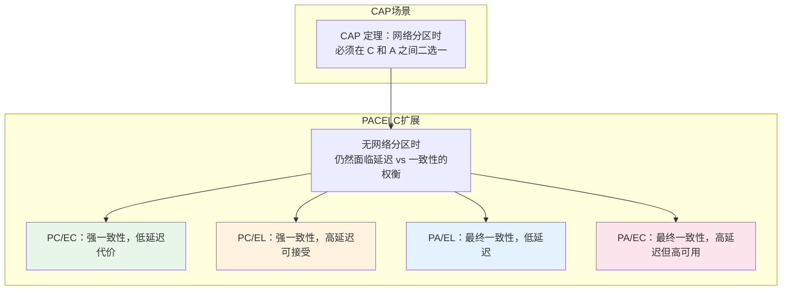
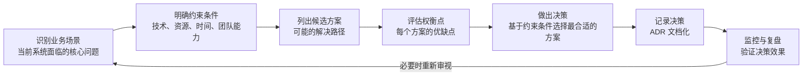

# 权衡分析总览

凌晨 3 点，电商团队的架构评审会上，一个看似简单的决策卡住了所有人：「库存服务到底该用强一致性还是最终一致性？」

强一致性意味着每次扣减库存都要等待数据库确认，用户体验可能慢了 50ms，但不会出现超卖；最终一致性响应快，可一旦消息延迟，用户可能会看到「有库存」却下单失败。团队吵了 2 个小时，最后用「先按最终一致性上线观察」收了尾。

半年后，系统因为消息积压导致超卖了 3000 单，赔偿金额足以让团队重新审视当初那个「不够慎重」的决策。

这不是一个孤例。在真实的架构工作中，90% 的技术决策本质上是权衡决策：选 A 还是选 B，不是因为 A 完美，而是因为 A 的代价在当前场景下更可接受。**架构设计的艺术，本质上是权衡的艺术。**

## 什么是权衡分析

架构权衡（Trade-off Analysis）是系统设计中最容易被忽视、却也是最重要的能力。很多工程师在技术选型时习惯性地收集「优点列表」，却很少认真追问：这个选择的代价是什么？什么场景下这个选择会变成错误？

权衡分析的核心逻辑很简单：**每个架构决策都会在某些维度上带来收益，在另一些维度上带来代价**。没有免费午餐（No Free Lunch）是分布式系统领域的第一性原理——你永远需要在多个相互冲突的目标之间寻找平衡点。

常见的权衡对象包括：

- 一致性 vs 可用性
- 延迟 vs 吞吐量
- 可扩展性 vs 复杂度
- 开发效率 vs 运行效率
- 成本 vs 性能
- 耦合度 vs 一致性
- 可读性 vs 灵活性

很多人以为架构决策是「选最优解」，实际上架构决策是「选最可接受的代价组合」。

## PACELC 定理：一图理解权衡

在讨论一致性 vs 可用性时，CAP 定理是绕不开的话题。但 CAP 定理只描述了网络分区发生时的行为，更完整的图景需要 PACELC 定理来补充。

PACELC 定理指出：**在系统存在延迟（Latency）的情况下，如果选择牺牲一致性（Consistency），必然换来更好的可用性和更低的延迟；如果选择保证一致性，则必须接受更高的延迟**。

这四种组合对应了不同的业务场景：

| 组合 | 说明 | 典型系统 |
| --- | --- | --- |
| `PC/EC` | 强一致 + 低延迟 | ZooKeeper、HBase |
| `PC/EL` | 强一致 + 可接受延迟 | 传统关系型数据库 |
| `PA/EL` | 最终一致 + 低延迟 | Cassandra、DynamoDB |
| `PA/EC` | 最终一致 + 高可用 | Eureka、某些 DNS 服务 |

如果你正在设计一个金融交易系统，大概率需要 `PC/EC` 或 `PC/EL`；如果你设计的是一个社交Feed流，`PA/EL` 往往是更务实的选择。关键不是选「最好」的组合，而是选「最适合当前业务」的组合。

## 核心权衡维度

### 一致性 vs 可用性

这是最经典的权衡维度。CAP 定理告诉我们：在网络分区发生时，一致性和可用性不可兼得。但这不意味着平时也要做这道选择题——只有在真正发生分区时，这个权衡才会显现。

很多团队把 CAP 当作「永远三选二」，结果要么过度设计，要么选错了场景。

### 延迟 vs 吞吐量

低延迟和高吞吐量往往是一对矛盾。要降低延迟，通常需要更多的资源投入（比如预热、缓存）；要提升吞吐量，通常需要批量处理、并发化，这会增加复杂度并可能影响单次请求的延迟。

对于延迟敏感型系统（如实时交易），优先保障延迟，接受较低的吞吐量；对于吞吐敏感型系统（如数据分析），优先保障吞吐量，接受较高的延迟。

### 读优化 vs 写优化

读多写少的场景，应该优化读性能：增加缓存、使用读取副本、设计更高效的索引；写多读少的场景，应该优化写性能：减少索引、使用顺序写入、优化事务粒度。

大多数系统不是单纯的读重或写重，而是混合场景。设计时需要明确当前的主要矛盾是什么。

### 强一致性 vs 最终一致性

强一致性保证每次读取都能获取最新写入的数据，但代价是更高的延迟和更低的可用性；最终一致性允许短暂的数据不一致，但换来更好的性能和更高的可用性。

对于金融交易、库存扣减等场景，强一致性往往是必选项；对于社交动态、浏览记录等场景，最终一致性通常是可接受的。

### 同步 vs 异步

同步处理简单、结果确定，但会造成调用方阻塞；异步处理解耦、响应快，但引入了消息传递、幂等性、最终一致性等额外复杂度。

选择同步还是异步，本质上是选择「简单但耦合」还是「复杂但解耦」。

### SQL vs NoSQL

SQL 数据库提供强一致性、事务支持和成熟的生态，但扩展性受限；NoSQL 数据库提供更好的扩展性和灵活性，但往往需要在一致性上做出妥协。

对于需要复杂查询、事务保证的结构化数据，SQL 仍然是首选；对于海量、高并发、schema 灵活的场景，NoSQL 更合适。

### 单体 vs 微服务

单体架构简单、部署方便、事务处理容易，但扩展性差、技术栈耦合；微服务架构解耦、扩展灵活，但增加了分布式复杂性、运维成本和一致性挑战。

小团队、小规模系统，微服务可能是over-engineering；大规模、复杂业务，微服务可能是必选项。关键是知道什么时候该切，什么时候不该切。

### 关系型 vs 非关系型数据库

关系型数据库擅长处理结构化数据和复杂查询，非关系型数据库擅长处理非结构化数据和海量数据。选择哪种，取决于数据的特性和访问模式。

### 批处理 vs 流处理

批处理适合大规模、历史数据分析，但延迟高；流处理适合实时数据处理，但实现复杂、状态管理困难。

Lambda 架构和 Kappa 架构尝试结合两者优点，但引入了额外的维护成本。

### 推模式 vs 拉模式

推模式（Push）响应快、延迟低，但服务端压力大、需要管理订阅关系；拉模式（Pull）实现简单、服务端压力小，但延迟高、轮询开销大。

Webhook、Server-Sent Events 属于推模式；轮询属于拉模式。

### Stateful vs Stateless

有状态服务数据本地化、延迟低，但扩展困难、故障恢复复杂；无状态服务扩展简单、故障恢复容易，但需要外部存储、增加网络开销。

现代云原生架构倾向于无状态设计，但某些场景（有状态计算、本地缓存）仍然需要状态。

### 成本 vs 性能

更好的性能通常意味着更高的成本。更快的存储、更多的计算资源、更好的网络带宽——都需要花钱。

成本敏感型系统需要接受性能上的妥协；性能敏感型系统需要接受成本上的投入。关键是找到性价比最优的配置点。

## 权衡分析框架

面对一个架构决策，应该如何系统地进行权衡分析？推荐使用以下框架：

**场景识别**是起点。要解决的是什么问题？用户的痛点是什么？性能瓶颈在哪里？

**约束条件**决定了决策的边界。预算多少？团队有多少人熟悉这项技术？上线时间窗口是什么？

**候选方案**要尽量穷举。常见的错误是只考虑「最显而易见的方案」，忽略了其他可能性。

**权衡评估**是核心环节。每个方案在性能、成本、复杂度、可维护性、扩展性等维度上的表现如何？代价是什么？

**决策记录**往往是团队最容易跳过的环节。但没有记录的决策，下次遇到类似问题就会「重新吵一遍」。ADR（Architecture Decision Record）就是为这个问题而生的。

## 权衡的艺术

### 没有标准答案，只有适合场景的答案

同一个问题，在 A 公司是正确的方案，在 B 公司可能是错误的。原因可能是用户规模、业务特性、团队能力、技术债务状况各不相同。

架构决策不能脱离上下文。脱离场景谈「最佳实践」，往往是最大的误导。

### 决策记录的重要性

推荐每个重要的架构决策都记录为 ADR（Architecture Decision Record）。ADR 应该包含：

- **背景**：要解决什么问题？
- **决策**：选择了什么方案？
- **权衡**：为什么选这个方案？放弃了什么？
- **后果**：预期的收益和代价是什么？
- **相关方**：谁参与了决策？

半年后回头看这段 ADR，你会庆幸当初写下了这些思考。

### 何时重新审视权衡

技术债务、用户规模、业务特性都会随着时间变化。当初正确的决策，可能因为业务演进而变成错误的决策。

推荐在以下时机重新审视权衡：

- **季度技术复盘**：评估架构决策的执行效果
- **用户规模突破量级**：10倍、100倍增长前检查架构瓶颈
- **重大技术迭代**：引入新技术时重新评估整体架构
- **线上故障复盘**：分析根因时检查当初的权衡是否合理

## 本章文章导读

本章将系统讲解架构设计中的核心权衡维度。每篇文章都会聚焦一个权衡对，深入分析其背后的原理、适用场景和常见误区。

| 文章 | 核心内容 |
| --- | --- |
| [一致性 vs 可用性：PACELC 定理](/system-design/tradeoffs/pacelc) | 深入解读 PACELC 定理，理解为什么一致性和可用性是一对永恒的权衡 |
| [延迟 vs 吞吐量](/system-design/tradeoffs/latency-throughput) | 分析高并发场景下延迟和吞吐量的相互制约关系及优化策略 |
| [读优化 vs 写优化](/system-design/tradeoffs/read-vs-write) | 根据读写比例设计不同的数据架构 |
| [强一致性 vs 最终一致性](/system-design/tradeoffs/consistency-choices) | 选择正确的一致性级别需要考虑哪些因素 |
| [同步 vs 异步处理](/system-design/tradeoffs/sync-vs-async) | 什么时候同步，什么时候异步，两种模式的设计要点 |
| [SQL vs NoSQL 选型矩阵](/system-design/tradeoffs/sql-vs-nosql) | 根据业务场景选择合适的数据库类型 |
| [单体 vs 微服务](/system-design/tradeoffs/monolith-vs-microservices) | 什么时候该拆，什么时候不该拆 |
| [关系型 vs 非关系型数据库](/system-design/tradeoffs/relational-vs-nonrelational) | 从数据模型和访问模式出发做选择 |
| [批处理 vs 流处理](/system-design/tradeoffs/batch-vs-stream) | 实时 vs 批量，不同数据处理模式的设计权衡 |
| [推模式 vs 拉模式](/system-design/tradeoffs/push-vs-pull) | 事件通知机制的设计权衡 |
| [状态ful vs 状态less 设计](/system-design/tradeoffs/stateful-vs-stateless) | 有状态和无状态架构的设计选择 |
| [成本 vs 性能](/system-design/tradeoffs/cost-vs-performance) | 在有限预算下做出最优的技术投入决策 |

建议按顺序阅读前几篇，理解权衡分析的基本框架后，再根据自己感兴趣的主题深入阅读。

读完本章后，你应该能够：**面对一个架构决策时，不再只看到「优点」，而是能看到「代价」和「适用场景」；能够在多个相互冲突的目标之间，找到当前场景下最可接受的平衡点。**

真正的架构能力，不是知道「什么方案最好」，而是知道「什么场景下应该选什么方案，以及为什么」。

