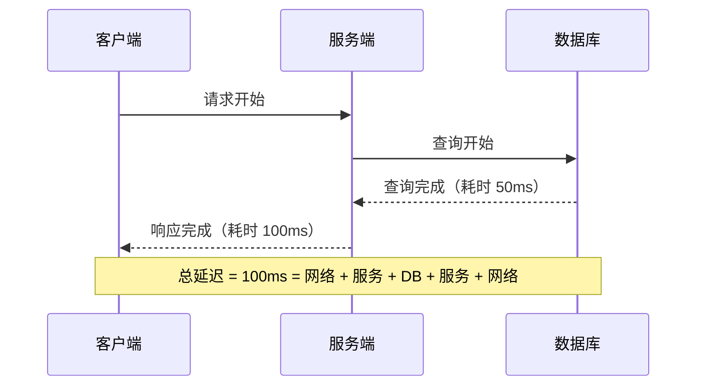
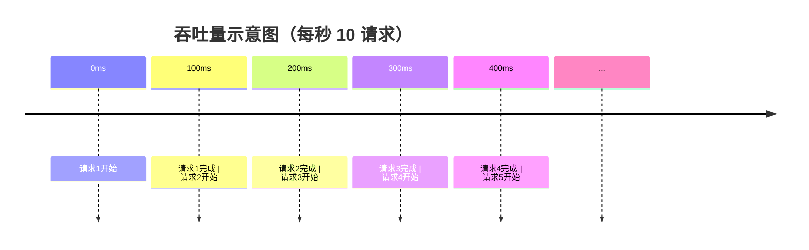
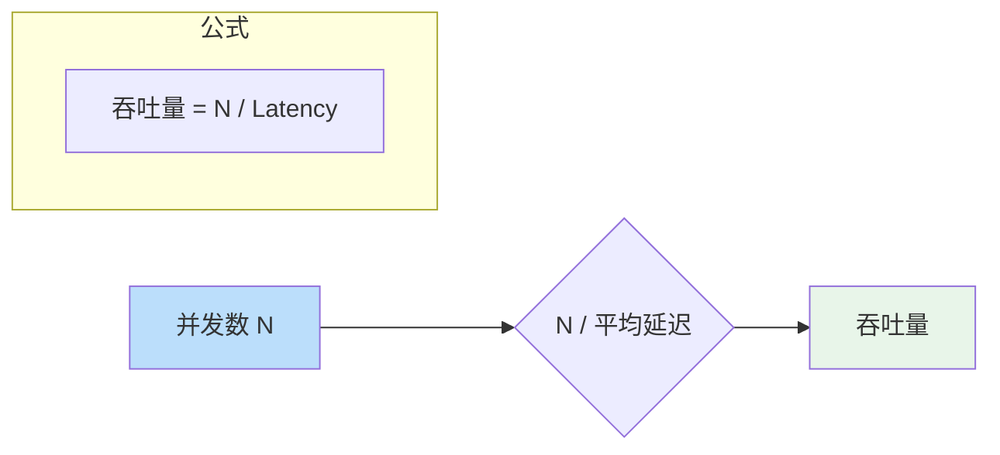
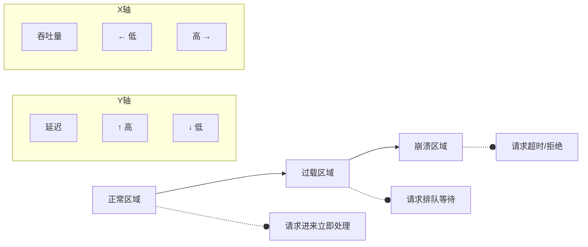
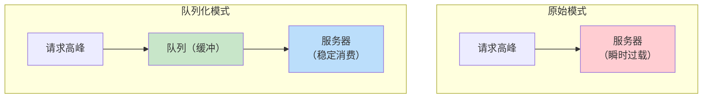

# 延迟 vs 吞吐量

你有没有遇到过这种情况：压测报告显示系统能承受 10 万 QPS，但线上用户却抱怨「卡得要命」？

问题出在对「性能」的理解上。10 万 QPS 是**吞吐量**指标，代表系统每秒能处理多少请求；而用户感受到的「卡」，是**延迟**指标，代表每个请求需要等待多久才能完成。这两个指标看起来相关，实际上却有不同的优化方向——有时候提高吞吐量反而会恶化延迟。

理解延迟和吞吐量的关系，是系统性能优化的第一课。

## 两个核心指标的定义

### 延迟：单个请求的响应时间

延迟（Latency）指从发起请求到收到响应所经历的时间，通常用以下指标衡量：

- **平均延迟**：所有请求延迟的算术平均值
- **P50（中位数）**：50% 的请求延迟低于此值
- **P90**：90% 的请求延迟低于此值
- **P99/P999**：99% 或 99.9% 的请求延迟低于此值



对于用户体验来说，P99 比平均延迟更重要。一个系统在 1 万个请求中，有 100 个请求需要 5 秒才能返回，这 100 个用户大概率会流失——而他们可能正是付费意愿最高的用户。

### 吞吐量：单位时间处理能力

吞吐量（Throughput）指系统在单位时间内能够处理的请求数量，常用单位：

- QPS（Queries Per Second）：每秒查询数
- TPS（Transactions Per Second）：每秒事务数
- RPS（Requests Per Second）：每秒请求数



## 两者之间的关系

延迟和吞吐量之间的关系可以用一个简单公式概括：

```
吞吐量 ≈ 并发数 / 平均延迟
```

这意味着：**在固定并发能力下，降低延迟可以提高吞吐量；在固定延迟下，增加并发数可以提高吞吐量**。



但这个公式的前提是「系统资源充足」。当并发数超过系统处理能力时，延迟会急剧上升，吞吐量反而下降——这就是系统过载。

### 拐点：资源耗尽时延迟爆炸



当系统接近资源极限时，请求开始排队，延迟急剧上升。即使看起来吞吐量还在增加，但实际上每个请求的等待时间已经让人无法接受。

## 低延迟 vs 高吞吐量：不同的优化方向

这两个目标在某些场景下是冲突的，需要根据业务优先级做出选择。

### 低延迟优先场景

适用场景：实时交易、在线游戏、搜索推荐、API 调用

这类场景对单个请求的响应时间有严格要求（通常是 P99 `<=` 100ms）。用户发起请求后，期待的是「马上得到响应」，而不是「系统吞吐量很高」。

优化策略：

- **减少不必要的等待**：异步化非关键路径
- **减少数据拷贝**：零拷贝、池化复用
- **就近处理**：CDN、边缘计算、本地缓存
- **预热与预计算**：热点数据提前加载

### 高吞吐量优先场景

适用场景：数据分析、批处理任务、数据导入导出、报表生成

这类场景更关心「单位时间内完成多少工作」，而不是「单个任务多久完成」。100ms 延迟和 500ms 延迟对批量处理来说几乎没有区别，但处理速度差 5 倍就会直接影响业务效率。

优化策略：

- **批量处理**：合并小请求为大请求，减少网络往返
- **并发化**：充分利用多核并行处理
- **流水线**：流水线上游和下游并行执行
- **削峰填谷**：将突发流量平滑到平均水位

## 常见优化策略

### 队列化：将突发流量平滑处理

当请求量波动较大时，直接处理所有请求会导致资源忽高忽低。将请求放入队列，用固定的速率消费，可以有效平滑流量。



队列化的代价是**增加平均延迟**（请求需要在队列中等待），但换来的是**更稳定的吞吐量和更低的错误率**。

### 批处理：减少单次操作开销

对于数据库、消息队列等存储系统，每次操作都有固定开销（网络往返、协议解析、事务处理）。将多个操作合并为一次批量操作，可以大幅提升吞吐量。

```java
// 错误示例：逐条插入（10000 次往返）
for (Order order : orders) {
    db.insert(order); // 每次插入都有网络往返
}

// 正确示例：批量插入（1 次往返）
db.batchInsert(orders); // 一次批量插入
```

批处理的代价是**增加单个请求的延迟**（需要等待凑齐足够多的请求），以及**复杂度增加**（需要处理批量失败的部分重试）。

### 并行化：充分利用多核能力

对于可以并行执行的任务（如多个独立查询），使用并行化可以同时降低延迟（并行执行比串行快）和提高吞吐量（在相同时间内完成更多任务）。

```java
// 串行执行：总耗时 = 100ms + 200ms + 150ms = 450ms
ProductInfo product = getProductInfo(productId);
ReviewInfo review = getReviewInfo(productId);
RecommendInfo recommend = getRecommendInfo(productId);

// 并行执行：总耗时 = max(100ms, 200ms, 150ms) = 200ms
CompletableFuture<ProductInfo> productFuture = 
    CompletableFuture.supplyAsync(() -> getProductInfo(productId));
CompletableFuture<ReviewInfo> reviewFuture = 
    CompletableFuture.supplyAsync(() -> getReviewInfo(productId));
CompletableFuture<RecommendInfo> recommendFuture = 
    CompletableFuture.supplyAsync(() -> getRecommendInfo(productId));

CompletableFuture.allOf(productFuture, reviewFuture, recommendFuture).join();
```

并行化的代价是**增加系统并发压力**，需要控制并行度避免压垮下游服务。

## 监控指标选择

对于延迟优先的系统，重点监控：

- P99/P999 延迟
- 慢请求比例
- 超时率

对于吞吐量优先的系统，重点监控：

- QPS/TPS
- 资源利用率（CPU、内存、IO）
- 队列积压深度

| 场景 | 核心指标 | 告警阈值建议 |
| --- | --- | --- |
| API 服务 | P99 延迟 `<=` 200ms | P99 > 500ms 告警 |
| 实时计算 | P99 延迟 `<=` 50ms | P99 > 100ms 告警 |
| 批处理 | 每小时处理量 `>=` 10万 | 处理量下降 30% 告警 |
| 消息队列 | 消费延迟 `<=` 1s | 消费延迟 > 10s 告警 |

## 常见误区

### 只看平均延迟

平均延迟容易掩盖问题。如果 99% 的请求在 5ms 完成，1% 的请求在 5000ms 完成，平均延迟可能看起来「还不错」，但实际上有 1% 的用户体验极差。

### 只看 QPS

QPS 高不代表系统健康。如果 QPS 高的代价是 P99 延迟暴涨到 10 秒，很多用户其实已经流失了。

### 忽略延迟分布

P50 和 P99 可能相差 10 倍。如果业务对用户体验敏感，P99 才是真正的「用户体验指标」。

## 思考题

**问题 1**：一个搜索服务目前的平均延迟是 50ms，P99 是 200ms，吞吐量是 5000 QPS。如果将平均延迟降到 20ms，吞吐量会提升到多少？实际情况会是多少？

<details>
<summary>参考答案</summary>

理论上（假设并发能力不变）：吞吐量 ≈ 5000 × (50 / 20) = 12500 QPS，提升 2.5 倍。

但实际情况通常不会达到理论值，原因如下：

1. **降低延迟往往需要更多资源**：缓存预热、连接池调优、代码优化都需要消耗额外内存或 CPU
2. **延迟降低可能导致请求量增加**：用户发现服务快了，会更频繁地使用
3. **P99 可能变化不大**：如果瓶颈在数据库等外部依赖，降低应用层延迟对 P99 影响有限

建议：实际提升可能在 1.5~2 倍左右，并且需要持续监控 P99 和错误率。

</details>

**问题 2**：一个系统需要同时满足「搜索响应快（P99 `<=` 100ms）」和「搜索高峰期吞吐量达到 10 万 QPS」。如果单台服务器无法同时满足这两个指标，应该如何设计？

<details>
<summary>参考答案</summary>

这是一个典型的「低延迟 + 高吞吐」双目标场景，可以考虑以下方案：

1. **分层架构**：将搜索拆分为「查询路由」和「实际搜索」
   - 查询路由层：轻量级，低延迟，承接所有请求
   - 搜索计算层：重量级，批量处理，通过队列削峰

2. **读写分离 + 缓存**：
   - 读取走缓存，延迟极低
   - 写入走写入队列，异步处理

3. **限流 + 降级**：
   - 高峰期对非核心搜索限流
   - 降级到简单搜索（如基于标签而非全文）

4. **弹性扩缩容**：
   - 使用 K8s HPA，根据延迟和队列深度自动扩容

核心思路：**不是让一台服务器同时满足两个目标，而是让不同组件各司其职**。

</details>

**问题 3**：批处理系统适合用 P99 作为性能指标吗？为什么？

<details>
<summary>参考答案</summary>

**不适合**。批处理系统的特点是大批量、长任务、容许一定延迟，P99 没有意义，原因如下：

1. **批处理任务通常是同步的**：一个批次内的任务按顺序执行，不存在「部分快、部分慢」的分布问题
2. **延迟对业务影响小**：批处理的结果通常用于 T+1 分析，晚几秒不影响业务决策
3. **P99 指标获取困难**：批处理不像在线服务有大量独立的短请求，很难定义「单个请求」的 P99

更合适的指标：
- 每小时/每天处理的记录数
- 批次总耗时
- 失败率/重试次数
- 资源利用率（CPU、内存）

</details>