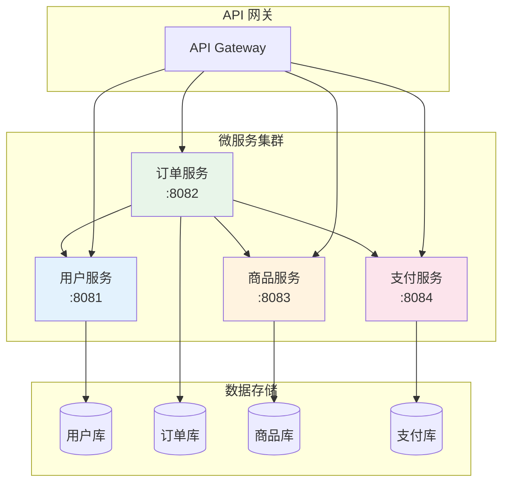
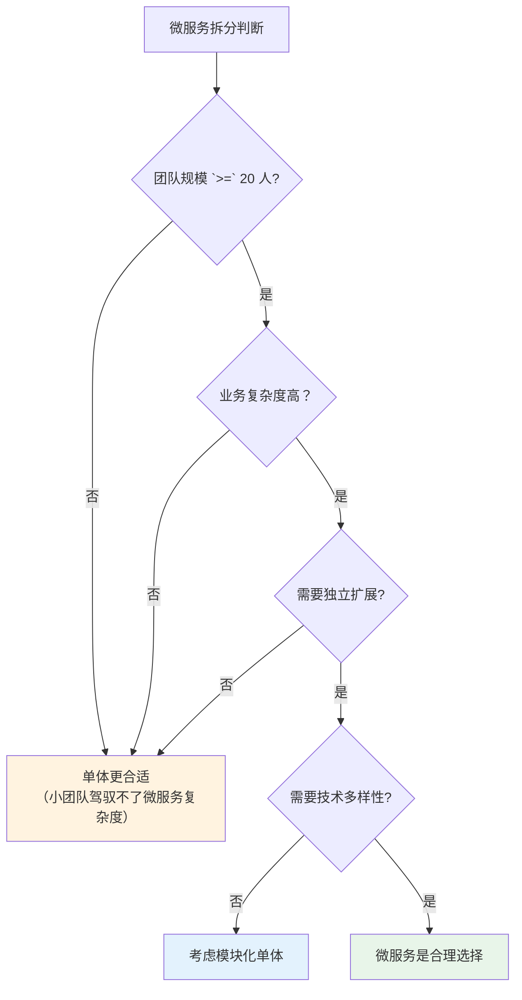
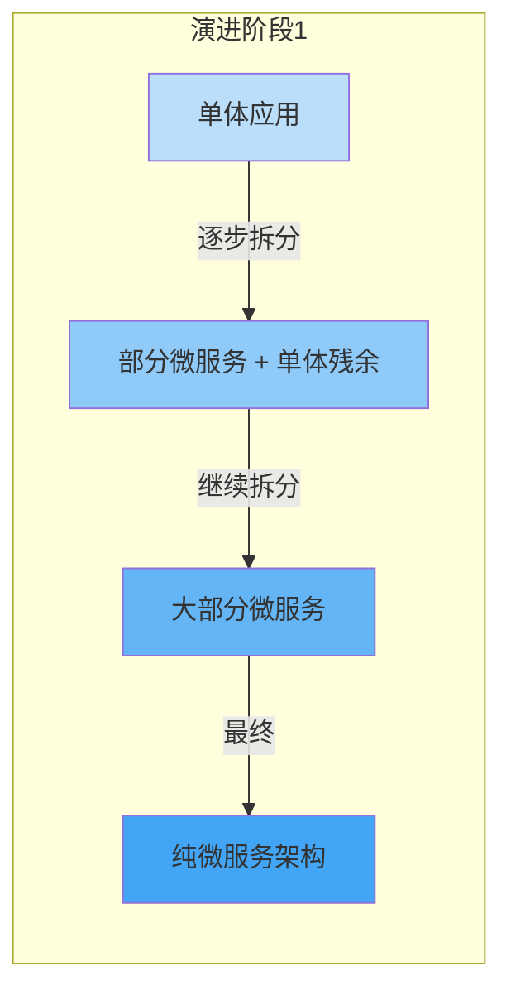
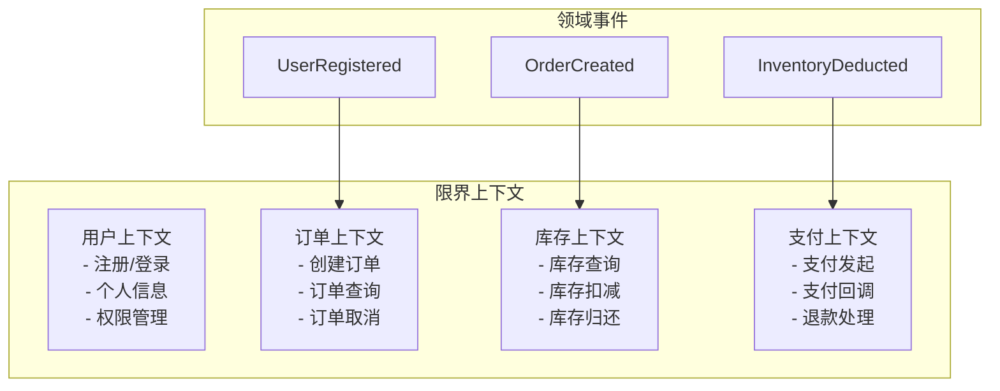

# 单体 vs 微服务权衡

2016 年，某创业公司在拿到 A 轮融资后决定「all in 微服务」。他们把一个 3 人团队维护的电商系统拆成了 20 个微服务，每个服务 2-3 个人负责。一年后，他们花了大价钱招聘 DevOps 工程师，购买了 K8s 集群，却因为服务间调用链路复杂、分布式事务问题频出，迭代速度反而比拆分前还慢。

2019 年，Instagram 在增长到亿级用户时仍然跑在单体架构上。他们没有把 Instagram 拆成几十个微服务，而是通过**单体 + 良好的模块化**来支撑业务高速增长。

这两个案例告诉我们：**微服务不是银弹，单体也不是原罪**。关键是理解两者的适用场景。

## 单体架构：简单即力量

### 什么是单体架构

单体架构（Monolithic Architecture）将所有功能模块打包在一个部署单元中。

```mermaid
flowchart TD
    subgraph 单体应用
        API["API 层"]
        Service["业务逻辑层"]
        DAO["数据访问层"]
        DB[("数据库")]
        
        API --> Service
        Service --> DAO
        DAO --> DB
    end
    
    subgraph 业务模块（都在一个进程内）
        User["用户模块"]
        Order["订单模块"]
        Product["商品模块"]
        Payment["支付模块"]
    end
    
    Service --> User
    Service --> Order
    Service --> Product
    Service --> Payment
```

### 单体架构的优势

**1. 开发效率高**

一个代码仓库，一套 CI/CD 流水线，一次部署所有功能。新入职的工程师两周内可以熟悉完整代码。

```java
// 单体项目：直接调用，不涉及网络
@Service
public class OrderService {
    
    @Autowired
    private UserService userService;
    
    @Autowired
    private ProductService productService;
    
    @Autowired
    private PaymentService paymentService;
    
    public void createOrder(OrderDTO dto) {
        // 直接调用，毫秒级响应
        User user = userService.getUserById(dto.getUserId());
        Product product = productService.getProductById(dto.getProductId());
        
        // 事务在同一个数据库连接中
        Order order = new Order(user, product, dto.getQuantity());
        orderRepository.save(order);
        
        // 调用支付服务，直接方法调用
        paymentService.processPayment(order);
    }
}
```

**2. 测试简单**

端到端测试不需要启动多个服务；本地开发不需要启动 Docker Compose；测试覆盖率统计一套工具就够了。

**3. 部署简单**

一个 JAR 包，一个进程，一行命令启动。没有服务发现、没有网关路由、没有分布式配置中心。

```bash
# 单体部署：简单到极致
java -jar app.jar --spring.profiles.active=prod

# 微服务部署：需要考虑很多东西
kubectl apply -f deployment.yaml
kubectl apply -f service.yaml
kubectl apply -f ingress.yaml
```

**4. 事务简单**

本地事务直接回滚，不需要考虑分布式事务。代码里的 `@Transactional` 注解就能解决 99% 的并发问题。

**5. 性能更好**

没有网络开销，方法调用比 RPC 快 1000 倍。对于中小规模系统，单体可以少买 50% 的服务器。

## 单体架构的局限

**1. 技术栈锁定**

选定了 Spring Boot，就很难在部分模块使用其他技术栈。想在某个模块用 Python 深度学习？抱歉，进了单体就出不来了。

**2. 团队耦合**

50 个工程师在一个代码仓库里，改代码时「牵一发动全身」。一个团队部署，影响其他团队的代码。

**3. 扩展性受限**

某个模块 CPU 密集（推荐算法），某个模块 IO 密集（文件处理），但只能统一扩展整应用。推荐算法拖垮了文件处理模块。

**4. 部署僵化**

修改一行代码，需要重新部署整个系统。「用户模块加个字段，订单模块被迫停机」。

## 微服务架构：分而治之

### 什么是微服务架构

微服务架构（Microservices Architecture）将系统拆分为多个独立部署、独立运行的服务，每个服务负责特定的业务能力。



### 微服务架构的优势

**1. 独立部署**

每个服务可以独立部署、回滚、扩缩容。支付服务出了 bug，不会影响用户浏览商品。

**2. 技术多样性**

可以用 Java 写订单服务，用 Go 写文件处理，用 Python 写推荐算法，按需选择最合适的技术栈。

**3. 团队自治**

每个团队负责自己的服务，端到端负责（开发、测试、运维）。团队之间通过 API 约定接口，不再需要协调部署。

**4. 弹性扩展**

CPU 密集的服务多部署几台，IO 密集的服务部署在更高配的机器上。各服务按需扩展，资源利用率更高。

### 微服务架构的代价

**1. 分布式复杂性**

```java
// 微服务调用：到处都是坑
@Service
public class OrderService {
    
    @Autowired
    private RestTemplate restTemplate;
    
    public void createOrder(OrderDTO dto) {
        // 问题1：服务发现，这个地址从哪来？
        String userServiceUrl = "http://user-service/api/users/" + dto.getUserId();
        
        // 问题2：网络超时，怎么处理？
        // 问题3：服务挂了，怎么降级？
        // 问题4：返回的数据格式对不对？
        UserDTO user = restTemplate.getForObject(userServiceUrl, UserDTO.class);
        
        // 问题5：本地事务不管用了，分布式事务怎么搞？
        orderRepository.save(order);
        // ... 调用支付服务
    }
}
```

分布式系统需要解决的问题清单：
- 服务发现（Consul / Eureka / Nacos）
- 负载均衡（Ribbon / Spring Cloud LoadBalancer）
- 熔断降级（Hystrix / Sentinel / Resilience4j）
- 分布式事务（Seata / Saga）
- 链路追踪（Zipkin / Jaeger）
- 统一配置（Nacos / Apollo）
- 日志聚合（ELK）
- 监控告警（Prometheus + Grafana）

**2. 运维复杂度**

Kubernetes、Docker、Helm、Istio——微服务的运维栈比单体复杂 10 倍不止。

**3. 调试困难**

一个用户请求经过 5 个服务，哪个环节出了问题？需要链路追踪系统、日志聚合系统来排查。

**4. 数据一致性**

跨服务的分布式事务，是微服务架构最大的痛点之一。

## 何时该拆分微服务？

微服务不是想拆就拆，而是需要满足一定的前提条件：



### 适合微服务的信号

| 信号 | 说明 |
| --- | --- |
| 团队人数 `>=` 20 人 | 超过 20 人，团队协调成本急剧上升 |
| 业务边界清晰 | 订单、用户、商品等模块可以独立演进 |
| 独立扩展需求 | 某些模块 QPS 是其他模块的 10 倍 |
| 技术栈差异需求 | 某些模块需要特殊技术（AI、实时计算） |
| 故障隔离要求 | 某个模块挂了不能影响全局 |
| 部署频率差异 | 某些模块每天发布 10 次，某些模块半年发布一次 |

### 不适合微服务的信号

| 信号 | 说明 |
| --- | --- |
| 团队人数 `<` 10 人 | 微服务运维成本远超收益 |
| 业务边界模糊 | 模块之间耦合严重，难以拆分 |
| 初期业务不确定 | 业务还没跑通，拆了白拆 |
| 数据强一致性要求 | 分布式事务的复杂度不是小团队能 handle 的 |

## 从单体到微服务：演进路径

### 路径一：绞杀者模式

在保留单体系统的基础上，逐步将功能迁移到微服务。新功能用微服务，老功能继续跑在单体里。



### 路径二：领域驱动设计（DDD）

用 DDD 的思想划分限界上下文，每个上下文对应一个微服务。这种拆分方式更符合业务边界，比按技术层拆分更合理。



### 路径三：模块化单体

在拆分微服务之前，先把单体做成「模块化的单体」。每个模块有清晰的接口，模块之间通过接口通信，但不涉及网络调用。等业务稳定、团队成熟后再考虑拆分。

```java
// 模块化单体：清晰的模块边界
package com.company.user;  // 用户模块
public interface UserService {
    User getUserById(Long id);
    void updateUser(User user);
}

package com.company.order;  // 订单模块
public interface OrderService {
    Order createOrder(Long userId, List<Long> productIds);
}

// 订单模块依赖用户模块，但不直接调用数据库
public class OrderServiceImpl implements OrderService {
    
    private final UserService userService;  // 通过接口注入
    
    @Override
    public Order createOrder(Long userId, List<Long> productIds) {
        // 调用用户服务，获取用户信息
        User user = userService.getUserById(userId);  // 本地方法调用，非网络调用
        // ...
    }
}
```

## 权衡矩阵

| 维度 | 单体架构 | 微服务架构 |
| --- | --- | --- |
| **开发速度** | 快（初期） | 慢（需要维护分布式基础设施） |
| **部署复杂度** | 低 | 高 |
| **团队协作** | 后期差（代码冲突多） | 好（独立开发） |
| **扩展性** | 差（只能整体扩展） | 好（按需扩展） |
| **技术多样性** | 低（统一技术栈） | 高（各服务选型独立） |
| **事务一致性** | 简单（本地事务） | 复杂（分布式事务） |
| **运维成本** | 低 | 高 |
| **故障隔离** | 差（一个模块挂全挂） | 好（可以熔断隔离） |
| **适合规模** | 小团队、中小规模 | 大团队、大规模 |

## 常见误区

### 「别人都在用微服务，我们也要用」

微服务不是追潮流的工具。小团队（`<` 10 人）强行上微服务，运维成本会拖垮整个研发效率。

### 「微服务就是 RPC 调用」

把单体拆成多个 JAR 包，用 RPC 调用，这不叫微服务，叫**分布式单体**。真正的微服务需要独立部署、独立数据、独立团队。

### 「拆分粒度越细越好」

服务粒度太细会导致调用链路过长、事务难以处理、运维成本暴增。Amazon 的「两个 pizza 原则」：一个团队吃两个 pizza 能吃饱，说明这个团队规模刚好，服务规模也差不多。

### 「微服务不需要考虑耦合」

微服务之间仍然需要考虑耦合问题。核心原则是：**同步调用要尽量少，异步消息通信优先**。

## 思考题

**问题 1**：一个 5 人团队的创业公司，要做电商平台，应该选单体还是微服务？为什么？

<details>
<summary>参考答案</summary>

**建议选单体**，原因：

1. **团队规模太小**：5 人驾驭微服务的分布式复杂度，运维成本会拖垮开发效率
2. **业务边界未清晰**：创业初期业务模式还在探索，拆了可能白拆
3. **快速迭代优先**：创业公司要快速验证业务，单体的开发速度优势明显

**推荐方案**：
- 模块化单体：按业务模块划分代码结构，但不拆分服务
- 加 Redis 缓存 + MySQL 主从，解决性能问题
- 等团队扩大到 15 人以上、业务稳定后，再考虑拆分微服务

**核心原则**：小团队做大事，先活下来再考虑架构优雅。

</details>

**问题 2**：微服务架构中，用户下单需要调用用户服务、商品服务、库存服务、积分服务。如果某个服务挂了，应该如何处理？

<details>
<summary>参考答案</summary>

**多级降级策略**：

**1. 熔断器（Circuit Breaker）**
```java
@FeignClient(name = "inventory-service", fallback = InventoryServiceFallback.class)
public interface InventoryService {
    void deduct(Long productId, Integer quantity);
}

// 熔断降级实现
@Component
public class InventoryServiceFallback implements InventoryService {
    @Override
    public void deduct(Long productId, Integer quantity) {
        // 库存服务挂了，降级：标记订单为「待确认库存」
        log.warn("库存服务不可用，订单库存待确认");
        order.setStatus(OrderStatus.PENDING_INVENTORY);
    }
}
```

**2. 重试 + 超时**
- 设置合理的超时时间（如 500ms）
- 网络抖动时自动重试
- 超时后降级处理

**3. 幂等设计**
- 使用幂等键（订单 ID）防止重复扣减
- 下游服务重启时，消费消息不会导致数据问题

**4. 最终一致性**
- 库存服务恢复后，通过消息队列补偿未处理的扣减
- 或使用 Saga 模式进行补偿事务

</details>

**问题 3**：如果让你把一个 50 万行代码的单体系统拆分为微服务，你会如何规划这个过程？需要关注哪些风险？

<details>
<summary>参考答案</summary>

**拆分步骤**：

1. **领域建模**：用 DDD 思想划分限界上下文
2. **识别粘性代码**：先拆耦合度低的模块
3. **API 设计**：定义服务间接口，保证向后兼容
4. **数据迁移**：每个服务最终要有自己的数据库
5. **逐步切换**：用 Strangler Fig 模式，新旧系统并存，逐步切流量

**关键风险**：

| 风险 | 应对措施 |
| --- | --- |
| 分布式事务 | 引入 Saga 或 TCC，提供补偿机制 |
| 服务间循环依赖 | 拆分前消除循环依赖 |
| 接口版本管理 | API 保持向后兼容，提供版本号 |
| 测试复杂度 | 引入契约测试（Pact），保证接口一致性 |
| 运维能力不足 | 先建好 CI/CD、监控、链路追踪再拆分 |
| 团队协作问题 | 建立 RFC 机制，统一技术栈 |

**核心建议**：先拆分数据，再拆分代码。没有独立数据库的微服务，等于没有拆分。

</details>
