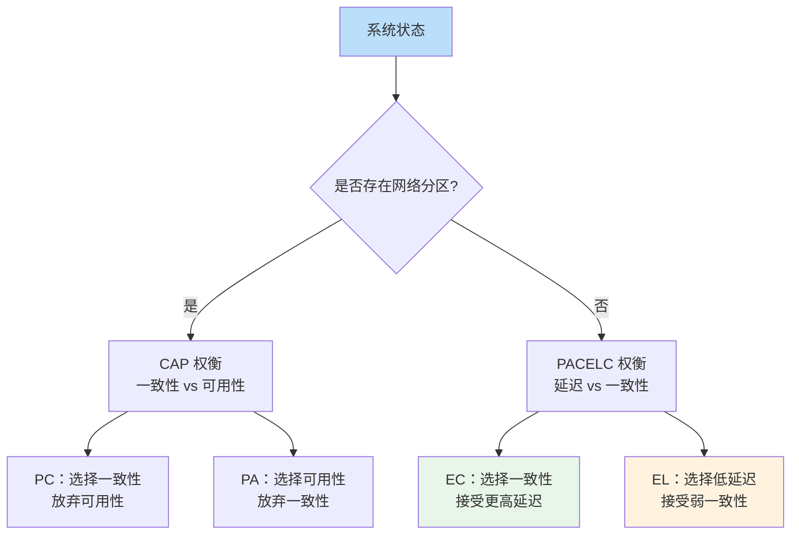
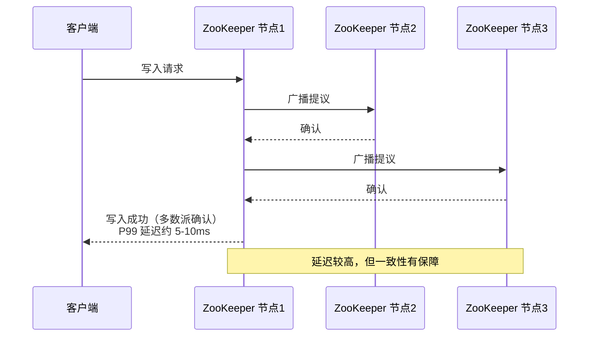
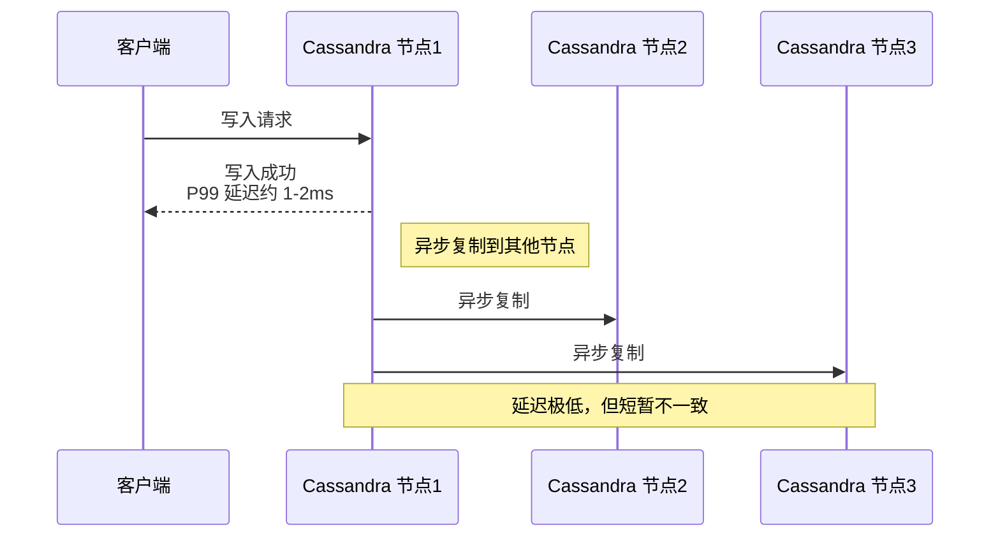
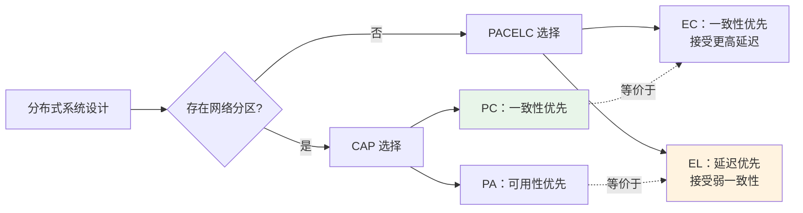
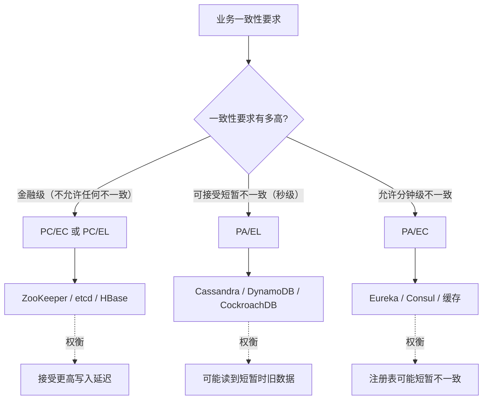

# 一致性 vs 可用性：PACELC 定理

凌晨 2 点，一个社交平台突然出现大量用户反馈「动态发不出去」。运维团队排查后发现：数据库主节点因为网络抖动发生了分区。按照系统的设计，分区发生时应该切换到从节点继续服务，但切换后用户发现自己的动态不见了——原来刚才发布的内容还只存在主节点，从节点还没来得及同步。

团队陷入了两难：继续提供服务意味着用户会看到不一致的数据；停止服务等待主节点恢复，用户体验又无法接受。

这个场景揭示了一个经典的分布式系统困境：**在网络分区发生时，一致性和可用性只能二选一**。而 CAP 定理只是这个问题的起点，更完整的分析需要 PACELC 定理来补充。

## CAP 定理回顾

在说 PACELC 之前，先快速回顾 CAP 定理的核心结论：

- **C（Consistency）**：每次读取都能获取最近一次写入的数据
- **A（Availability）**：每个请求都能获得响应（非错误）
- **P（Partition Tolerance）**：系统能够在网络分区发生时继续运行

分布式系统必须保证分区容错，这一点没有选择余地。所以在网络分区发生时，实际上只能在一致性和可用性之间做出选择。

但 CAP 定理只回答了「网络分区发生时」的问题。有一个更重要的问题 CAP 没有回答：**当没有网络分区时，系统应该如何设计？**

## PACELC 定理登场

2012 年，AWS CTO Werner Vogels 在博客中提出了 PACELC 定理，填补了 CAP 的空白。

> **PACELC**：Partition tolerance + Availability vs Consistency + Latency

核心观点是：**即使在没有网络分区的情况下，系统仍然面临延迟与一致性之间的权衡**。



这个框架让分布式系统设计变得更加完整：**分区时看 CAP，非分区时看 PACELC**。

## 四种系统类型

PACELC 框架将系统分为四种类型，每种类型对应不同的业务场景：

| 类型 | 描述 | 典型系统 | 适用场景 |
| --- | --- | --- | --- |
| `PC/EC` | 强一致 + 低延迟 | ZooKeeper、etcd、HBase | 分布式锁、元数据存储、配置中心 |
| `PC/EL` | 强一致 + 可接受延迟 | 传统关系型数据库（主从） | 金融交易、库存扣减、订单系统 |
| `PA/EL` | 最终一致 + 低延迟 | Cassandra、DynamoDB | 社交Feed、日志收集、推荐系统 |
| `PA/EC` | 最终一致 + 高可用 | Eureka、Consul、某些 DNS | 服务发现、健康检查、缓存路由 |

### PC/EC 系统：一致性优先

ZooKeeper 是 PC/EC 系统的典型代表。每次写入都需要达成多数派共识，只有在多数节点确认后写入才算成功。这种设计确保了**线性一致性**——所有客户端看到的写入顺序完全一致。



PC/EC 系统的代价是**写入延迟较高**，因为需要等待多数派确认。好处是**一致性有保障**，适合对数据一致性要求极高的场景。

### PA/EL 系统：延迟优先

Cassandra 是 PA/EL 系统的典型代表。它采用「随时可写」的设计：写入数据时，只要任何节点接收成功就立即返回，**不等待其他节点确认**。通过向量时钟或时间戳来处理冲突，实现最终一致性。



PA/EL 系统的优势是**写入延迟极低**，适合「写得多、读得少」或者「读的时候可以接受轻微不一致」的场景。代价是**可能读到旧数据**。

### PA/EC 系统：可用性优先

Eureka 服务发现是 PA/EC 系统的典型代表。它保证**高可用性**，即使部分节点宕机，服务仍然可以注册和发现。但作为副作用，实例列表可能短暂不一致——某个已经下线的服务可能短暂显示为在线。

```mermaid
flowchart LR
    subgraph Eureka集群
        E1[Eureka 节点1]
        E2[Eureka 节点2]
        E3[Eureka 节点3]
    end
    
    S1[服务实例A] --> E1
    S2[服务实例B] --> E2
    S3[服务实例C] --> E3
    
    C1[客户端] --> E2
    C2[客户端] --> E3
    
    E1 <-.-> E2
    E2 <-.-> E3
    E3 <-.-> E1
    
    Note over E1,E3: 节点间注册表同步异步进行
```

PA/EC 系统的核心权衡是：**接受短暂的注册表不一致，换取极高的可用性**。对于服务发现这种场景，偶尔读到「服务已下线但仍显示在线」比「服务发现不可用导致整个系统不可用」要温和得多。

## PACELC 与 CAP 的关系

PACELC 不是对 CAP 的否定，而是**补充和深化**。

| 对比维度 | CAP 定理 | PACELC 定理 |
| --- | --- | --- |
| 描述场景 | 仅在网络分区发生时的行为 | 无论是否发生分区都有权衡 |
| 决策点 | 分区发生时二选一 | 分区时看 CAP，非分区时看延迟 |
| 完整性 | 只回答了一半问题 | 提供了完整的决策框架 |
| 实际指导 | 理论意义大于���践意义 | 更接近实际系统设计决策 |



从某种意义上说，PACELC 将 CAP 的「二选一」扩展成了「四选一」的决策树：**分区时选 PC 还是 PA，非分区时选 EC 还是 EL**。

## 常见误区

### 误区一：CAP 是「三选二」

很多人误解 CAP 为「分布式系统必须在 C、A、P 三个特性中选择两个」。实际上，**P（分区容错）是分布式系统的必选项**，因为网络分区在现实中无法避免。所以真正的选择是在 C 和 A 之间。

### 误区二：系统可以同时满足 CAP

一个系统无法同时是 PC 又是 PA（分区时）。但在非分区状态下，系统可以表现出 PA/EL 的特性（低延迟、弱一致），而在分区发生时切换到 PC/EC 的行为（保证一致性、牺牲可用性）。这是很多分布式数据库的策略。

### 误区三：PACELC 只考虑网络分区

PACELC 的价值恰恰在于**它不只考虑网络分区**。它提醒我们，即使在正常运行状态下，延迟和一致性之间的权衡同样存在。很多团队只关注「分区时怎么办」，却忽略了「平时怎么设计」。

## 选型决策树

在实际项目中，如何根据 PACELC 框架选择系统？



## 真实案例

> **Netflix 的教训**：Netflix 早期使用 Cassandra 作为其配置存储系统。在一次网络抖动中，部分 Cassandra 节点与其他节点失去联系。按照 PA/EL 的设计，失去联系的节点继续接受写入，导致网络恢复后数据出现冲突。团队最终在应用层引入了冲突解决逻辑，并添加了「配置变更审计」机制来处理最终一致性带来的问题。
>
> 这个案例说明：**选择 PA/EL 系统不仅仅是「不用管一致性」，而是需要把一致性逻辑下沉到应用层**。

## 思考题

**问题 1**：一个订单系统需要处理双十一秒杀场景，库存扣减必须准确（不能超卖），但系统可用性也很重要（不能因为系统挂了导致用户无法访问）。应该选择哪种 PACELC 类型？为什么？

<details>
<summary>参考答案</summary>

建议选择 **PC/EC 或 PC/EL**（强一致性优先），原因如下：

1. 超卖会直接导致财产损失和用户体验严重下降
2. 订单库存扣减属于「写得多、但每次写都很关键」的场景
3. 可以通过**分区设计**（将库存按商品ID分片）来提高可用性，避免单点故障

具体实现上，可以在库存扣减这一层保证强一致，在「查询库存」这一层做最终一致（允许短暂显示「有货」但下单时再检查）。这样既保证了资金安全，又提升了查询体验。

</details>

**问题 2**：为什么 ZooKeeper 的读取性能比 Cassandra 差很多，但 ZooKeeper 仍然被广泛用于配置中心和服务协调？

<details>
<summary>参考答案</summary>

核心原因是**读取模式不同**：

1. **ZooKeeper 是 PC/EC**：所有读取都走 Leader，每次读取都是一致的
2. **Cassandra 是 PA/EL**：可以配置读取从最近节点返回，延迟更低

对于配置中心和服务协调场景：
- 配置项数量少，读取频率远高于写入频率
- 每次读取必须是最新的，否则可能导致整个系统状态错误
- 允许稍高的读取延迟（毫秒级 vs 微秒级）
- 一致性比性能更重要

所以 ZooKeeper 的「慢」在这种场景下反而是优势：**慢意味着安全**。

</details>

**问题 3**：如果让你设计一个「用户画像系统」，用于存储用户的兴趣标签和行为数据，应该选择哪种 PACELC 类型？为什么？

<details>
<summary>参考答案</summary>

建议选择 **PA/EL 或 PA/EC**（低延迟/高可用优先），原因如下：

1. **数据更新频繁**：用户每次点击、搜索、购买都会产生行为数据
2. **短暂不一致可接受**：用户看到的推荐「稍微旧一点」不会造成严重问题
3. **可用性要求高**：推荐系统故障会导致转化率下降，但不会导致核心业务中断
4. **数据量巨大**：需要能水平扩展到PB级

具体实现可以采用：
- 写入 Cassandra（PA/EL），低延迟接收行为数据
- 后台定时同步到分析型数据库（如 ClickHouse）做批量分析
- 推荐服务从两个数据源读取，平衡实时性和准确性

</details>
