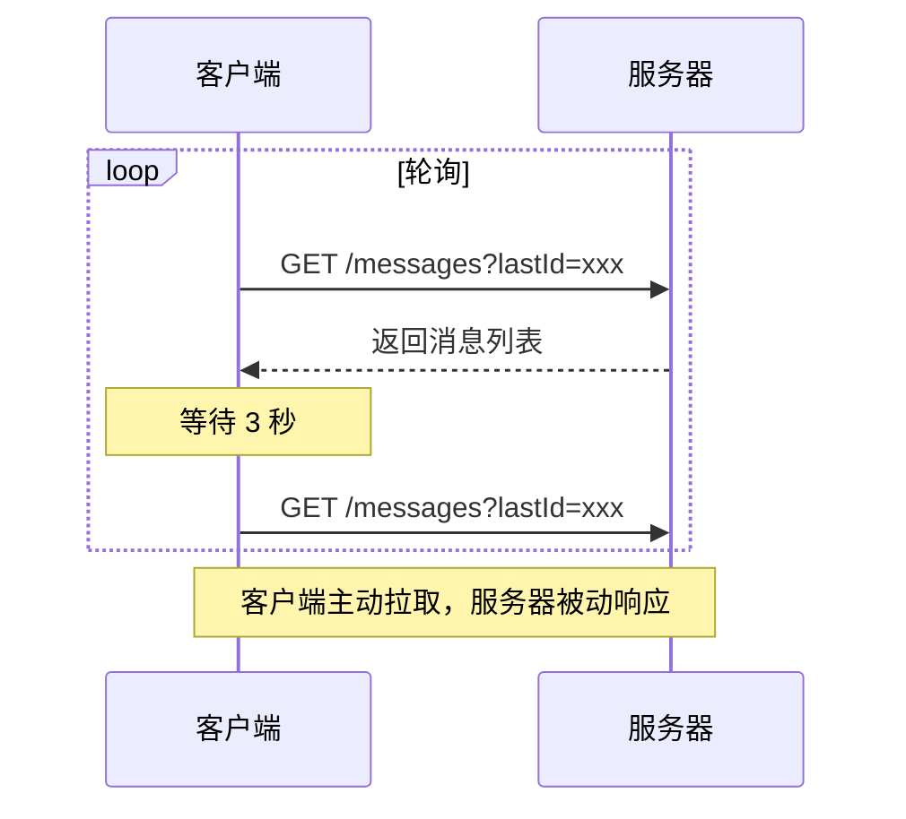
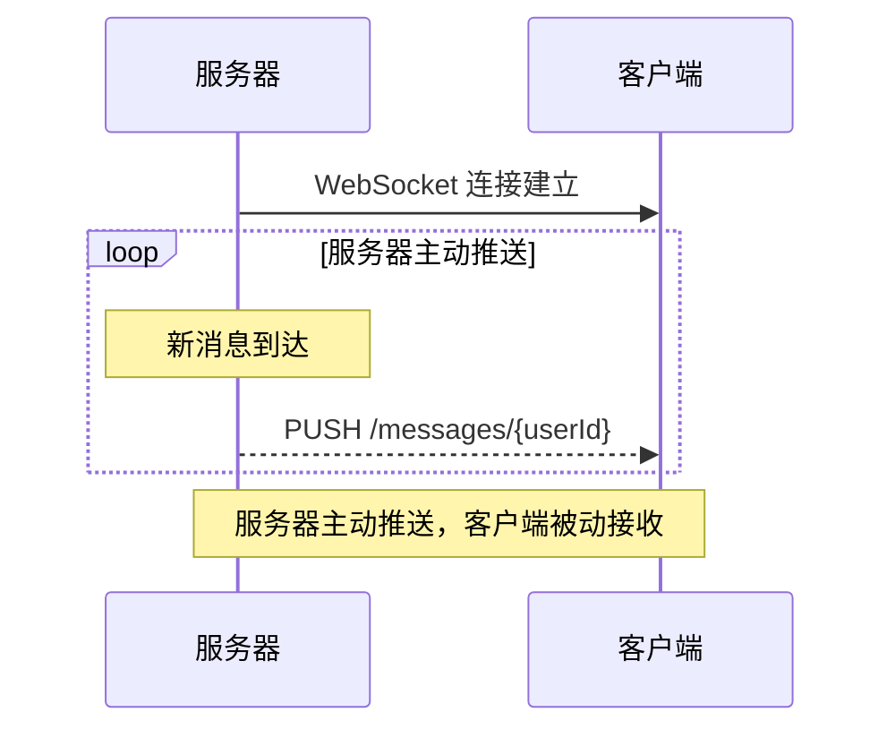
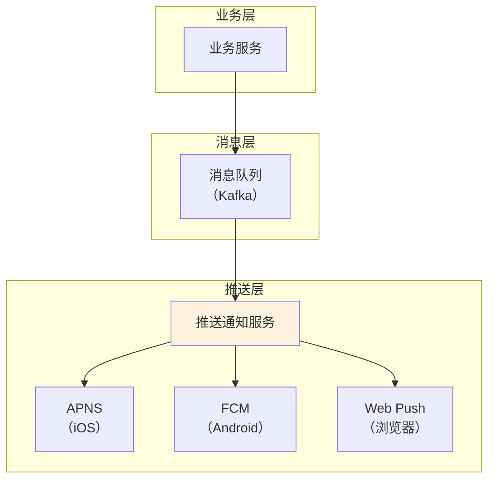
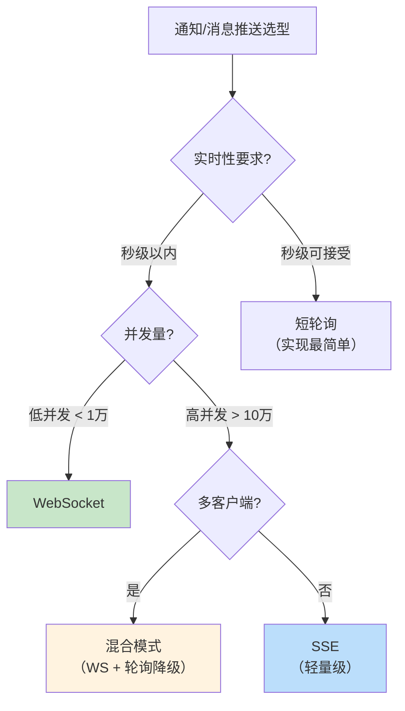
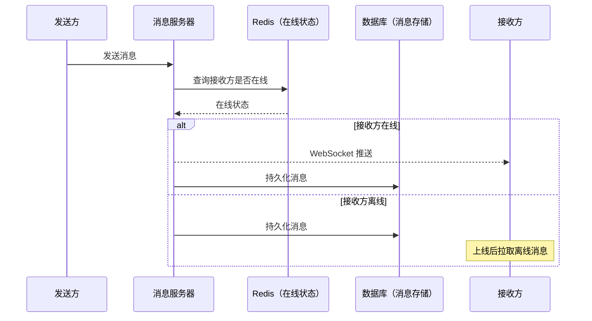
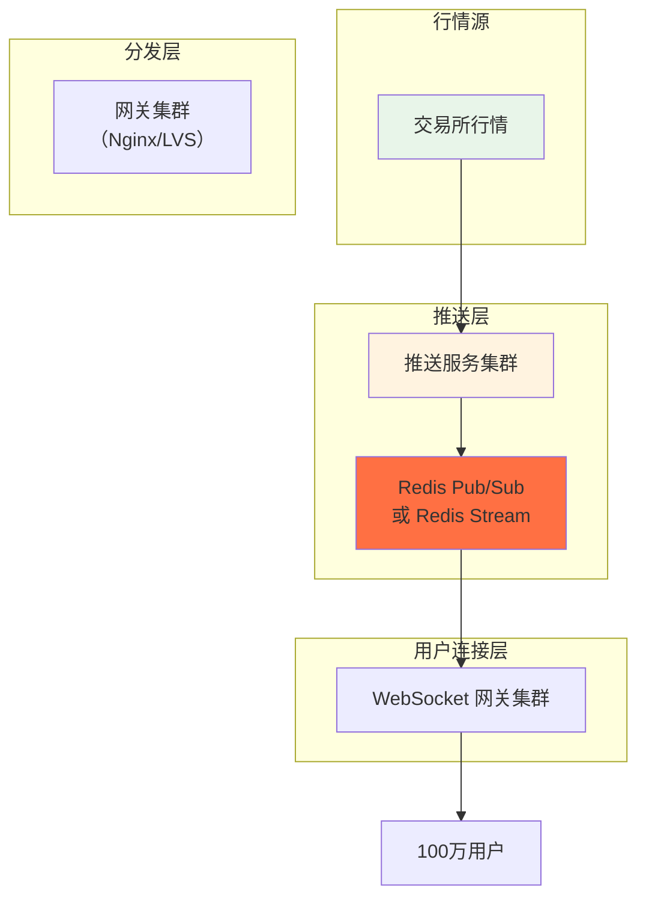

# 推模式 vs 拉模式

用户刷新页面，看到有新消息——这是拉模式。用户没刷新页面，却收到弹窗通知「新消息」——这是推模式。

两种模式都能实现「用户看到新消息」，但背后的架构复杂度、延迟表现、资源消耗完全不同。选择哪种，取决于业务场景和系统约束。

## 核心概念对比

### 拉模式（Pull）

客户端主动向服务器请求数据。



### 推模式（Push）

服务器主动将数据发送给客户端。



## 对比矩阵

| 维度 | 推模式 | 拉模式 |
| --- | --- | --- |
| **延迟** | 低（立即送达） | 高（取决于轮询间隔） |
| **资源消耗** | 服务器压力大 | 客户端压力大 |
| **实时性** | 真正实时 | 伪实时（取决于轮询频率） |
| **实现复杂度** | 高（需要长连接） | 低（普通 HTTP 即可） |
| **扩展性** | 差（连接数限制） | 好（无状态请求） |
| **断线恢复** | 需要重连机制 | 客户端重试即可 |

## 推模式详解

### WebSocket：双向长连接

WebSocket 是最常见的推模式实现，建立后服务端和客户端可以双向通信。

```java
// WebSocket 服务端（Spring Boot）
@Configuration
@EnableWebSocket
public class WebSocketConfig {
    
    @Bean
    public WebSocketHandler messageHandler() {
        return new AbstractWebSocketHandler() {
            
            private Map<String, WebSocketSession> users = new ConcurrentHashMap<>();
            
            @Override
            protected void handleTextMessage(WebSocketSession session, 
                                              TextMessage message) {
                // 收到客户端消息
                TextMessage msg = new TextMessage("收到: " + message.getPayload());
                try {
                    session.sendMessage(msg);
                } catch (IOException e) {
                    e.printStackTrace();
                }
            }
            
            @Override
            public void afterConnectionEstablished(WebSocketSession session) {
                // 连接建立，保存 session
                String userId = extractUserId(session);
                users.put(userId, session);
            }
            
            @Override
            public void afterConnectionClosed(WebSocketSession session, 
                                               CloseStatus status) {
                // 连接关闭，移除 session
                users.remove(session.getId());
            }
        };
    }
}

// 推送消息给指定用户
public void pushToUser(String userId, String message) {
    WebSocketSession session = users.get(userId);
    if (session != null && session.isOpen()) {
        try {
            session.sendMessage(new TextMessage(message));
        } catch (IOException e) {
            e.printStackTrace();
        }
    }
}
```

### Server-Sent Events（SSE）：服务端单向推送

SSE 是 HTML5 推出的轻量级推模式，只能服务端推给客户端，但实现比 WebSocket 简单。

```java
// SSE 端点（Spring Boot）
@GetMapping(value = "/events/{userId}", produces = MediaType.TEXT_EVENT_STREAM_VALUE)
public SseEmitter subscribe(@PathVariable String userId) {
    SseEmitter emitter = new SseEmitter(3600000L); // 超时时间 1 小时
    
    // 保存 emitter
    emitterMap.put(userId, emitter);
    
    // 清理回调
    emitter.onCompletion(() -> emitterMap.remove(userId));
    emitter.onTimeout(() -> emitterMap.remove(userId));
    
    return emitter;
}

// 推送事件
public void pushEvent(String userId, String eventType, Object data) {
    SseEmitter emitter = emitterMap.get(userId);
    if (emitter != null) {
        try {
            emitter.send(SseEmitter.event()
                .name(eventType)
                .data(data));
        } catch (IOException e) {
            emitterMap.remove(userId);
        }
    }
}
```

```html
<!-- 前端订阅 SSE -->
<script>
const eventSource = new EventSource('/events/user123');

eventSource.addEventListener('message', (event) => {
    const data = JSON.parse(event.data);
    console.log('收到消息:', data);
});

eventSource.addEventListener('notification', (event) => {
    showNotification(event.data);
});
</script>
```

### 消息队列：系统间推拉混合

消息队列（Kafka/RabbitMQ）本质上是「分布式推模式」：生产者推送消息到队列，消费者从队列拉取。

```mermaid
flowchart LR
    subgraph 生产者（推）
        P1["服务A"]
        P2["服务B"]
    end
    
    subgraph 消息队列
        MQ["Kafka / RabbitMQ"]
    end
    
    subgraph 消费者（拉）
        C1["服务C"]
        C2["服务D"]
    end
    
    P1 --> MQ
    P2 --> MQ
    MQ --> C1
    MQ --> C2
    
    Note over P1,P2: 生产者推送消息到队列
    Note over C1,C2: 消费者从队列拉取消息
```

**推拉分离的设计意图**：
- 生产者不需要知道有多少消费者
- 消费者可以根据自己的能力拉取数据（背压机制）
- 系统间解耦

## 拉模式详解

### HTTP 轮询：简单但浪费

最简单的拉模式实现，客户端定时请求。

```java
// 前端轮询
setInterval(async () => {
    const response = await fetch('/api/notifications');
    const notifications = await response.json();
    renderNotifications(notifications);
}, 5000); // 每 5 秒轮询一次
```

**问题**：
- 5 秒轮询间隔意味着消息最多延迟 5 秒
- 即使没有新消息，也需要发送 HTTP 请求
- 服务器资源浪费在处理空请求

### 长轮询：减少无效请求

客户端发起请求，服务器如果有新消息立即返回，否则等待有消息或超时再返回。

```java
// 长轮询服务端
@GetMapping("/api/notifications/long-poll")
public DeferredResult<List<Notification>> longPoll(@RequestParam Long lastId) {
    DeferredResult<List<Notification>> deferredResult = new DeferredResult<>(30000L);
    
    // 检查是否有新消息
    List<Notification> newNotifications = notificationService.getNewNotifications(lastId);
    if (!newNotifications.isEmpty()) {
        deferredResult.setResult(newNotifications);
    } else {
        // 注册异步回调
        notificationService.addListener(lastId, (notifications) -> {
            deferredResult.setResult(notifications);
        });
        
        // 超时处理
        deferredResult.onTimeout(() -> {
            deferredResult.setResult(Collections.emptyList());
        });
    }
    
    return deferredResult;
}
```

**优势**：
- 没有新消息时不立即响应，减少无效请求
- 消息到达后立即返回，延迟比短轮询低

**劣势**：
- 实现比短轮询复杂
- 服务器需要维护长连接
- 高并发下资源消耗仍然较高

## 混合模式：取长补短

### WebSocket + 轮询降级

WebSocket 是最佳选择，但连接可能不稳定。需要降级机制。

```java
// 前端实现
class NotificationService {
    
    constructor() {
        this.useWebSocket = true;
        this.pollingInterval = 5000;
    }
    
    connect() {
        if (this.useWebSocket) {
            this.connectWebSocket();
        } else {
            this.startPolling();
        }
    }
    
    connectWebSocket() {
        this.ws = new WebSocket('wss://api.example.com/notifications');
        
        this.ws.onmessage = (event) => {
            this.handleNotification(JSON.parse(event.data));
        };
        
        this.ws.onclose = () => {
            // WebSocket 断开，降级到轮询
            this.useWebSocket = false;
            this.startPolling();
        };
        
        this.ws.onerror = () => {
            this.useWebSocket = false;
            this.startPolling();
        };
    }
    
    startPolling() {
        this.pollingTimer = setInterval(async () => {
            const notifications = await fetch('/api/notifications').then(r => r.json());
            notifications.forEach(n => this.handleNotification(n));
        }, this.pollingInterval);
    }
}
```

### 消息队列 + 推送通知

对于需要跨多个客户端（Web、iOS、Android）推送的场景，消息队列 + 第三方推送服务是标准方案。



## 消息队列中的推拉模式

### Kafka：拉模式

Kafka 是典型的「拉模式」——消费者主动从 Broker 拉取消息。

```java
// Kafka 消费者
KafkaConsumer<String, String> consumer = new KafkaConsumer<>(props);

consumer.subscribe(Arrays.asList("topic"));

while (running) {
    ConsumerRecords<String, String> records = consumer.poll(Duration.ofMillis(100));
    for (ConsumerRecord<String, String> record : records) {
        processMessage(record);
    }
}
```

**优势**：
- 消费者控制拉取速率（背压机制）
- 消费者故障不影响 Broker
- 无状态的 Broker 扩展容易

**劣势**：
- 消费者需要持续轮询
- 消息到达后不能立即被处理（最多延迟一个轮询周期）

### RabbitMQ：推模式

RabbitMQ 支持「推模式」——Broker 主动将消息推给消费者。

```java
// RabbitMQ 消费者（推模式）
@RabbitListener(queues = "my-queue")
public void handleMessage(String message) {
    processMessage(message);
}
```

**优势**：
- 消息到达后立即被处理（延迟低）
- 不需要消费者持续轮询

**劣势**：
- 消费者压力大（消息量大时可能被压垮）
- 需要背压机制保护消费者

### RocketMQ：推拉结合

RocketMQ 提供了两种消费模式：
- **PushConsumer**：封装了拉取逻辑，对外表现为推模式
- **PullConsumer**：完全由用户控制拉取逻辑

```java
// RocketMQ PushConsumer
DefaultMQPushConsumer consumer = new DefaultMQPushConsumer("consumer-group");

consumer.subscribe("TopicTest", "*");

consumer.registerMessageListener((MessageListenerConcurrently) (msgs, context) -> {
    for (MessageExt msg : msgs) {
        processMessage(new String(msg.getBody()));
    }
    return ConsumeConcurrentlyStatus.CONSUME_SUCCESS;
});

consumer.start();
```

## 选型决策树



## 常见误区

### 「WebSocket 一定比轮询好」

WebSocket 在实时性上优势明显，但代价是：
- 实现复杂度高
- 连接数受限（单机通常 `<` 10 万连接）
- 需要处理断线重连

对于「消息通知」这种低频场景，轮询的成本可能更低。

### 「推模式不需要客户端操作」

推模式下客户端也需要「订阅」，订阅关系需要存储和维护。而且推送通道不稳定（移动网络切换、后台进程被杀），需要重连机制。

### 「长轮询解决了所有问题」

长轮询在高并发下仍然会消耗服务器资源——每个长轮询请求都需要占用一个线程。需要配合熔断、限流等保护机制。

### 忽视离线消息

推模式的客户端只有在「在线」时才能收到消息。离线消息（用户不在线时的消息）需要持久化存储，等用户上线后拉取。

## 思考题

**问题 1**：一个即时通讯应用（类似微信），消息投递应该用推模式还是拉模式？为什么？

<details>
<summary>参考答案</summary>

**建议：混合模式**

1. **消息投递**：推模式（WebSocket）
   - 用户在线时，消息通过 WebSocket 立即推送到客户端
   - 延迟极低，用户体验好

2. **消息同步**：拉模式
   - 用户上线时，从服务器拉取离线消息
   - 切换设备时，从服务器拉取历史消息

3. **心跳保活**：推模式的补充
   - WebSocket 连接需要定期心跳保活
   - 检测连接是否存活

4. **离线消息存储**：
   - 消息需要持久化存储（MySQL/MongoDB）
   - 用户上线后拉取未收到的消息
   - 需要标记「已读」状态

**架构示例**：


</details>

**问题 2**：为什么 Kafka 选择拉模式而不是推模式？这种选择有什么优势？

<details>
<summary>参考答案</summary>

**Kafka 选择拉模式的原因**：

1. **背压机制**：
   - 消费者根据自己处理能力拉取数据
   - 处理快的消费者可以拉取更多，处理慢的可以少拉
   - 不会因为生产者发送过快而压垮消费者

2. **无状态 Broker**：
   - Broker 不需要维护消费者状态
   - 消费者故障不影响 Broker
   - Broker 扩展容易

3. **消费位点控制**：
   - 消费者自己控制消费位点（offset）
   - 可以重置偏移量回溯消费
   - 故障恢复时可以指定从哪个位置开始消费

4. **批量消费优化**：
   - 消费者可以一次拉取多条消息
   - 减少网络往返，提高吞吐量

**推模式的劣势**：
- Broker 需要维护每个消费者的状态
- 推送速度不可控，可能压垮消费者
- 消费者故障时需要 Broker 处理重试逻辑

</details>

**问题 3**：如果你负责设计一个「实时股票行情」系统，100 万用户同时在线，每秒行情更新 1000 次，应该如何设计？

<details>
<summary>参考答案</summary>

**设计分析**：

1. **问题规模**：
   - 100 万并发连接
   - 每秒 1000 次更新
   - 每条更新可能推送给所有用户

2. **推送方案**：
   - 每秒 1000 × 100 万 = 10 亿次推送
   - 单机 WebSocket 撑不住

3. **解决方案**：分层 + 广播



4. **关键技术点**：

   - **行情聚合**：1000 次/秒更���聚合到 10-50 次/秒推送（按用户订阅的股票）
   - **房间分组**：用户按订阅的股票分组，同一房间内的用户共享行情推送
   - **CDN/边缘计算**：在用户就近的边缘节点处理推送，减少骨干网络流量
   - **WebSocket 集群**：使用分布式 WebSocket 网关（如 GateWay）

5. **降级方案**：
   - 行情延迟推送（从实时降级到 5 秒延迟）
   - 热点股票降级（减少推送频率）
   - 非核心用户断开（VIP 用户优先）

</details>
