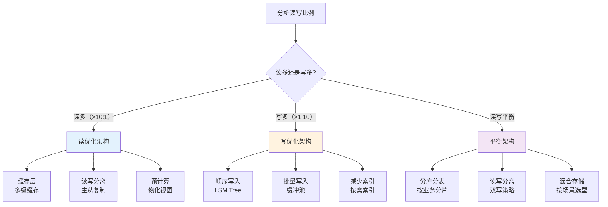
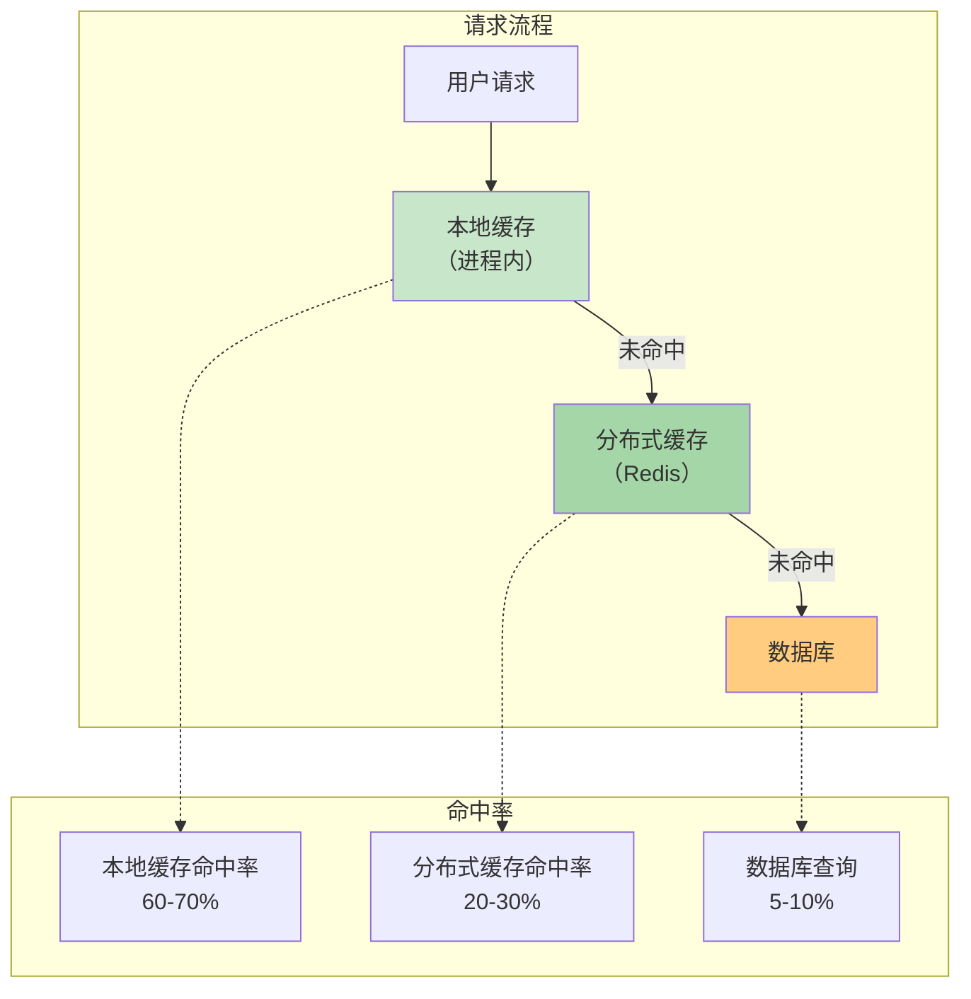
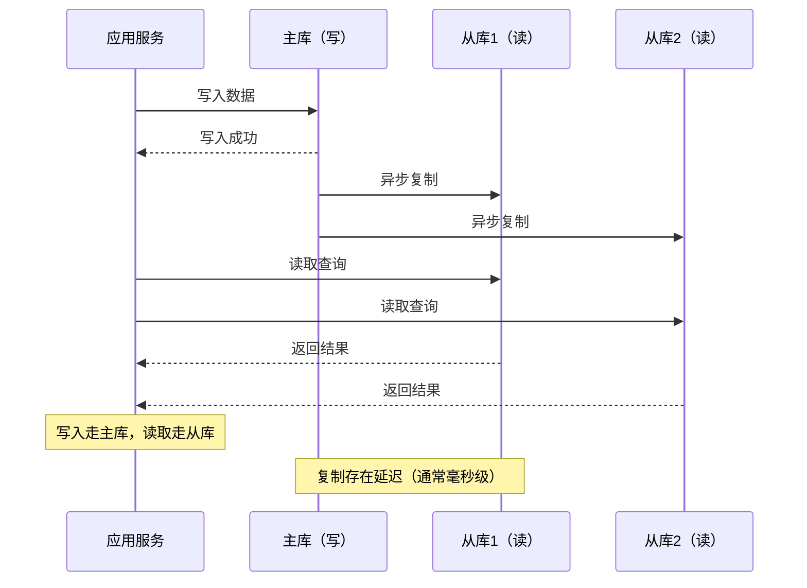
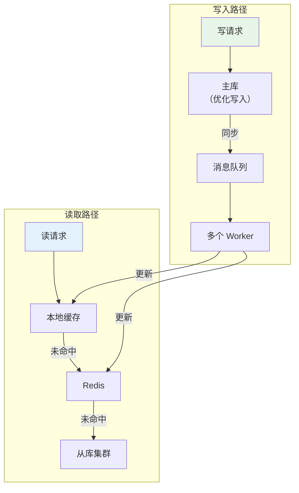
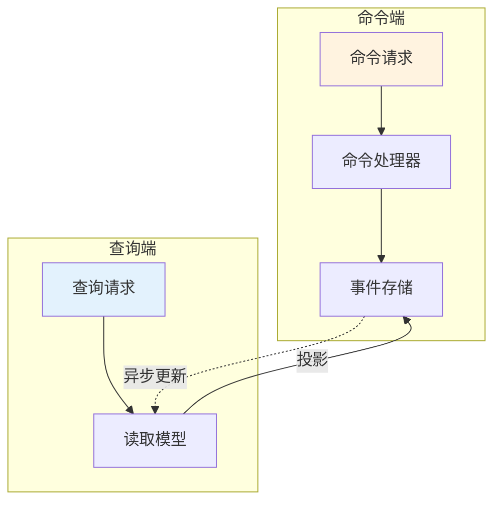

# 读优化 vs 写优化

想象一个新闻网站：首页展示的是过去 24 小时的热门文章，每天的阅读量是 1000 万次，但编辑发布新文章只有 100 次。如果你把全部精力放在优化「写文章」的体验上，用户打开首页却要等 3 秒——这个优化方向显然走偏了。

反过来，如果你负责的是日志采集系统：每秒写入 10 万条日志，读取只有运维人员排查问题时才会用到，优化「读取」就是浪费时间。

**读写比例是架构设计最重要的起点之一**。在动手之前，先问自己：这个系统读多还是写多？比例大概是多少？

## 读写比例决定优化方向

不同场景的读写比例差异巨大：

| 场景 | 读:写比例 | 优化重点 |
| --- | --- | --- |
| 社交Feed | 100:1 | 读优化（缓存、CDN、预计算） |
| 日志系统 | 1:100 | 写优化（顺序写、批量写入） |
| 电商商品详情 | 1000:1 | 读优化（多级缓存） |
| 订单支付 | 1:1 | 读写平衡 |
| 实时排行榜 | 10:1 | 写优化（增量更新） |
| 搜索系统 | 100:1 | 读优化（倒排索引和缓存） |



## 读优化：让数据「靠近」用户

### 核心思想

读优化的本质是**让数据「更近、更快、更近用户」**。核心手段包括：

1. **缓存**：热点数据放入内存，减少数据库压力
2. **多副本**：读取分散到多个节点，降低单点压力
3. **读写分离**：写主库，读从库或缓存
4. **预计算**：提前算好结果，避免实时计算

### 缓存：多级缓存架构



本地缓存（如 Caffeine、Guava Cache）访问延迟约 100 纳秒级，分布式缓存（如 Redis）约 1 毫秒级，数据库约 10 毫秒级。每一层缓存都能过滤掉大量请求，减轻下一层压力。

### 读写分离：MySQL 主从复制



读写分离的代价是**主从延迟**，从库的数据可能短暂落后于主库。对于一致性要求高的场景，需要在应用层处理延迟问题（如强制读主库、延迟感知路由）。

### 预计算：Feed 流预推送

社交平台的 Feed 流是读优化的极致案例。用户的好友动态不需要每次都去计算，而是提前算好并存入缓存，用户访问时直接读取。

```java
// 传统做法：实时计算（每次读都很慢）
public Feed getFeedRealTime(long userId) {
    List<Long> friendIds = getFriends(userId);
    List<Post> posts = new ArrayList<>();
    for (Long friendId : friendIds) {
        posts.addAll(postService.getPostsByUser(friendId, limit)); // 多次查询
    }
    return sortByTime(posts);
}

// 优化做法：预计算（读的时候直接返回）
public Feed getFeedPrecomputed(long userId) {
    return feedCache.get(userId); // 直接从缓存读取
}
```

预计算的代价是**存储空间增加**和**数据新鲜度下降**。需要权衡预计算的范围和更新频率。

## 写优化：让数据「顺畅」落盘

### 核心思想

写优化的本质是**减少写入摩擦，让数据快速落盘**。核心手段包括：

1. **顺序写**：利用磁盘顺序写的性能优势
2. **批量写**：合并多次写入为一次
3. **异步写**：写入先入内存或队列，异步落盘
4. **减少索引**：避免每次写入都更新多个索引

### 顺序写：LSM Tree 架构

传统 B+ Tree 的问题是**随机写入**：每次写入都可能触发页分裂，导致大量磁盘随机写。LSM Tree（Log-Structured Merge Tree）通过将随机写转为顺序写来解决这个问题。

```mermaid
flowchart LR
    subgraph 写入流程
        W["写入请求"] --> MemTable["内存表\n（MemTable）"]
        MemTable -->|"刷盘"| SSTable["磁盘文件\n（SSTable）"]
        SSTable -->|"合并"| SSTable2["新的 SSTable"]
    end
    
    subgraph 读取流程
        R["读取请求"] --> MemTable
        MemTable -->|"未命中"| SSTable
    end
    
    style MemTable fill:#c8e6c9
    style SSTable fill:#bbdefb
    
    Note over MemTable: 写入先入内存，异步刷盘
    Note over SSTable: 顺序写入，批量合并
```

LSM Tree 的代表实现包括 LevelDB、RocksDB、Cassandra 的存储引擎。它的核心优势是**写入性能极佳**（所有写入都是顺序追加），代价是**读取需要合并多个层级**（读取性能略差于 B+ Tree）。

### 批量写：数据库的批处理能力

```java
// 错误示例：逐条插入
for (LogEntry entry : entries) {
    db.insert(entry); // 每次插入都有网络往返和事务开销
}

// 正确示例：批量插入
db.batchInsert(entries); // 一次网络往返，一次事务
```

批量写的关键是**控制批量大小**。太小没有效果，太大可能导致内存溢出或事务时间过长。通常建议：

- 单批次大小：100-1000 条
- 单批次数据量：不超过 1MB
- 批次间隔：不超过 5 秒（避免数据丢失）

### 异步写：写缓冲队列

对于可以容忍短暂数据丢失的场景，可以先将数据写入内存队列（如 Kafka、Redis List），后台线程异步批量写入数据库。

```mermaid
flowchart TD
    subgraph 同步写入（慢）
        W1["写请求"] --> DB1["数据库"]
        DB1 --> R1["响应"]
    end
    
    subgraph 异步写入（快）
        W2["写请求"] --> Q["消息队列"]
        Q --> Worker["后台 Worker"]
        Worker --> DB2["批量写入"]
        W2 -->|"立即"| R2["响应（已接收）"]
    end
    
    style Q fill:#c8e6c9
    style W2 fill:#e8f5e9
```

异步写的代价是**数据可靠性降低**（消息队列可能有丢失）和**数据可见性延迟**（数据写入队列后还不能立即查询）。

## 同时优化读写：混合策略

很多系统不是单纯的读重或写重，而是「两端都重」。这时候需要组合多种策略。

### 读写分离 + 写优化

写主库，读从库或缓存。同时优化写入路径（如批量写、异步写），让主库压力更小，从库同步更快。



### CQRS 架构

CQRS（Command Query Responsibility Segregation）将读写彻底分离：
- **写入侧**：专门处理命令（Create/Update/Delete），优化写入性能
- **读取侧**：专门处理查询，预计算、反规范化、缓存



CQRS 适合复杂业务场景，代价是**架构复杂度增加**和**一致性保证更复杂**。

## 常见误区

### 不做分析就优化

「我觉得这个系统读多」和「这个系统实际读多」是两回事。先用监控数据说话，确认实际的读写比例，再决定优化方向。

### 只优化一方

读优化做得很极致，缓存命中率 99%，结果写入时缓存全部失效——这就是「只优化读」的问题。好的架构需要**读写双方协同优化**。

### 忽视写入延迟

用户只关心读取延迟，忽视了写入延迟对系统的影响。如果写入延迟太高，缓存预热时间变长，缓存命中率下降，最终影响读取性能。

### 过度优化

对于小规模系统，读写分离、LSM Tree、预计算这些都是过度设计。先用简单方案（单库单表），等规模上来了再逐步优化。

## 思考题

**问题 1**：一个电商商品详情页，每天被访问 100 万次，但商品信息每天只更新 10 次。你会如何设计这个场景的读写架构？

<details>
<summary>参考答案</summary>

这是一个典型的「读远多于写」场景，应该以读优化为主：

1. **多级缓存**：
   - L1 本地缓存（CDN 或进程内 Caffeine）：缓存商品信息，TTL 1-5 分钟
   - L2 分布式缓存（Redis）：缓存热点商品，TTL 5-10 分钟

2. **读写分离**：
   - 写入走主库，更新商品信息
   - 读取走从库或缓存，主库压力几乎为零

3. **预计算**：
   - 商品详情页的渲染结果可以预先生成静态 HTML，存在对象存储中

4. **缓存更新策略**：
   - 商品更新时**主动失效缓存**，而不是等 TTL 自然过期
   - 可以使用 Canal 监听 MySQL binlog 实现缓存更新

核心思路：**让 99.99% 的读取请求根本不碰到数据库**。

</details>

**问题 2**：日志采集系统每秒写入 10 万条日志，但查询只有运维人员在排查问题时才会用到。你会如何设计？

<details>
<summary>参考答案</summary>

这是一个典型的「写远多于读」场景，应该以写优化为主：

1. **顺序写优先**：使用 LSM Tree 引擎（如 RocksDB）或追加写日志文件
2. **批量写入**：每 1000 条或每 100ms 批量写入一次
3. **异步写入**：写入先入内存缓冲区，后台线程定期刷盘
4. **减少索引**：日志系统不需要传统数据库的复杂索引，按时间戳顺序存储即可

5. **压缩存储**：日志数据重复度高，使用 LZ4 或 ZSTD 压缩可节省 5-10 倍存储

6. **分层存储**：
   - 热数据（最近 7 天）：SSD 或内存
   - 温数据（7-30 天）：普通磁盘
   - 冷数据（30 天以上）：对象存储归档

核心思路：**让写入尽可能快，数据进来就不丢**。查询慢一点可以接受（运维排查不差那几秒）。

</details>

**问题 3**：一个聊天室系统，用户可以发送消息、查看历史消息。如果要同时优化读写性能，应该如何设计？

<details>
<summary>参考答案</summary>

聊天室是「读写都重」的场景：

1. **写入优化**：
   - 消息先写入 Redis Stream 或 Kafka（高性能队列）
   - 后台 Worker 批量写入数据库（降低数据库压力）

2. **读取优化**：
   - 历史消息走分页查询，限制每页大小（如 20 条）
   - 热点房间的消息可以缓存（如最近 100 条）
   - 新消息推送用 WebSocket，不需要用户主动拉取

3. **消息同步**：
   - 如果用户切换设备，需要拉取历史消息走数据库
   - 如果只在线查看，新消息通过 WebSocket 推送

4. **分库分表**：
   - 按房间 ID 分片，每个房间的消息存在一起
   - 避免跨分片查询

核心思路：**写入用队列削峰，读取用缓存加速，新消息用推送代替拉取**。

</details>
