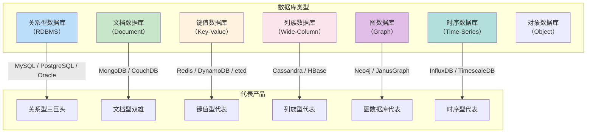
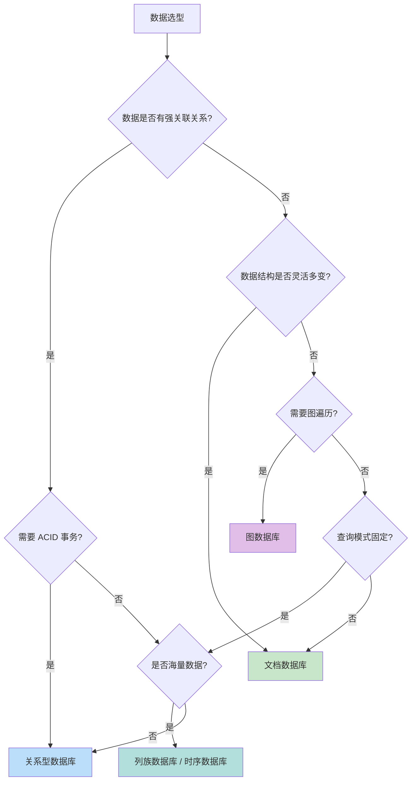
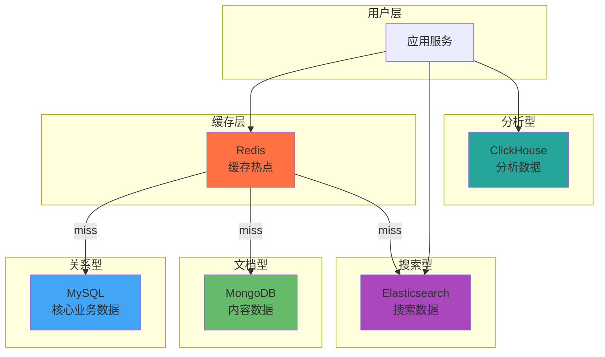

# 关系型 vs 非关系型数据库

数据库选型时最常见的问题：「用 MySQL 还是 MongoDB？」、「PostgreSQL 能不能解决一切？」、「Redis 算不算数据库？」

这些问题没有标准答案，但有清晰的思考框架。选错数据库的后果比选错编程语言的代价大得多——数据迁移的成本是代码重写的 10 倍。

## 数据库的分类图谱

数据库世界远比「关系型 vs 非关系型」的二分法复杂：



## 关系型数据库：结构化数据的王者

### 核心特征

| 特征 | 说明 |
| --- | --- |
| **ACID 事务** | 原子性、一致性、隔离性、持久性，事务安全 |
| **SQL 查询** | 标准化查询语言，JOIN、聚合、子查询能力强大 |
| **关系模型** | 表与表之间通过外键建立关系 |
| **成熟生态** | 运维工具、监控、人才储备都很完善 |
| **强一致性** | 默认隔离级别下，读取不会出现脏读、不可重复读 |

### 适用场景

**金融账务**：每一笔转账、每一笔支付都必须准确无误。

```sql
-- 转账：原子操作，要么全部成功，要么全部失败
BEGIN TRANSACTION;

UPDATE accounts SET balance = balance - 1000 WHERE id = 'A';
UPDATE accounts SET balance = balance + 1000 WHERE id = 'B';
INSERT INTO transaction_log (from, to, amount) VALUES ('A', 'B', 1000);

COMMIT;
```

**订单系统**：订单、商品、用户、库存之间存在复杂关系。

```sql
-- 复杂查询：JOIN 多个表获取订单完整信息
SELECT 
    o.order_id,
    u.username,
    p.product_name,
    oi.quantity,
    oi.price
FROM orders o
JOIN users u ON o.user_id = u.user_id
JOIN order_items oi ON o.order_id = oi.order_id
JOIN products p ON oi.product_id = p.product_id
WHERE o.order_status = 'PAID'
ORDER BY o.created_at DESC
LIMIT 20;
```

### 代表产品对比

| 产品 | 优势 | 劣势 | 适用场景 |
| --- | --- | --- | --- |
| **MySQL** | 生态完善、性能优秀 | 并行能力弱 | 互联网业务、Web 应用 |
| **PostgreSQL** | 功能强大、扩展性好 | 配置复杂 | 复杂查询、GIS |
| **Oracle** | 功能最全、稳定性高 | 成本高、运维复杂 | 金融、电信核心系统 |

## 非关系型数据库全景

### 文档数据库：灵活 Schema

MongoDB 是文档数据库的代表，数据以 BSON 文档存储，Schema 灵活。

```json
// 一个文档：用户画像，字段随时变化
{
    "_id": "user_001",
    "name": "张三",
    "profile": {
        "age": 28,
        "interests": ["旅游", "摄影", "编程"],
        "preferences": {
            "theme": "dark",
            "notifications": true
        }
    },
    "activity": {
        "lastLogin": "2024-01-15",
        "totalOrders": 45
    }
}
```

**优势**：
- Schema 灵活，字段随时增删
- 嵌套文档减少 JOIN
- 文档结构贴近业务对象

**劣势**：
- 不支持复杂 JOIN（需要应用层处理）
- 事务能力相对较弱（MongoDB 4.0+ 才开始支持）
- 关联查询性能不如关系型

**适用场景**：
- 内容管理（文章、帖子、评论）
- 用户画像（属性多样）
- 敏捷开发（需求变化频繁）

### 键值数据库：极致性能

Redis、DynamoDB、etcd 是键值数据库的代表。

```java
// Redis：毫秒级读写
String user = redis.get("user:12345");  // 读取
redis.setex("token:abc123", 3600, userId);  // 写入，带过期时间

// Redis 数据结构丰富
redis.zadd("ranking:2024", 8500, "user_001");  // 有序集合：排行榜
redis.lpush("queue:orders", orderId);  // 列表：消息队列
redis.sadd("tags:product_123", "热销", "新品");  // 集合：标签系统
```

**优势**：
- 微秒级读写延迟
- 支持丰富的数据结构
- 内存存储，吞吐量极高

**劣势**：
- 数据受内存大小限制
- 不支持复杂查询
- 持久化能力有限

**适用场景**：
- 缓存层（热点数据）
- 会话存储（Session、Token）
- 实时排行（分数排序）
- 分布式锁

### 列族数据库：海量写入

Cassandra、HBase 是列族数据库的代表。

```sql
-- Cassandra CQL
CREATE TABLE sensor_data (
    sensor_id UUID,
    timestamp TIMESTAMP,
    temperature DOUBLE,
    humidity DOUBLE,
    PRIMARY KEY (sensor_id, timestamp)
);

-- 按时间范围查询，极其高效
SELECT * FROM sensor_data 
WHERE sensor_id = ? 
AND timestamp > '2024-01-01' 
AND timestamp < '2024-01-02';
```

**优势**：
- LSM Tree 写入优化，高并发写入
- 无主分布式，天然支持横向扩展
- 多数据中心复制

**劣势**：
- 查询模式受限（需要预设计分区键）
- 不支持 JOIN
- 一致性模型复杂

**适用场景**：
- 物联网时序数据
- 日志收集系统
- 消息存储

### 图数据库：关系网络

Neo4j、JanusGraph 是图数据库的代表。

```cypher
// Neo4j Cypher：社交关系查询
MATCH (me:Person {name: '张三'})-[:FOLLOWS*1..3]->(friend)-[:LIKES]->(product:Product)
WHERE product.category = '电子产品'
RETURN DISTINCT friend.name, product.name
ORDER BY friend.followers DESC
LIMIT 10;
```

**优势**：
- 图遍历性能极佳（多层关联查询比 SQL 快 100 倍）
- 关系建模自然
- 支持复杂图算法

**劣势**：
- 数据量大时存储成本高
- 生态相对小众
- 运维复杂度高

**适用场景**：
- 社交网络（好友推荐）
- 知识图谱
- 欺诈检测
- 推荐系统

### 时序数据库：时间序列

InfluxDB、TimescaleDB 是时序数据库的代表。

```sql
-- InfluxDB InfluxQL：时间序列聚合
SELECT 
    MEAN(temperature) as avg_temp,
    MAX(temperature) as max_temp,
    MIN(temperature) as min_temp
FROM sensor_data
WHERE time > now() - 7d
GROUP BY time(1h), sensor_id
```

**优势**：
- 时间序列优化（压缩、存储、聚合）
- 高速持续写入
- 内置时序分析函数

**劣势**：
- 通用查询能力弱
- 事务能力有限
- 生态较小众

**适用场景**：
- 监控指标（Prometheus 数据）
- 物联网传感器数据
- 金融 K 线数据
- 应用日志分析

## 选型决策树



## 常见场景选型

| 场景 | 推荐选择 | 备选方案 |
| --- | --- | --- |
| **用户账号、订单、账务** | PostgreSQL / MySQL | TiDB（数据量大时） |
| **商品详情、内容管理** | MongoDB | PostgreSQL JSONB |
| **会话、缓存、Token** | Redis | DynamoDB |
| **好友关系、社交图谱** | Neo4j | PostgreSQL + 递归查询 |
| **监控指标、IoT 数据** | InfluxDB / TimescaleDB | ClickHouse |
| **日志、消息存储** | Cassandra / ClickHouse | Elasticsearch |
| **排行榜、计数器** | Redis Sorted Set | MongoDB |
| **配置中心、分布式锁** | etcd / ZooKeeper | Redis |

## 混合使用：现实中的常态

没有哪个数据库能解决所有问题。实际项目中，**混合使用多种数据库是常态**。



### 数据同步问题

混合使用多种数据库时，数据同步是核心挑战。

```java
// 方案1：双写（不推荐，复杂且容易出错）
public void saveUser(User user) {
    // 写入 MySQL
    mySqlRepo.save(user);
    
    // 写入 MongoDB
    mongoTemplate.save(user);
    
    // 写入 Redis 缓存
    redisTemplate.opsForValue().set("user:" + user.getId(), user);
}

// 方案2：CDC（Change Data Capture，推荐）
// 使用 Canal 监听 MySQL binlog，异步同步到其他数据库
```

## 常见误区

### 「PostgreSQL 能解决一切」

PostgreSQL 功能确实强大，但它仍然受限于单机性能。百亿级数据量下，PostgreSQL 的查询性能会急剧下降，此时需要分布式数据库。

### 「MongoDB 不需要 Schema」

MongoDB 的 Schema 灵活不等于不需要设计。好的文档结构能提升查询性能；混乱的文档结构会让查询变得缓慢且不可预测。

### 「Redis 可以替代数据库」

Redis 是内存数据库，容量受限于内存大小。Redis 的持久化能力不如磁盘数据库，不能作为主数据库使用。

### 「图数据库适合所有关系查询」

图数据库适合「关系复杂、遍历深度大」的场景。如果只是简单的关联查询，关系型数据库的 JOIN 足够用了。

## 思考题

**问题 1**：一个社交平台，用户关注关系、动态内容、点赞评论、实时聊天分别应该用什么数据库？为什么？

<details>
<summary>参考答案</summary>

| 数据类型 | 推荐选择 | 理由 |
| --- | --- | --- |
| **用户关注关系** | Neo4j 或 MySQL | 关注关系适合图遍历，Neo4j 更高效；简单场景 MySQL 够用 |
| **动态内容** | MongoDB + Redis | 内容字段灵活多变，MongoDB 适合；热点动态用 Redis 缓存 |
| **点赞、评论** | MySQL + Redis | MySQL 存完整数据；Redis 存实时计数（点赞数、评论数） |
| **实时聊天** | Redis | 聊天记录用 Redis Stream 或 List，毫秒级读写 |

**架构示例**：
- 用户关系：Neo4j（图数据库，社交推荐）
- 用户信息：MySQL + Redis 缓存
- 动态内容：MongoDB + Elasticsearch 搜索
- 实时计数：Redis
- 聊天消息：Redis Stream
- 历史消息归档：MongoDB 或 ClickHouse

</details>

**问题 2**：为什么传统关系型数据库在物联网场景下撑不住？Cassandra 是如何解决这个问题的？

<details>
<summary>参考答案</summary>

**传统 RDBMS 的瓶颈**：

1. **写入性能有限**：MySQL 使用 B+ Tree，每次写入都可能触发随机 IO
2. **连接数限制**：百万设备同时上报数据，连接数暴增
3. **水平扩展困难**：MySQL 分库分表成本极高
4. **成本高**：高并发写入需要昂贵的高端存储

**Cassandra 的解决方案**：

1. **LSM Tree 写入优化**：
   - 写入先入内存，后台批量刷盘
   - 所有写入都是顺序追加，无随机 IO
   - 写入性能比 B+ Tree 高 10 倍以上

2. **无主分布式架构**：
   - 每个节点都是平等的，横向扩展简单
   - 数据自动分片到多个节点
   - 支持多数据中心复制

3. **写入无锁**：
   - Cassandra 写入不需要读取数据页
   - 无需维护索引结构（索引也是 SSTable）

```java
// Cassandra 写入：简单高效
PreparedStatement stmt = session.prepare(
    "INSERT INTO sensor_data (sensor_id, timestamp, temperature) VALUES (?, ?, ?)"
);
BoundStatement bound = stmt.bind(sensorId, System.currentTimeMillis(), temp);
session.execute(bound);  // 写入极快
```

</details>

**问题 3**：如果一个系统当前使用 MySQL，需要存储海量的用户行为日志（日均 1 亿条），你会如何选型？

<details>
<summary>参考答案</summary>

**问题分析**：
- 日均 1 亿条日志 = 每秒约 1000 条写入
- 写入量大，查询少（运维排查时）
- 需要聚合分析（按用户、按时间）
- 数据量大（1 年约 3650 亿条）

**选型建议**：

1. **ClickHouse（首选）**：
   - 列式存储，压缩比高（10:1+）
   - 向量引擎，聚合查询极快
   - 支持时间分区
   - 写入性能高（异步批量写入）

2. **Elasticsearch（备选）**：
   - 全文检索能力强
   - 但存储成本高，不太适合纯日志

3. **Kafka + ClickHouse（推荐架构）**：
   ```mermaid
   flowchart LR
       App["业务系统"] -->|"写入"| Kafka["Kafka"]
       Kafka -->|"批量消费"| ClickHouse["ClickHouse"]
       Dashboard["分析平台"] -->|"查询"| ClickHouse
   ```

**不建议的选择**：
- MySQL：单表亿级数据查询很慢
- MongoDB：聚合分析能力弱于 ClickHouse
- Cassandra：适合时序但聚合能力不如 ClickHouse

</details>
