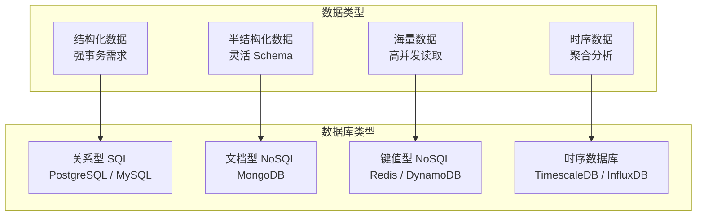
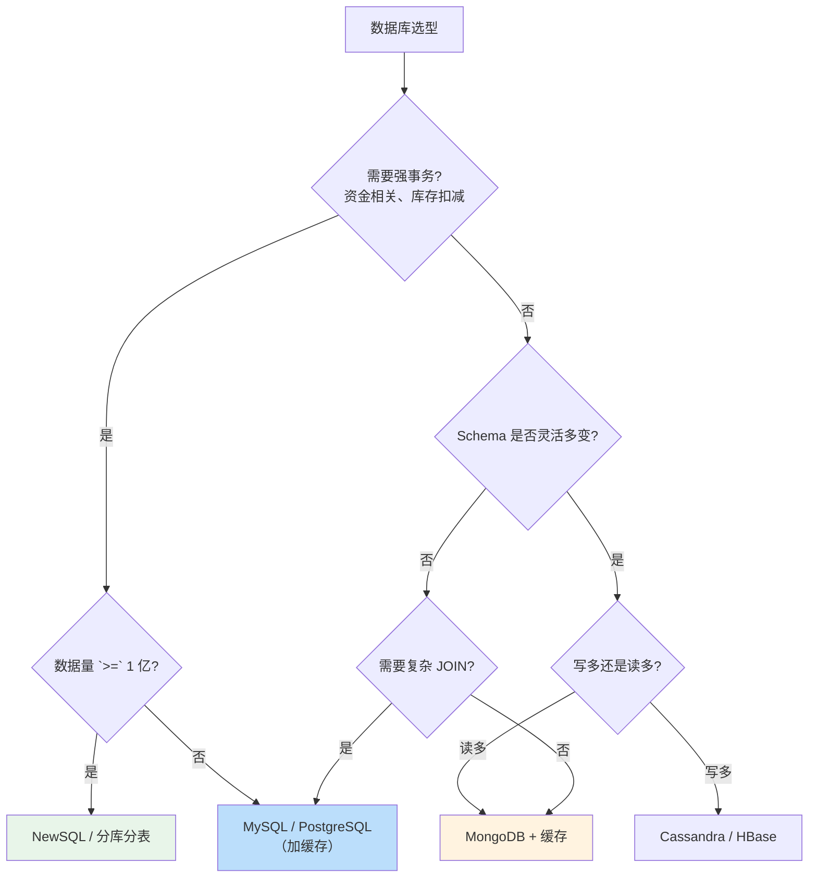
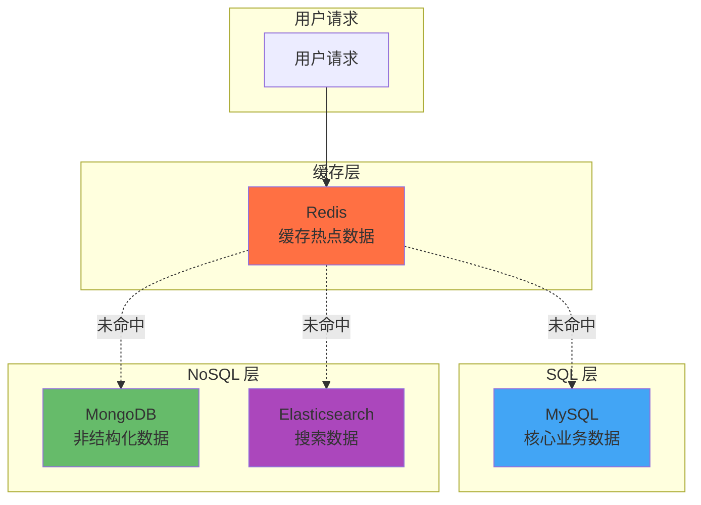

# SQL vs NoSQL 选型矩阵

业务飞速发展，数据量从 100 万增长到 10 亿，QPS 从 1000 飙升到 10 万。数据库团队提出了三套方案：

A 方案：PostgreSQL 主从 + 分库分表
B 方案：MongoDB 分片集群
C 方案：TiDB 分布式数据库

团队讨论了三天，最后选了「先上 Redis 缓存撑一撑」。半年后 Redis 缓存被打穿，数据库濒临崩溃，团队才意识到：**当初那个数据库选型决策，本应想得更清楚**。

数据库选型是架构设计中最重要、也最容易被「随便选一个」的决策。一旦数据量和业务复杂度上来，迁移成本巨大。

## SQL vs NoSQL：不是非此即彼

首先澄清一个常见误区：SQL 和 NoSQL 不是「谁取代谁」的关系，而是「各有所长」的关系。成熟的架构往往是**混合架构**：核心业务用 SQL，缓存用 Redis，海量日志用 MongoDB，大数据分析用 ClickHouse。



## 传统 SQL：强事务的代名词

### 核心优势

| 优势 | 说明 |
| --- | --- |
| **ACID 事务** | 原子性、一致性、隔离性、持久性， 금융级可靠 |
| **复杂查询** | JOIN、子查询、聚合、事务嵌套 |
| **成熟生态** | 运维工具、监控体系、人才储备都很完善 |
| **标准化** | SQL 是工业标准，迁移成本低 |

### 典型场景

**金融系统**：转账、支付、账务——这些场景要求「钱不能算错」，ACID 事务是刚需。

```java
// 金融级转账（强一致性）
public void transfer(String fromAccount, String toAccount, BigDecimal amount) {
    transactionTemplate.execute(status -> {
        Account from = accountRepo.findById(fromAccount);
        Account to = accountRepo.findById(toAccount);
        
        if (from.getBalance().compareTo(amount) < 0) {
            throw new InsufficientBalanceException();
        }
        
        from.setBalance(from.getBalance().subtract(amount));
        to.setBalance(to.getBalance().add(amount));
        
        accountRepo.save(from);
        accountRepo.save(to);
        
        return null;
    });
}
```

**ERP、CRM 系统**：业务逻辑复杂，模块之间关联紧密，强 JOIN 能力必不可少。

### 局限性

| 局限 | 说明 |
| --- | --- |
| **水平扩展难** | 分库分表成本高，跨分片 JOIN 是噩梦 |
| **Schema 变更** | 加字段、改索引需要锁表或长时间 DDL |
| **写入瓶颈** | 单机写入能力有限，高并发写入需要优化 |

## NoSQL：灵活与扩展的代名词

### NoSQL 的四大类型

| 类型 | 代表产品 | 核心优势 | 典型场景 |
| --- | --- | --- | --- |
| **键值型** | Redis、DynamoDB | 极快读写、高并发 | 缓存、会话、排行榜 |
| **文档型** | MongoDB、CouchDB | 灵活 Schema、嵌套文档 | 内容管理、用户画像 |
| **列族型** | Cassandra、HBase | 列式存储、写优化 | 物联网、日志、时序 |
| **图数据库** | Neo4j、JanusGraph | 图遍历、高效关系查询 | 社交网络、推荐系统 |

### 键值型：极致读写性能

Redis 是键值型 NoSQL 的代表。它将数据存储在内存中，辅以 RDB/AOF 持久化，实现微秒级读写延迟。

```java
// Redis 高性能缓存
public User getUserById(String userId) {
    // L1: 本地缓存
    User cached = localCache.get(userId);
    if (cached != null) {
        return cached;
    }
    
    // L2: Redis 缓存
    String json = redisTemplate.opsForValue().get("user:" + userId);
    if (json != null) {
        User user = JSON.parseObject(json, User.class);
        localCache.put(userId, user);
        return user;
    }
    
    // L3: 数据库
    User user = userRepo.findById(userId);
    redisTemplate.opsForValue().set("user:" + userId, JSON.toJSONString(user));
    
    return user;
}
```

适用场景：
- 热点数据缓存（用户信息、配置数据）
- 会话存储（JWT Token、Session）
- 实时排行（分数排行、投票统计）
- 分布式锁（Redisson）

### 文档型：灵活 Schema

MongoDB 是文档型 NoSQL 的代表。数据以 BSON 文档存储，Schema 灵活，不需要预先定义表结构。

```java
// MongoDB 灵活文档存储
// 一条用户文档，结构完全自定义
{
    "_id": ObjectId("..."),
    "username": "john",
    "profile": {
        "name": "John Doe",
        "avatar": "https://...",
        "preferences": {
            "theme": "dark",
            "language": "zh-CN"
        }
    },
    "orders": [
        { "id": "001", "amount": 100 },
        { "id": "002", "amount": 200 }
    ]
}

// 查询：嵌套字段直接查
db.users.find({"profile.preferences.theme": "dark"})
```

适用场景：
- 内容管理（文章、评论、帖子）
- 用户画像（属性多样、频繁变更）
- 敏捷开发（Schema 变化频繁）

### 列族型：海量写入

Cassandra 是列族型 NoSQL 的代表。它采用 LSM Tree 写入优化 + 无主分布式架构，支持跨数据中心复制。

```java
// Cassandra 写优化
// 写入极快，不等确认就返回
public void recordSensorData(String sensorId, long timestamp, double value) {
    String cql = "INSERT INTO sensor_data (sensor_id, timestamp, value) " +
                 "VALUES (?, ?, ?)";
    cassandraTemplate.execute(cql, sensorId, timestamp, value);
}
```

适用场景：
- 物联网传感器数据（高并发写入）
- 日志采集（每条日志独立写入）
- 时序数据（按时间分片）

### NoSQL 的代价

| 代价 | 说明 |
| --- | --- |
| **事务能力弱** | 大多数 NoSQL 不支持跨文档事务（MongoDB 4.0+ 开始支持） |
| **查询能力有限** | 不支持复杂 JOIN、聚合查询受限 |
| **运维复杂** | 不同 NoSQL 运维体系不同，学习成本高 |
| **数据一致性** | 很多 NoSQL 选择最终一致性 |

## NewSQL：鱼和熊掌兼得？

NewSQL 是近年来出现的新品类，试图同时满足 SQL 的事务能力和 NoSQL 的水平扩展性。

### 代表产品

| 产品 | 特点 | 适用场景 |
| --- | --- | --- |
| **TiDB** | MySQL 兼容、水平扩展、强一致 | 互联网业务、金融级场景 |
| **CockroachDB** | PostgreSQL 兼容、全球分布 | 全球化业务、多活架构 |
| **Google Spanner** | 强一致、全球分布、自动分片 | 全球服务、跨国公司 |
| **SingleStore** | 内存计算、HTAP（混合事务分析） | 实时分析、物联网 |

### TiDB 实战

```java
// TiDB 业务代码（与 MySQL 几乎一致）
public List<Order> getOrdersByUser(String userId, int page, int size) {
    String sql = "SELECT * FROM orders WHERE user_id = ? ORDER BY created_at DESC LIMIT ? OFFSET ?";
    return jdbcTemplate.query(sql, orderRowMapper, userId, size, page * size);
}
```

TiDB 的优势是**对 MySQL 兼容**，很多存量 MySQL ��统可以直接迁移。但 TiDB 的吞吐量比 MySQL 高 10 倍以上，延迟也更低——这是用分布式架构换来的。

### NewSQL 的代价

| 代价 | 说明 |
| --- | --- |
| **延迟略高** | 分布式事务比单机事务多一次网络往返 |
| **运维门槛高** | NewSQL 通常需要专业人员维护 |
| **成本高** | 至少需要 3 个节点，资源消耗比单节点高 |

## 选型决策树



## 详细选型矩阵

| 场景 | 推荐选择 | 理由 | 不推荐 |
| --- | --- | --- | --- |
| **金融转账** | PostgreSQL / TiDB | ACID 事务是刚需 | MongoDB、Cassandra |
| **电商订单** | MySQL / TiDB | 事务 + 复杂查询 | 纯 Redis |
| **社交 Feed** | Cassandra + Redis | 海量写入、高并发读取 | PostgreSQL（撑不住） |
| **内容管理** | MongoDB | 灵活 Schema、嵌套文档 | MySQL（表结构复杂） |
| **缓存/会话** | Redis | 微秒级延迟、丰富数据结构 | MySQL（太慢） |
| **实时排行** | Redis Sorted Set | 高性能、增量更新 | MongoDB（聚合慢） |
| **日志收集** | Cassandra / ClickHouse | 写入优化、时序分析 | MySQL（撑不住） |
| **用户画像** | MongoDB / Elasticsearch | 灵活 Schema、全文检索 | MySQL（字段多） |
| **物联网时序** | InfluxDB / TimescaleDB | 时序优化、连续查询 | MySQL（查询慢） |
| **社交关系图** | Neo4j | 图遍历、关系查询 | MySQL（多层 JOIN 慢） |

## 混合架构实战

实际项目很少只用一种数据库，而是根据数据特性选择不同的存储。



## 常见误区

### 「NoSQL 比 SQL 快」

NoSQL 快的场景是**特定访问模式**下。Redis 快在缓存命中，读缓存 1ms vs 读数据库 10ms；Cassandra 快在批量写入，10 万 QPS 写入 vs MySQL 1 万 QPS。

但如果你的访问模式是「复杂 JOIN + 聚合查询」，NoSQL 可能比 SQL 慢 100 倍。

### 「NoSQL 不需要 Schema」

NoSQL 的 Schema 灵活不等于没有 Schema。MongoDB 的文档结构混乱会导致查询性能下降；Cassandra 的表设计需要提前考虑查询模式。

### 「选错数据库可以随时迁移」

迁移数据库的成本极高：
- 数据迁移需要停服或双写
- 代码需要大量修改
- 历史数据需要清洗

**选型时多花一天时间，胜过上线后迁移花三个月**。

### 「NewSQL 是银弹」

NewSQL 解决了水平扩展的问题，但引入了新的复杂度：
- 运维复杂度增加
- 延迟略有上升
- 成本显著增加

如果数据量没到亿级，先优化单机 MySQL + 缓存的性价比更高。

## 思考题

**问题 1**：一个日活跃 1000 万的社交平台，用户信息、动态、互动数据分别应该用什么数据库？为什么？

<details>
<summary>参考答案</summary>

**用户信息**：Redis + MySQL 混合
- Redis 缓存热点用户数据（头像、昵称、粉丝数）
- MySQL 存储完整用户信息和关系数据
- 理由：用户信息读取频率极高，需要毫秒级响应

**动态（Feed）**：Cassandra + Redis 混合
- Cassandra 存储动态内容，支持高并发写入
- Redis 缓存热门动态，支持快速读取
- 理由：动态写入量大（每个用户每天发多条），读取集中在最近几条

**互动数据**（点赞、评论）：MongoDB + Redis 混合
- MongoDB 存储评论内容（嵌套文档结构灵活）
- Redis 缓存点赞数、评论数
- 理由：互动数据结构灵活多变，需要快速计数

</details>

**问题 2**：为什么 Redis 不适合作为主数据库，而只适合作为缓存？

<details>
<summary>参考答案</summary>

Redis 不适合作为主数据库的原因：

1. **内存有限**：Redis 数据存在内存，单机几十 GB 到几百 GB；而 MySQL 可以用 TB 级磁盘存储
2. **不支持复杂查询**：不支持 JOIN、聚合查询等 SQL 能力，业务查询会很受限
3. **持久化不可靠**：RDB + AOF 的持久化模式，在极端情况下可能丢失少量数据
4. **单线程模型**：单节点写入能力受限，高并发写入会成为瓶颈
5. **运维能力弱**：缺乏 MySQL 那样成熟的运维工具和生态

**Redis 的正确用法**：作为缓存层，承接热点读取；MySQL 作为主存储，存储全量数据。

</details>

**问题 3**：如果你负责一个日订单量 10 万的电商系统，当前使用 MySQL 单机，现在想迁移到分布式数据库，应该选择哪种方案？

<details>
<summary>参考答案</summary>

**迁移决策树**：

1. **先问数据量**：10 万单/天 × 365 = 3650 万单/年。3 年累积约 1 亿订单，加上商品、用户等表，MySQL 单机在亿级数据下需要优化，但还不到必须迁移的程度。

2. **先优化单机**：
   - 加索引优化查询
   - 读写分离（读从库）
   - Redis 缓存热点数据
   - 99% 的场景优化后能撑住

3. **如果确实需要迁移**：
   - **选项 A（分库分表）**：按用户 ID 或时间分库分表，改动较大，但成本低
   - **选项 B（TiDB）**：MySQL 兼容，改动小，但需要运维 TiDB 集群
   - **选项 C（继续 MySQL + 按需扩容）**：加从库、加缓存，先撑住

**建议**：先用 3 个月优���单机 MySQL + 缓存，如果性能仍然不达标再考虑迁移分布式数据库。**过早分布式化是 over-engineering**。

</details>
