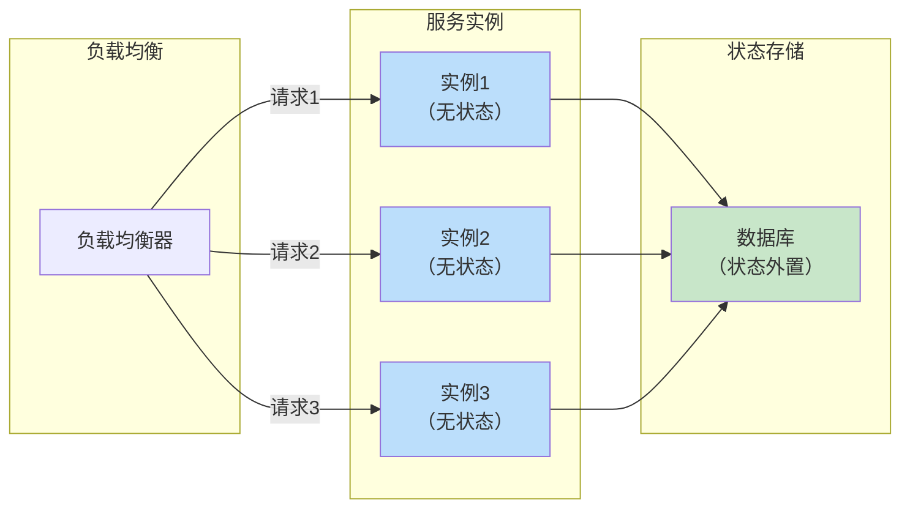
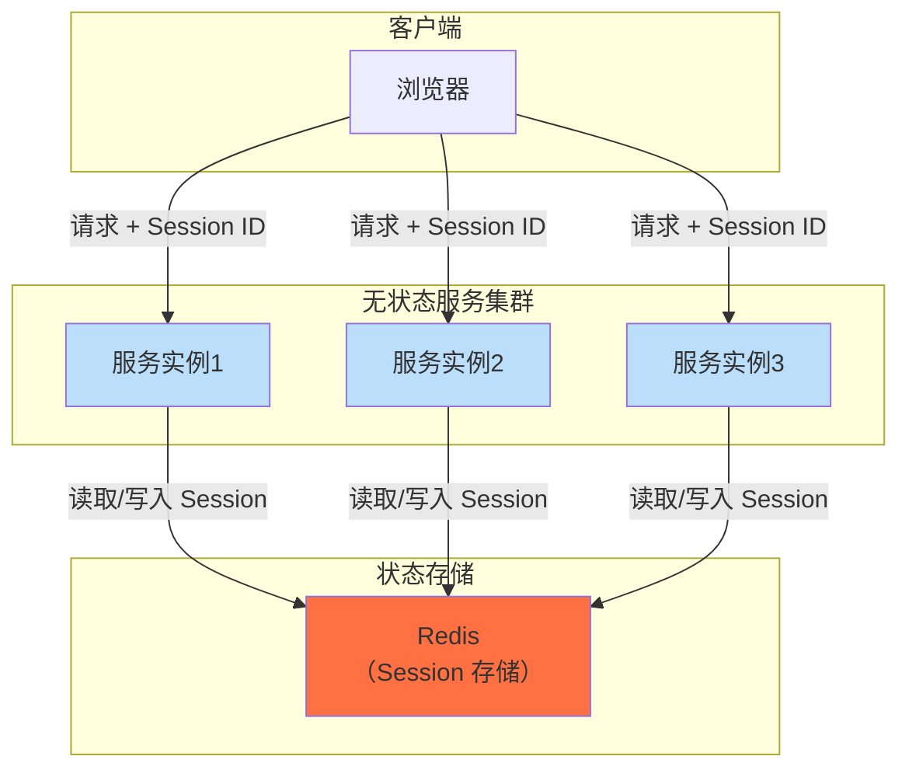
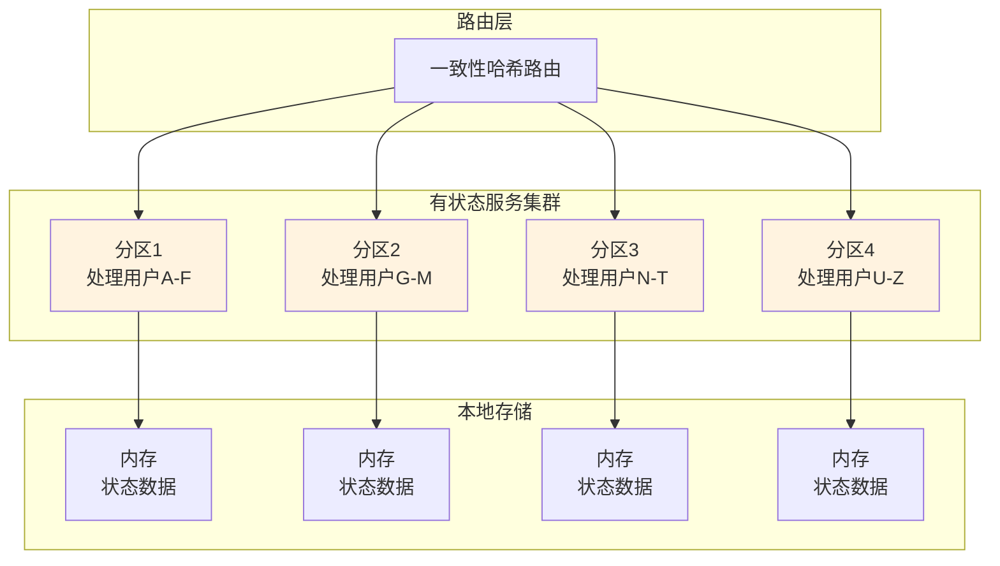
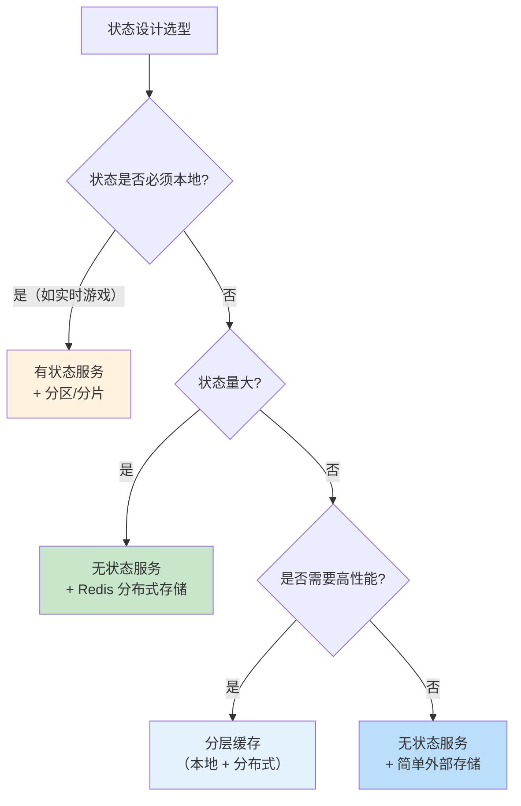

# Stateful vs Stateless 设计

用户打开购物网站，加载了 5 秒——页面显示「购物车里有 3 件商品」，但刷新页面后购物车空了。

这不是网络问题，而是状态管理的设计缺陷。购物车数据存在应用服务器内存里，但应用服务器重启或负载均衡把请求路由到了另一台服务器——那台服务器的内存里是空的。

这就是「有状态」和「无状态」的本质区别：**状态存在哪里，决定了服务能否水平扩展**。

## 核心概念对比

### 无状态服务（Stateless）

服务不存储请求之间的数据，每个请求都携带完整的信息。



**特点**：
- 任何请求可以被路由到任何实例
- 实例故障不影响其他实例
- 水平扩展简单，加机器即可

### 有状态服务（Stateful）

服务需要维护会话、连接或状态数据。

```mermaid
flowchart LR
    subgraph 负载均衡
        LB["负载均衡器"]
    end
    
    subgraph 服务实例（按请求路由）
        S1["实例1\n购物车用户A"]
        S2["实例2\n购物车用户B"]
        S3["实例3\n购物车用户C"]
    end
    
    subgraph 本地内存
        M1["购物车\n[商品1,2]"]
        M2["购物车\n[商品3]"]
        M3["购物车\n[商品4,5,6]"]
    end
    
    S1 --> M1
    S2 --> M2
    S3 --> M3
    
    Note over LB: 需要 sticky session\n路由到固定实例
    
    style S1 fill:#fff3e0
    style S2 fill:#fff3e0
    style S3 fill:#fff3e0
    style M1 fill:#ffccbc
    style M2 fill:#ffccbc
    style M3 fill:#ffccbc
```

**特点**：
- 同一用户请求路由到同一实例
- 状态读取速度快（内存访问）
- 水平扩展困难，需要状态迁移

## 对比矩阵

| 维度 | 无状态服务 | 有状态服务 |
| --- | --- | --- |
| **扩展性** | 简单（加机器即可） | 困难（需要状态迁移） |
| **故障恢复** | 简单（请求切换实例） | 复杂（状态可能丢失） |
| **资源占用** | 低（无本地状态） | 高（内存中存储状态） |
| **延迟** | 较高（需要访问外部存储） | 较低（本地访问状态） |
| **一致性** | 简单（共享存储） | 复杂（状态同步） |
| **部署复杂度** | 低 | 高 |

## 无状态设计：现代云原生的选择

### 状态外置：把状态交给专业存储

把状态存储在专门的存储服务中（Redis、MySQL、MongoDB），应用服务只负责计算。

```java
// 无状态服务：状态外置到 Redis
@Service
public class CartService {
    
    @Autowired
    private RedisTemplate<String, Object> redis;
    
    public void addToCart(String userId, String productId, int quantity) {
        // 从 Redis 读取购物车
        String key = "cart:" + userId;
        List<CartItem> cart = getCartItems(key);
        
        // 添加商品
        CartItem item = new CartItem(productId, quantity);
        cart.add(item);
        
        // 写回 Redis
        redis.opsForValue().set(key, cart);
    }
    
    public List<CartItem> getCart(String userId) {
        String key = "cart:" + userId;
        return getCartItems(key);
    }
    
    public void clearCart(String userId) {
        String key = "cart:" + userId;
        redis.delete(key);
    }
}
```

### 无状态的好处

1. **水平扩展简单**：任何实例处理任何请求，加机器即可提升容量
2. **故障恢复快**：实例故障，请求自动路由到其他实例
3. **部署简单**：不需要考虑状态迁移
4. **成本低**：按需扩缩容，不浪费资源

### 无状态的挑战

1. **延迟增加**：每次请求都要访问外部存储
2. **存储压力**：状态存储集中在 Redis/MySQL
3. **网络开销**：请求数据需要序列化传输

## 有状态设计：必要的场景

### 需要本地缓存

对于高频读取的数据，可以缓存在本地内存，减少网络开销。

```java
// 本地缓存：热点数据缓存到内存
@Service
public class ConfigService {
    
    private LoadingCache<String, Object> localCache = Caffeine.newBuilder()
        .maximumSize(1000)
        .expireAfterWrite(Duration.ofMinutes(5))
        .build(key -> loadFromRedis(key));
    
    public Object getConfig(String key) {
        try {
            return localCache.get(key);
        } catch (ExecutionException e) {
            return loadFromRedis(key);
        }
    }
}
```

### 长连接场景

WebSocket、RPC 长连接需要维护连接状态，无法做到完全无状态。

```java
// 有状态服务：WebSocket 连接管理
@Service
public class WebSocketService {
    
    private Map<String, WebSocketSession> sessions = new ConcurrentHashMap<>();
    
    public void handleConnection(WebSocketSession session) {
        String userId = extractUserId(session);
        sessions.put(userId, session);  // 保存连接状态
    }
    
    public void pushMessage(String userId, String message) {
        WebSocketSession session = sessions.get(userId);
        if (session != null && session.isOpen()) {
            session.sendMessage(new TextMessage(message));
        }
    }
}
```

### 有状态计算

窗口聚合、状态机等需要维护中间状态，无法完全无状态。

```java
// Flink 有状态计算：窗口聚合
public class OrderStatistics {
    
    public static void main(String[] args) {
        StreamExecutionEnvironment env = StreamExecutionEnvironment.getExecutionEnvironment();
        
        // 开启状态后端
        env.enableCheckpointing(1000);
        env.getCheckpointConfig().setCheckpointStorage("hdfs:///checkpoints");
        
        DataStream<Order> orders = env.addSource(new KafkaSource());
        
        // 有状态聚合：每分钟 GMV
        DataStream<MinuteGMV> gmvStats = orders
            .keyBy(order -> "gmv")
            .timeWindow(Time.minutes(1))
            .sum("amount");
    }
}
```

## Session 外置：两全其美

通过将 Session 存储在 Redis 等外部存储中，既能享受无状态的水平扩展能力，又能保持快速的会话访问。

### Session 外置架构



### Spring Session + Redis

```java
// Spring Boot + Spring Session + Redis
@Configuration
@EnableRedisHttpSession(maxInactiveIntervalInSeconds = 3600)
public class SessionConfig {
    // Session 自动存储到 Redis
    // 每次请求通过 Session ID 从 Redis 读写 Session
}

// 使用 Session
@RestController
public class UserController {
    
    @GetMapping("/user/info")
    public UserInfo getUserInfo(HttpSession session) {
        // 从 Redis 读取 Session
        User user = (User) session.getAttribute("currentUser");
        return new UserInfo(user.getId(), user.getName());
    }
    
    @PostMapping("/login")
    public Response login(String username, String password, HttpSession session) {
        User user = userService.login(username, password);
        // 写入 Redis Session
        session.setAttribute("currentUser", user);
        return Response.success();
    }
}
```

### Session 外置的优势

1. **无状态扩展**：服务实例可以随意增减
2. **故障恢复**：实例重启不影响用户会话
3. **跨域访问**：用户请求可以路由到任意实例
4. **统一管理**：Session 集中在 Redis，便于监控和清理

### Session 外置的代价

1. **延迟增加**：每次 Session 访问需要 Redis 网络往返
2. **Redis 压力**：Session 量大时 Redis 压力增加
3. **序列化开销**：Session 数据需要序列化/反序列化

## 有状态服务的扩展策略

如果业务确实需要维护状态（如实时游戏、实时协作），有以下扩展策略：

### 方案一：分区

按用户 ID 或会话 ID 分区，每个分区由独立的「有状态服务」处理。



### 方案二：分片

使用分布式存储（如 Redis Cluster）分片存储状态，服务本身仍然可以水平扩展。

```java
// Redis Cluster 分片
RedisClusterClient client = RedisClusterClient.create(
    ClusterClientSettings.create(Arrays.asList(
        "redis://127.0.0.1:7001",
        "redis://127.0.0.1:7002",
        "redis://127.0.0.1:7003"
    ))
);

StatefulRedisClusterConnection<String, String> connection = client.connect();

// 根据 key 自动路由到对应分片
String result = connection.sync().get("user:12345:cart");
```

### 方案三：内存网格（In-Memory Data Grid）

使用 Hazelcast、Ignite 等内存网格，在多个服务实例间共享状态。

```java
// Hazelcast 分布式映射
 HazelcastInstance hazelcast = Hazelcast.newHazelcastInstance();
 
 Map<String, UserSession> sessions = hazelcast.getMap("user-sessions");
 
 // 分布式 Session 操作
 sessions.put(userId, new UserSession(userId, sessionData));
 UserSession session = sessions.get(userId);
```

## 选型决策树



## 常见误区

### 「无状态 = 不用存储数据」

无状态只是「不在本地存储状态」，状态仍然需要存储——只是存在外部存储中。Session 外置、缓存都是典型的例子。

### 「有状态服务不能扩展」

有状态服务可以通过分区、分片实现水平扩展。关键是设计好状态分区策略，避免状态迁移。

### 「Session 存在 Redis 里就够了」

对于简单场景，把 Session 存在 Redis 里确实够用。但如果 Session 数据量很大（购物车有几百件商品），Redis 的内存压力会很大，需要考虑分层存储。

### 忽视状态失效

状态数据应该有过期时间，否则内存会无限增长。Session 需要定期清理，缓存需要设置 TTL。

## 思考题

**问题 1**：一个在线游戏（多人实时对战）需要维护每个玩家的位置、状态。如何设计状态管理架构？

<details>
<summary>参考答案</summary>

**设计分析**：

1. **状态特点**：
   - 高频更新（每秒多次位置更新）
   - 需要广播给同房间所有玩家
   - 低延迟要求（毫秒级）
   - 状态量适中（每个玩家 KB 级）

2. **架构设计**：

```mermaid
flowchart TD
    subgraph 游戏客户端
        Player1["玩家1"]
        Player2["玩家2"]
        Player3["玩家3"]
    end
    
    subgraph 游戏服务器（分区）
        GS["游戏房间服务器\n（有状态）"]
    end
    
    subgraph 状态存储
        Redis["Redis\n（广播、心跳）"]
        DB["数据库\n（存档）"]
    end
    
    Player1 -->|"WebSocket"| GS
    Player2 -->|"WebSocket"| GS
    Player3 -->|"WebSocket"| GS
    
    GS --> Redis
    GS --> DB
    
    Note over GS: 玩家状态存在本地内存\n高频广播使用 Redis Pub/Sub
```

3. **关键设计**：
   - **房间服务器**维护房间内所有玩家的实时状态（本地内存）
   - **Redis Pub/Sub**用于广播状态更新（低延迟广播）
   - **定期存档**到数据库（每 30 秒或每局结束）
   - **状态分区**：按房间 ID 分区，不同房间在不同服务器

4. **故障恢复**：
   - 房间服务器故障 → 玩家重新匹配
   - 不需要状态恢复（实时游戏容忍断线重连）

</details>

**问题 2**：为什么 Spring Cloud Gateway 推荐无状态设计？它是如何处理 Session 的？

<details>
<summary>参考答案</summary>

**Spring Cloud Gateway 无状态设计的原因**：

1. **性能**：网关需要处理大量请求，每个请求都要经过过滤器链，无状态的请求处理更快
2. **扩展**：网关通常需要水平扩展，无状态设计使得扩缩容简单
3. **故障恢复**：实例故障不影响请求，请求自动路由到其他实例

**Gateway 如何处理 Session**：

1. **JWT Token**：把 Session 信息编码到 Token 中，每次请求携带 Token
   ```yaml
   spring:
     cloud:
       gateway:
         routes:
           - id: route
             uri: http://backend
             filters:
               - TokenRelay= # 传递 JWT Token 到下游服务
   ```

2. **分布式 Session**：如果必须使用传统 Session，可以配合 Spring Session + Redis
   - Gateway 只做路由，不存储 Session
   - Session 存储在 Redis
   - 下游服务从 Redis 读取 Session

3. **Cookie + 签名**：简单场景可以用 Cookie 存储 Session ID，Session 数据存储在 Redis

**无状态网关的优势**：
- 每个请求都独立，可以负载均衡到任意实例
- 不需要 sticky session 配置
- 扩缩容不影响现有请求

</details>

**问题 3**：如果把状态都存在 Redis 里，Redis 挂了怎么办？

<details>
<summary>参考答案</summary>

**Redis 故障的应对策略**：

1. **多级缓存**：本地缓存 + Redis 缓存
   - Redis 挂了时，fallback 到本地缓存
   - 牺牲一致性，换取可用性
   ```java
   public Object get(String key) {
       // 先查本地缓存
       Object local = localCache.get(key);
       if (local != null) {
           return local;
       }
       
       // 本地缓存 miss，查 Redis
       try {
           Object redis = redis.get(key);
           if (redis != null) {
               localCache.put(key, redis);  // 回填本地缓存
           }
           return redis;
       } catch (RedisException e) {
           // Redis 故障，返回默认值或拒绝请求
           return getDefaultValue(key);
       }
   }
   ```

2. **Redis 主从 + 哨兵/集群**：
   - 主从复制保证数据不丢失
   - 哨兵自动故障切换
   - 集群保证高可用

3. **降级策略**：
   - 读请求降级：直接查数据库或返回默认值
   - 写请求降级：写入内存队列或本地文件，恢复后补写入

4. **本地 Session 兜底**：
   - 即使 Redis 不可用，用户已经登录的 Session 不受影响
   - 新登录请求可能受影响（可以降级到本地认证）

**核心原则**：**缓存失效 ≠ 服务不可用**。设计时要考虑降级策略，保证核心功能可用。

</details>
