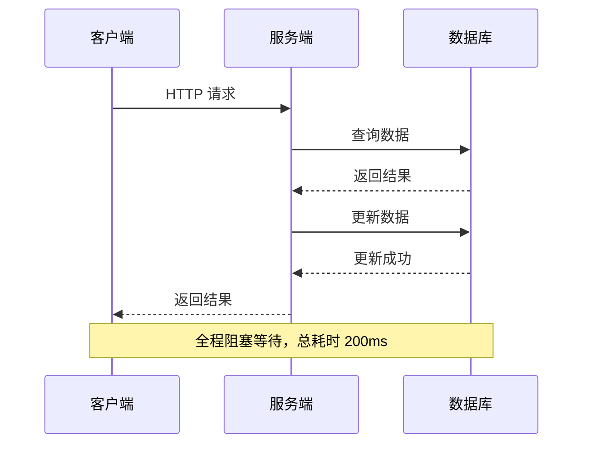
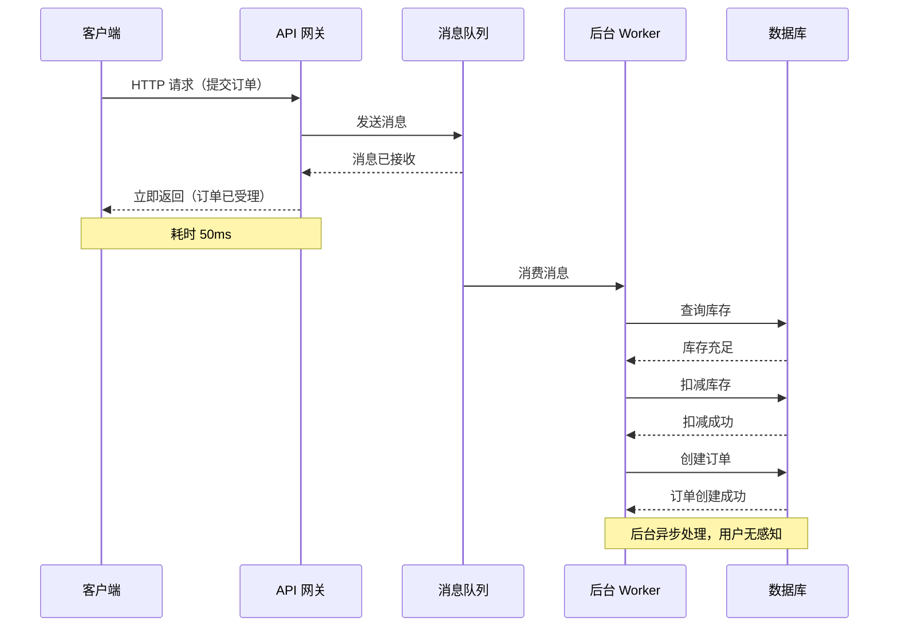
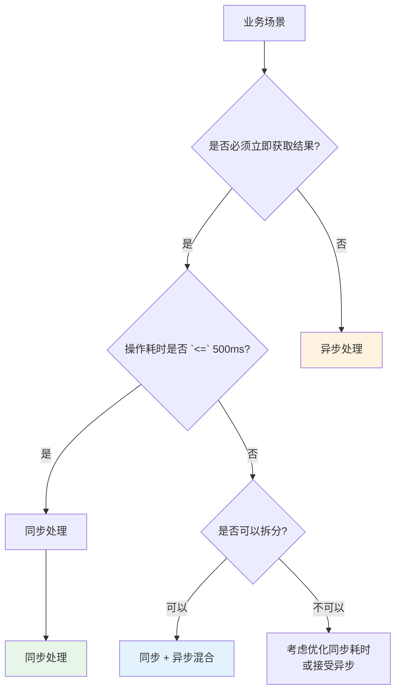

# 同步 vs 异步处理

用户点击「提交订单」，页面转圈圈等待 2 秒后显示「下单成功」。这 2 秒里，到底发生了什么？

如果系统是**同步**的，那这 2 秒内你的请求一直占用着服务器线程，从创建订单、扣减库存、发送通知，每个环节都要等待完成才返回结果。

如果系统是**异步**的，你点击「提交」的瞬间系统就告诉你「订单已受理」，后台在「看不见的地方」慢慢处理扣库存、发通知这些事。

同步和异步不只是技术选择，更是一种**用户体验和系统复杂度之间的权衡**。

## 同步处理：简单直接，实时响应

### 核心特征

同步处理是最直觉的模式：调用方发起请求后，必须等待被调用方返回结果，才能继续执行后续逻辑。



同步处理的优势是**逻辑简单、结果确定**。调用方可以立即知道操作是成功还是失败，不需要额外的状态查询或补偿逻辑。

### 适用场景

**用户下单、支付**：用户点击支付后必须等待支付结果，不可能一边支付一边让用户继续操作。这是用户体验的要求，也是业务逻辑的要求——支付成功后才能生成订单。

```java
// 同步支付（用户必须等待结果）
public PaymentResult processPaymentSync(PaymentRequest request) {
    // 1. 校验支付参数
    validatePaymentRequest(request);
    
    // 2. 调用第三方支付
    PaymentResponse response = paymentGateway.pay(request);
    
    // 3. 更新订单状态
    if (response.isSuccess()) {
        orderService.updateStatus(OrderStatus.PAID);
        return PaymentResult.success(response.getTransactionId());
    } else {
        return PaymentResult.failure(response.getErrorMessage());
    }
}
```

**同步适用场景清单**：
- 业务逻辑强依赖操作结果的场景
- 需要立即获取操作结果才能继续的场景
- 对数据一致性要求极高的场景
- 操作耗时较短（通常 `<=` 500ms）的场景

### 代价

同步处理的代价是**调用方必须等待**，这会带来以下问题：

1. **接口耗时增加**：每个环节的耗时累加，用户等待时间长
2. **资源占用增加**：请求占用服务器线程/连接，时间越长资源消耗越大
3. **级联失败风险**：下游服务慢会导致上游服务也被拖慢
4. **吞吐量受限**：同步阻塞模式下，并发能力受限于线程数

## 异步处理：解耦系统，提升吞吐

### 核心特征

异步处理的核心是**发送即完成**：调用方发送请求后，不等待处理完成就返回成功。



### 适用场景

**消息推送**：用户发了消息，不需要等所有接收方都收到才告诉发送方「发送成功」。消息入队后立即返回，推送是后台慢慢处理的事。

**日志收集**：每个请求都往日志队列写入一条日志，如果同步写日志会增加接口耗时。异步写入后，接口响应时间几乎不受影响。

**数据同步**：A 系统产生数据，B 系统需要同步。同步模式下 A 调用 B，B 挂了 A 也受影响；异步模式下 A 只管发消息，B 自行消费，两系统解耦。

```java
// 异步下单（用户不需要等待完整流程）
public OrderSubmitResponse submitOrderAsync(OrderSubmitRequest request) {
    // 1. 快速校验（参数校验、风控预检）
    validateRequest(request);
    
    // 2. 发送消息到队列，立即返回
    orderMessageProducer.send(new OrderCreatedMessage(request));
    
    // 3. 返回受理成功（不等待后续处理）
    return OrderSubmitResponse.accepted(request.getOrderId());
}

// 后台 Worker 处理
@MessageListener
public void handleOrderCreated(OrderCreatedMessage message) {
    // 扣减库存
    inventoryService.deduct(message.getProductId(), message.getQuantity());
    
    // 创建正式订单
    orderService.createOrder(message);
    
    // 发送通知
    notificationService.notifyOrderCreated(message.getUserId());
}
```

### 代价

异步处理的代价是**复杂度增加**：

1. **消息可靠性**：消息是否会丢失？是否会被重复消费？
2. **结果延迟**：调用方不能立即获取结果，需要额外的查询或通知机制
3. **幂等性**：消息可能重复投递，消费者必须能处理重复消息
4. **调试困难**：异步链路是「发完就不管」，出问题排查难度大

## 同步异步对比矩阵

| 维度 | 同步处理 | 异步处理 |
| --- | --- | --- |
| **响应时间** | 较长（累加所有环节耗时） | 极短（发送即完成） |
| **系统复杂度** | 低（逻辑简单直接） | 高（消息队列、幂等、补偿） |
| **资源占用** | 高（请求期间占用线程/连接） | 低（请求立即释放） |
| **可用性** | 依赖下游服务可用性 | 下游故障不影响上游 |
| **一致性** | 容易保证强一致性 | 需要 Saga 或最终一致性 |
| **适用场景** | 支付、下单、查询 | 推送、日志、通知、同步 |



## 同步转异步：常见的演进路径

### HTTP → 消息队列

最常见的同步转异步模式。同步 HTTP 调用改为发送消息，后台 Worker 消费处理。

```java
// 原始同步代码
public void submitOrder(Order order) {
    // 调用库存服务
    inventoryService.decrement(order.getProductId(), order.getQuantity());
    
    // 调用积分服务
    pointService.add(order.getUserId(), order.getPoints());
    
    // 调用通知服务
    notificationService.send(order.getUserId(), "订单创建成功");
    
    // 保存订单
    orderRepository.save(order);
}

// 优化为异步
public void submitOrder(Order order) {
    // 只需要同步保存订单
    orderRepository.save(order);
    
    // 发送事件，后续服务自行处理
    eventPublisher.publish(new OrderCreatedEvent(order));
}
```

### 回调 → 消息队列

有时候第三方服务不支持同步返回（如短信发送、邮件发送），会通过回调通知结果。但回调 URL 需要暴露到公网，存在安全性问题。

更可靠的方案是让第三方发送消息到你的消息队列：

```mermaid
flowchart LR
    subgraph 回调模式（不推荐）
        A["服务"] -->|"HTTP 请求"| B["第三方服务"]
        B -.->|"回调"| A
    end
    
    subgraph 消息队列模式（推荐）
        C["服务"] -->|"消息"| D["MQ"]
        D -->|"消费"| E["第三方服务"]
        E -->|"结果消息"| D
    end
    
    style B fill:#ffcdd2
    style D fill:#c8e6c9
```

### 轮询 → Webhook/SSE

前端轮询获取任务状态是一种「伪异步」，本质还是同步。真正的异步应该用 Webhook（后端）或 Server-Sent Events（前端）。

```java
// 轮询模式（浪费资源）
@GetMapping("/task/status")
public TaskStatus pollStatus(@RequestParam String taskId) {
    return taskService.getStatus(taskId);
}

// Webhook 模式（真正的异步）
@PostMapping("/task/webhook")
public void receiveWebhook(TaskResult result) {
    taskService.updateResult(result);
}
```

## 异步处理的可靠性设计

异步处理最大的挑战是**消息可靠性**。以下是确保异步处理可靠性的关键设计：

### 消息持久化

消息队列必须开启持久化，避免消息丢失。

```java
// RocketMQ 持久化消息
Message message = new Message(
    "order-topic",
    "create",
    order.toJSON().getBytes()
);
message.setDelayTimeLevel(3); // 持久化保障

producer.send(message);
```

### 消费确认

消费者处理成功后确认消息，失败后重试或进入死信队列。

```java
@RocketMQMessageListener(
    topic = "order-topic",
    consumerGroup = "order-consumer-group",
    maxReconsumeTimes = 3  // 最大重试 3 次
)
public class OrderConsumer implements RocketMQListener<OrderMessage> {
    
    @Override
    public void onMessage(OrderMessage message) {
        try {
            processOrder(message);
            // 成功：自动 ACK
        } catch (Exception e) {
            // 失败：抛出异常，进入重试队列
            throw e;
        }
    }
}
```

### 幂等设计

消息可能被重复投递，消费者必须能处理重复消息。

```java
public void handleMessage(OrderMessage message) {
    // 幂等键：使用订单 ID 作为唯一标识
    String idempotentKey = "order:processed:" + message.getOrderId();
    
    // Redis SETNX 实现幂等
    Boolean result = redisTemplate.opsForValue()
        .setIfAbsent(idempotentKey, "1", Duration.ofHours(24));
    
    if (Boolean.FALSE.equals(result)) {
        log.info("订单已处理过，跳过: {}", message.getOrderId());
        return;
    }
    
    // 执行业务逻辑
    processOrder(message);
}
```

## 混合策略：同步入口 + 异步处理

实际系统很少纯同步或纯异步，更多是**同步入口 + 异步处理**的混合模式。

```mermaid
flowchart TD
    subgraph 用户请求（同步）
        R["用户下单"]
        V["快速校验"]
        S["返回受理成功"]
    end
    
    subgraph 后台处理（异步）
        Q["消息队列"]
        W1["Worker: 扣库存"]
        W2["Worker: 发通知"]
        W3["Worker: 记录日志"]
    end
    
    R --> V --> S
    S --> Q
    Q --> W1
    Q --> W2
    Q --> W3
    
    style R fill:#bbdefb
    style S fill:#c8e6c9
    style Q fill:#fff3e0
```

这种模式的优势：
- **用户响应快**：同步部分只做快速校验，返回立即完成
- **系统吞吐高**：后台异步处理，不占用用户请求的资源
- **下游解耦**：库存、通知等下游服务故障不影响用户下单

## 常见误区

### 「异步一定比同步好」

异步的优势是响应快、解耦，代价是复杂度高、调试难、结果不确定。如果业务简单明了，同步可能是更好的选择。

### 忽略幂等性

异步处理时消息可能重复投递，很多团队只想着「正常流程怎么走」，忽视了「重复消息怎么处理」。没有幂等设计的异步系统，轻则数据重复，重则资金损失。

### 不考虑失败补偿

同步调用失败，调用方直接知道；异步消息发送失败，需要额外的检测和补偿机制。很多团队「发送消息后就不管了」，等到消息丢失才发现问题。

### 消息队列当数据库用

消息队列不适合存储大量历史数据。MQ 的消息有生命周期，堆积太久会被清理或丢弃。如果需要持久化存储，应该用数据库。

## 思考题

**问题 1**：用户注册成功后需要发送欢迎邮件、初始化积分、生成默认配置。这三个操作可以异步吗？如果可以，应该如何设计？

<details>
<summary>参考答案</summary>

**可以异步**，原因：
- 用户注册成功后不需要等待这三个操作完成才能「使用系统」
- 这三个操作互相独立，不存在数据依赖
- 如果同步执行，会让注册接口耗时增加 100-200ms

设计建议：
1. 注册接口只做三件事：校验参数、写入用户表、发送注册成功消息
2. 后台 Worker 消费消息，并行执行邮件、积分、配置的初始化
3. 需要考虑幂等：Worker 重启或消息重复时，同一个用户的初始化不应该重复执行

如果某个操作失败（如邮件服务挂了），应该记录失败状态，允许重试，而不是让整个注册流程失败。

</details>

**问题 2**：一个文件上传服务，用户上传文件后需要做病毒扫描、内容审核、格式转换。这些操作应该如何设计同步/异步策略？

<details>
<summary>参考答案</summary>

建议**同步 + 异步混合**：

1. **文件上传本身要同步**：用户必须等待文件上传完成才能进行下一步
2. **病毒扫描建议同步**（可选）：对于企业安全要求高的场景，可以等扫描通过再让用户下载
3. **内容审核建议异步**：审核通常需要几秒到几分钟，不应该让用户等
4. **格式转换建议异步**：视频转码等耗时操作，必须异步

设计示例：
```java
public UploadResponse uploadFile(MultipartFile file) {
    // 1. 上传到对象存储（同步，用户必须等）
    String fileKey = ossClient.upload(file);
    
    // 2. 发送处理消息（异步）
    processingQueue.send(new FileProcessingMessage(fileKey, file.getType()));
    
    // 3. 立即返回，用户可以查询处理状态
    return UploadResponse.accepted(fileKey);
}
```

后台 Worker 处理时：
- 审核通过 → 标记文件可用
- 审核拒绝 → 标记文件不可用，通知用户
- 转码完成 → 更新文件格式信息

</details>

**问题 3**：异步处理中，如果消息消费失败了，应该如何处理？

<details>
<summary>参考答案</summary>

消息消费失败的典型处理策略：

**1. 重试机制**
- 立即重试 N 次（如 3 次）
- 间隔重试（1s, 5s, 30s）
- 最大重试次数后进入死信队列

**2. 死信队列**
- 记录失败消息到死信队列，供人工处理
- 设置告警通知运维

**3. 幂等 + 覆盖**
- 如果消息支持「幂等键」，可以简单重试
- Consumer 直接覆盖状态，不会产生副作用

**4. 降级处理**
- 如果某个下游服务完全不可用，可以降级处理（如关闭审核、跳过积分）
- 需要设计降级开关

**代码示例**：
```java
try {
    processMessage(message);
} catch (RetryableException e) {
    // 可重试异常：重新入队，稍后重试
    retryQueue.send(message, delaySeconds(5));
} catch (FatalException e) {
    // 不可重试异常：进入死信队列
    deadLetterQueue.send(message, e.getReason());
    alert("消息处理失败: " + message.getId());
} catch (Exception e) {
    // 其他异常：也进入死信队列，避免无限重试
    deadLetterQueue.send(message, e.getMessage());
}
```

</details>
